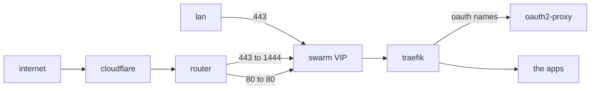
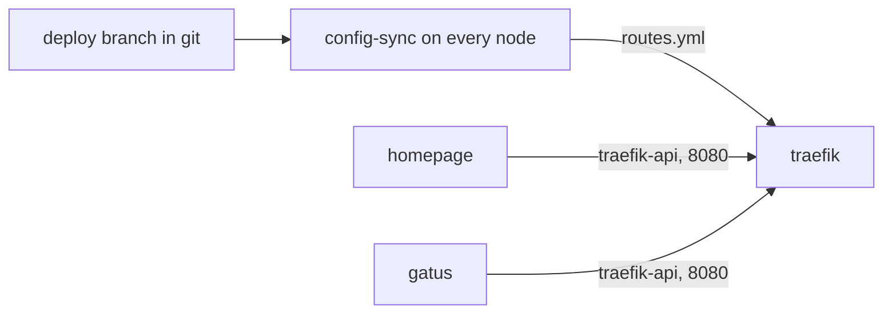

# traefik

traefik is my reverse proxy for every web interface, inside the lan and
outside. it runs as one replica on the swarm. i chose it over
[nginx proxy manager](nginx-proxy-manager.md), which it replaced, so every
route is a line in git, reviewed in a pull request and checked before it
deploys.

every request reaches an app through the VIP and traefik:



the routes reach traefik from git, and homepage and gatus read traefik's API
over a private network:



--8<-- "blocks/swarm/traefik/compose.yml.md"

--8<-- "blocks/swarm/traefik/traefik.yml.md"

## before you deploy

1. create a cloudflare API token with **Zone / Zone / Read** and
   **Zone / DNS / Edit**, limited to your zone, and store it as a docker secret:

    ```bash
    docker secret create traefik_cf_token_v1 -
    ```

    - paste the token, then press Ctrl-D
    - traefik reads the token from the secret's file, and the service spec
      never holds it

2. create the certificate folder on the cephfs mount:

    ```bash
    sudo mkdir -m 700 /mnt/docker-cephFS/traefik_acme
    ```

    - without the folder the bind fails and traefik doesn't start. that's
      better than starting with no certificate state

3. create `gitsync_ssh_key_v1`, the read-only deploy key config-sync uses to
   read the repo, as in [gatus's steps](../monitoring/gatus.md#before-you-deploy).
   gatus and homepage use the same key, so skip this if either is deployed

    - the stack declares the key as an external secret. without it the deploy
      fails with `secret not found`

4. create the `traefik-api` overlay on a manager, with a fixed subnet:

    ```bash
    docker network create -d overlay --attachable --scope swarm --subnet 10.0.200.0/24 traefik-api
    ```

    - traefik's API router only answers this subnet, so the subnet has to match
      the registry. pick one clear of the /24s docker hands out in order from
      10.0.0.0/8
    - no stack owns the overlay, so removing traefik, homepage or gatus leaves
      it for the other two

5. check nothing on the swarm already listens on 80, 443 or 1444

## state considerations

- the certificate and the let's encrypt account are in
  `/mnt/docker-cephFS/traefik_acme`, a named bind on cephfs, see
  [stack conventions](../docker/conventions.md#volumes-are-a-named-bind-with-driver_opts).
  they follow traefik to whichever node it starts on
- the routes are in a small in-memory volume on each node, filled by that
  node's config-sync. it holds nothing that isn't in git
- there is one replica. traefik's free edition can't share its let's encrypt
  state between instances

## network considerations

- traefik publishes three ports on the ingress mesh, so each one answers on
  every node and on the [keepalived](../docker/swarm/keepalived.md) VIP:

    | port | for |
    | --- | --- |
    | 80 | redirects every name to https on the same name, keeping the path. the router forwards its 80 here |
    | 443 | the lan |
    | 1444 | outside. the router forwards its 443 here |

- the mesh replaces each client's address with its own, so traefik's logs show
  `10.0.0.x`. nothing here decides anything on the client's address
- homepage and gatus read traefik's read-only API on the unpublished 8080,
  over the `traefik-api` overlay. the dashboard's name is behind oauth, which a
  widget or a health check can't pass
    - 8080 also listens on the ingress network that every published service
      shares, so the router for the API only answers `traefik-api`'s subnet
    - traefik doesn't join the `discovery` overlay. traefik faces the internet,
      and `discovery` carries the docker socket proxy

## placement considerations

- traefik can run on any node
- config-sync runs on every node (`mode: global`). traefik reloads when a file
  in its folder changes, and a write on one node's cephfs mount never reaches
  a watcher on another, so each node writes its own copy of the routes

## the registry

`services.yaml` has one entry per name. my script, `tools/traefik_render.py`,
renders it into `dynamic/routes.yml`, which traefik reads. it also writes a
[gatus](../monitoring/gatus.md) check for every route, and refuses an unknown
field or a name used twice. CI fails if the files disagree with the registry,
then starts the pinned traefik on them and fails if any route reports an
error.

a service that already serves 443 with a valid certificate stays direct on
the lan. home assistant and the unifi gateway keep their own names and
certificates. traefik is for everything that lacks one or both.

### adding a service

1. add an entry to `services.yaml`:

    ```yaml title="services.yaml"
      jellyfin:
        upstream: http://192.168.1.86:8096
        internal: open
        native:
          auth: "password"
          mfa: "none"
    ```

    - the key is the name, so this serves `jellyfin.mydomain.com`
    - an app on the swarm is reached on its published port at the VIP. its own
      port keeps working and its stack doesn't change

2. render the routes, and commit what the script writes

3. merge. every node's config-sync picks up the routes within a minute, and
   traefik reloads without restarting

4. add the name to the internal DNS, as a CNAME to the VIP's name. mine is
   windows DNS:

    ```powershell
    Add-DnsServerResourceRecordCName -ZoneName "mydomain.com" -Name "jellyfin" -HostNameAlias "swarm.mydomain.com"
    ```

    - the name is the same inside and outside, so an app on a phone needs one
      address
    - never give a service a host's own name. `truenas1` and `frigate` also
      carry ssh, smb and video, and pointing either at traefik breaks those

### the fields

| field | does |
| --- | --- |
| `upstream` | where traefik sends requests. a list gets a health check on `/` and a sticky cookie; proxmox uses all three nodes |
| `upstream_tls: insecure` | skips the check of a backend's certificate, for one that is self-signed or expired |
| `tls_name` | checks a backend's certificate against this name, for a backend reached by address |
| `internal` | `open`, or `oauth` for oauth2-proxy in front. leave it out and the name isn't served on the lan |
| `external` | `oauth`, `own-mfa` or `public`. leave it out and the name isn't served outside |
| `mfa` | with `own-mfa`, a line saying how the app enforces MFA, so a reviewer sees the claim |
| `native` | the app's own login and MFA, and its own address when it differs from `upstream`. required |
| `external_oauth_paths`, `external_oauth_headers` | oauth in front of part of an `own-mfa` or `public` name only |
| `redirect` | the name only redirects, keeping the path |
| `root_redirect` | the front page redirects, and every other path is served |

--8<-- "blocks/swarm/traefik/services.yaml.md"

--8<-- "blocks/swarm/traefik/dynamic/routes.yml.md"

--8<-- "blocks/swarm/traefik/sync-routes.sh.md"

## oauth, for names with no login of their own

a name marked `oauth` asks [oauth2-proxy](oauth2-proxy.md) about every request
first. a browser that isn't signed in goes to entra, and comes back to the page
it asked for. the sign-in lands on `auth.mydomain.com` and sets a cookie on the
whole domain, so one sign-in covers every name. the oauth2-proxy page has the
entra side.

- on the lan, a name is `open` or `oauth`, chosen per name. `oauth` protects
  the name only: the app's own port still answers on the lan
- an app whose users sign in with entra through its own OIDC setting, such as
  proxmox or portainer, needs no oauth in front of it
- [auth](../auth/index.md) has every name's sign-in and MFA, on the lan and
  outside

## what faces the internet

outside, every name needs MFA or has to be a public site. `external` has no
`open`, and the script refuses a name that sets one.

- `oauth` puts oauth2-proxy in front, so users sign in with entra first
- `own-mfa` relies on the app's own login, and needs the `mfa` line
- `public` is for a site meant for anyone, such as the blog

some apps with their own MFA have a second way in that skips it. portainer's
first admin can always log in with a password, and an API key skips the login
altogether. `external_oauth_paths` and `external_oauth_headers` put oauth in
front of just those requests. each path is also matched with `%2F` in place of
its inner slashes, because the app reads `/api%2Fauth` as `/api/auth` and a
plain rule doesn't.

## checking it

`auth.mydomain.com` is the one name with nothing in front of it. check it by
name, as a browser reaches it:

```bash
curl -sS -w ' %{http_code} verify=%{ssl_verify_result}\n' https://auth.mydomain.com/ping
```

it should print `OK 200 verify=0`. then check the certificate, straight from
the VIP:

```bash
openssl s_client -connect 192.168.1.45:443 -servername traefik.mydomain.com </dev/null 2>/dev/null | openssl x509 -noout -issuer -ext subjectAltName -enddate
```

- the dashboard is at `https://traefik.mydomain.com`, behind oauth. it lists
  every route with its status
- [gatus](../monitoring/gatus.md) checks every route through the VIP, with the
  name as the Host header and no DNS. a mis-wired route goes red on its own,
  and a DNS outage doesn't turn them all red
- gatus also checks the certificate's expiry and goes red with 21 days left.
  traefik renews at 30
