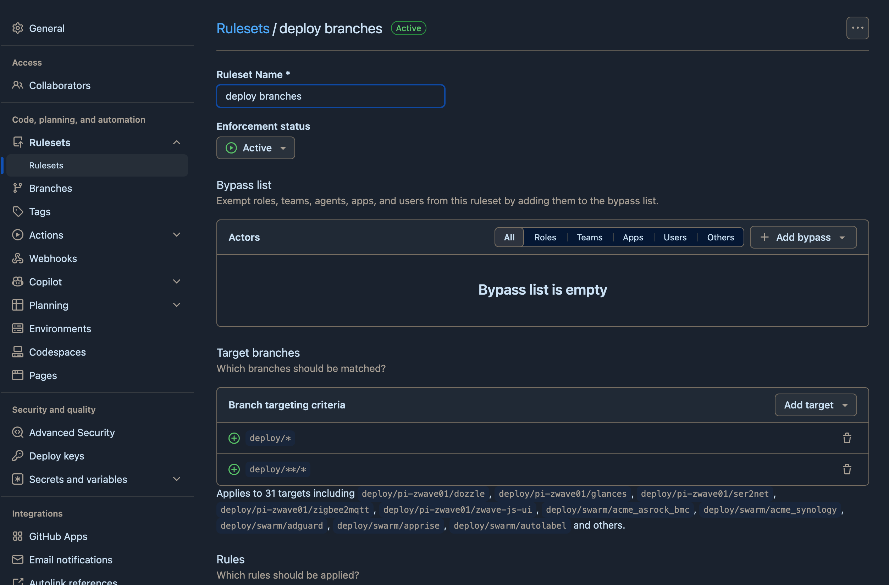
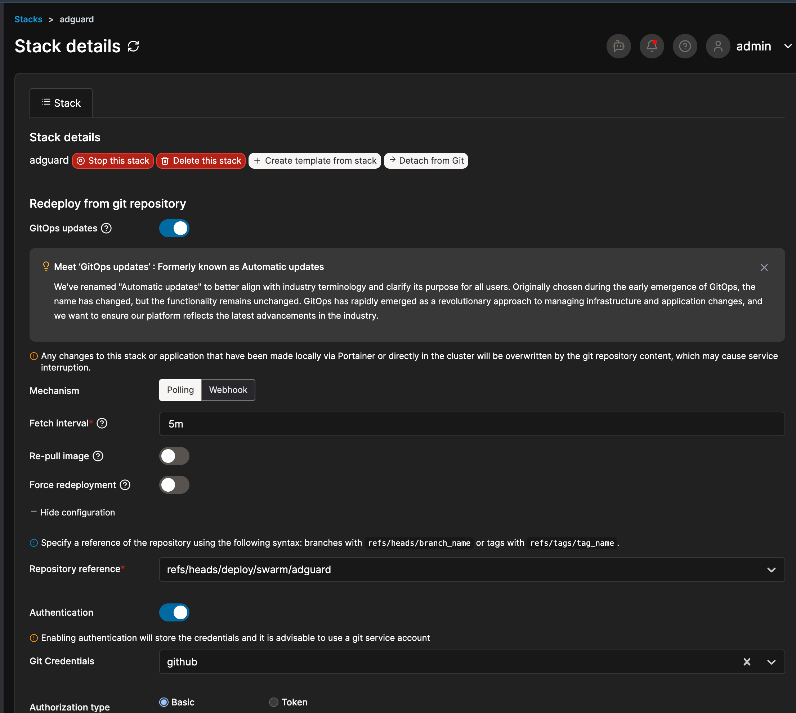

# moving stacks from the web editor to git

all my stacks used to live in portainer's web editor. the compose text existed in
exactly one place, portainer's database, and the only backup was portainer's own
backup. editing a stack meant editing production, no history, no review.

this is how i moved them to git.

portainer polls a git repo and redeploys a stack when the commit it is watching
changes. each stack gets its own compose path and its own branch, and portainer
remembers the last commit it deployed. default poll is five minutes.

assumes you have [portainer on a swarm](portainer.md) already.

## Pre-reqs

1. a git repo, private if your compose files describe your estate (mine does)
2. portainer business or CE, both do git stacks
3. shell access to a manager node
4. somewhere to put secrets first, see [secrets](secrets.md), do that page before
   this one if any stack has a password in it

## 1. lay the repo out one directory per stack

```
stacks/
  swarm/                      # the three node swarm
    adguard/compose.yml
    npm/compose.yml
    uptime-kuma/compose.yml
  pi-zwave01/                 # a standalone pi with the radios on it
    ser2net/compose.yml
    zigbee2mqtt/compose.yml
    zwave-js-ui/compose.yml
```

`stacks/<env>/<stack>/compose.yml`, and the `<env>` level is not optional. i had
a stack called `watchtower` on three different machines, without the env level
they collide. the directory name is also what the deploy branch and the renovate
PR title get named after, so make it readable.

the rest of the examples on this page use those six.

## 2. fix the compose files before you cut anything over

three things to fix while the stack is still running the old way.

**all bind paths must be absolute.** a relative `./data` does not resolve on the
host, it resolves inside portainer's clone of your repo. the container starts,
finds an empty directory, reports itself healthy and writes there. if its a
database it initialises a new empty one.

i use an explicit local volume rather than bare bind syntax:

```yaml
volumes:
  db:
    driver: local
    driver_opts:
      type: none
      device: "/mnt/docker-cephFS/wordpress_db"
      o: bind
```

reason for this approach: deleting the stack removes the volume definition but not
the data at the device path. my nodes share replicated storage so a delete that
took the data would take it from all three at once.

**pin the digest if you want the cutover to change nothing.** no digest in the
spec means a recreate re-pulls whatever the tag points at today, so your restart
is also a version bump you didn't ask for.

```yaml
    image: mysql:8.0@sha256:968e12b1fde035655c7a940db808b47372b70128293a38a3914e0b291c306e5e
```

**check the repo file against what is actually running.** my portainer database
had been restored from backup at some point and several stacks in it did not
match reality. the running container is the source of truth, not portainer's
stored copy and not your new repo file. compare images and every bind and device
path before you delete anything. two small scripts against the docker api were
enough and they found real differences.

## 3. one branch per stack, not main

the obvious setup is point every stack at `main`. don't.

portainer compares the **commit**, not the file. twenty two stacks on `main` means
every commit to `main` redeploys all twenty two whether their compose changed or
not. fix a typo in a readme, restart the lot. mostly harmless, but not for a
database, and not for anything holding a serial device or a dns role.

so each stack points at its own branch:

```
deploy/swarm/adguard
deploy/swarm/npm
deploy/swarm/uptime-kuma
deploy/pi-zwave01/ser2net
deploy/pi-zwave01/zigbee2mqtt
deploy/pi-zwave01/zwave-js-ui
```

one branch per stack directory, same names. nobody commits to them directly, the
workflow in the next step moves them. change `stacks/swarm/npm/compose.yml`,
`deploy/swarm/npm` moves, npm redeploys, the other five don't notice.

`main` is never deployed by anything. merging to main is a promotion, not a
deployment.

## 4. the workflow that moves the branches

`.github/workflows/promote.yml`. it works out which stack directories the push
touched and fast forwards those deploy branches. it never talks to portainer, it
only pushes refs, so it needs no credentials, no path to your lan and no self
hosted runner. portainer's polling does the rest.

```yaml
name: promote

on:
  push:
    branches: [main]

permissions:
  contents: write        # the only permission needed

jobs:
  promote:
    runs-on: ubuntu-latest
    steps:
      - uses: actions/checkout@v5
        with:
          fetch-depth: 0        # needed, it diffs two commits

      - name: promote changed stacks
        env:
          BEFORE: ${{ github.event.before }}
          AFTER: ${{ github.sha }}
        run: |
          set -euo pipefail

          # a new branch or a force push leaves BEFORE unusable. promote nothing
          # rather than guess, the deploy branches keep serving what they have
          if [ "$BEFORE" = "0000000000000000000000000000000000000000" ] \
             || ! git cat-file -e "${BEFORE}^{commit}" 2>/dev/null; then
            echo "::warning::no usable before-SHA; promoting nothing"; exit 0
          fi

          changed="$(git diff --name-only "$BEFORE" "$AFTER")"
          [ -z "$changed" ] && { echo "nothing changed"; exit 0; }

          refs=""
          while IFS= read -r dir; do
            if printf '%s\n' "$changed" | grep -q "^${dir}/"; then
              branch="deploy/${dir#stacks/}"
              refs="${refs} ${AFTER}:refs/heads/${branch}"
              echo "  $dir -> $branch"
            fi
          done < <(find stacks -mindepth 2 -maxdepth 2 -type d | sort)

          [ -z "$refs" ] && { echo "no stack dirs changed"; exit 0; }

          # ONE push, all refs, --atomic. a plain multi ref push is NOT all or
          # nothing: refuse one ref and the others still land
          git push --atomic origin $refs
```

`find stacks -mindepth 2 -maxdepth 2 -type d` is what makes it generic, it picks
up `stacks/<env>/<stack>` and nothing else, so adding a stack needs no edit here.
add the directory, create its deploy branch, point portainer at it.

**`--atomic` is not optional.** i first wrote this as a plain `git push` with
several refs and told myself that was all or nothing. it isn't. refuse one ref,
say a deploy branch is somehow non fast forward, and the others still land, so a
commit touching two stacks gets half of itself into production and then reports
failure, which reads like nothing happened. with `--atomic` either every branch
moves or none do.

easy to check against a local bare repo with an `update` hook that refuses one
ref. without the flag the survivor shows `* [new branch]`, with it both report
`atomic push failure` and the remote is untouched. use an `update` hook not
`pre-receive`, exiting non zero in `pre-receive` rejects the whole push either
way and makes a non atomic push look atomic.

worked example, a commit that edits `stacks/swarm/npm/compose.yml` and
`stacks/pi-zwave01/ser2net/compose.yml` and a readme:

```
  stacks/pi-zwave01/ser2net -> deploy/pi-zwave01/ser2net
  stacks/swarm/npm -> deploy/swarm/npm
```

two branches move, four don't, the readme moves nothing.

## 5. protect the deploy branches (and check it actually applies)

block force pushes and deletions on `deploy/*` so a deploy branch can only ever
move forward, onto a commit that passed ci. that makes rollback a revert rather
than a rewrite, see [step 7](#7-rolling-back-a-compose).

the trap: a ruleset targeting `deploy/**` matches **nothing**, because of how
github's `**` matching works. it shows as active and enforces nothing at all. you
need both patterns:

```
deploy/*
deploy/**/*
```

that is what you type in the UI. the API stores them prefixed as
`refs/heads/deploy/*`, so don't be thrown when `gh api repos/<owner>/<repo>/rulesets/<id>`
reads back differently to what you entered.

green status is not proof. the useful tell is the **applies to N targets** line
under the patterns: if that reads 0, or fewer than you have deploy branches, the
pattern is wrong however active the ruleset says it is. then try to push
something the rule should forbid and confirm you get refused.

the rules for `main` itself, require a PR and require your ci check, are worth
doing once renovate is opening PRs, see
[image updates with renovate](image-updates-renovate.md#lock-the-branches-down-last).



## 6. cut a stack over

this is a delete and recreate, not an edit. portainer always deploys on create.

**before you touch anything**, capture what is running so you can diff after:

```
docker stack ls --format '{{.Name}}' | while read s; do
  docker service inspect $(docker stack services -q "$s") > "/tmp/pre-gitops-$s.json"
done
```

then per stack:

1. confirm the hardware is present if the stack needs it, `ls -l /dev/serial/by-id/`
2. confirm every secret and config the compose references already exists
3. note the exact stack name, you must reuse it, service dns is `<stack>_<service>`
4. delete the stack in portainer
5. wait for the overlay network to actually go away, see below
6. Stacks > Add stack > **same name** > Git repository, then

   | field | value, for adguard |
   | --- | --- |
   | Repository URL | your repo |
   | Repository reference | `refs/heads/deploy/swarm/adguard` |
   | Compose path | `stacks/swarm/adguard/compose.yml` |
   | GitOps updates | on, polling, 5m |

7. diff `docker service inspect` against the capture you took above

the same fields on a stack that is already git backed, so you can see what it
looks like once it is working. note `Re-pull image` and `Force redeployment` are
both **off**: renovate changes the tag in git, so portainer has nothing to
re-pull behind your back.



## 7. rolling back a compose

deploy branches are fast forward only, so a rollback is **not** a force push. its
a revert on `main` that gets promoted forward like any other change:

```
git checkout -b revert/npm-bad-change
git revert <bad-sha>              # or just edit the file back by hand
git push origin revert/npm-bad-change
gh pr create --fill && gh pr merge --rebase
```

promote moves `deploy/swarm/npm` forward to the revert and portainer picks it up
on the next poll, so under five minutes from merge.

i chose this over allowing force push rollbacks because the audit trail survives,
the revert commit records why, and the deploy branches keep the property that
they only ever point at a commit that passed ci.

the cost is speed, and its slower exactly when you want it to be fast. a revert
still needs a PR and a ci run. if something is actually broken right now:

1. **stop the stack in portainer.** instant, stops the bleeding, do the proper
   revert after
2. **roll forward** if the fault is obvious and small
3. **break glass**, suspend the ruleset, force push, put it back:

   ```
   gh api repos/<owner>/<repo>/rulesets                       # get the id
   gh api -X PUT repos/<owner>/<repo>/rulesets/<id> -F enforcement=disabled
   # force push the rollback, then IMMEDIATELY
   gh api -X PUT repos/<owner>/<repo>/rulesets/<id> -F enforcement=active
   ```

   a disabled ruleset nobody re-enables is worse than never having had one.

**a compose revert is not a data revert.** reverting the image tag on something
that ran a schema migration on startup gets you the old binary against the new
schema. for databases, take the backup before you merge the bump, not after.

## traps

- **check hardware is present before cutting over a device dependent stack.**
  create always deploys, and if the deploy fails the rollback fails the same way
  and the stack record is gone. i lost my `zigbee2mqtt` stack this way, dongle
  wasn't plugged in. cost me a rebuild because the compose was already in git,
  had it only been in the web editor it was gone
- **deleting a stack races its own overlay network.** `<name>_default` takes a
  moment to tear down and recreating too fast fails on a network that still
  exists while being deleted. the rollback hits the same race. wait for it:

  ```
  docker network ls --filter name=<stack>_default
  ```

- **a stopped stack stops tracking git entirely.** portainer doesn't poll stopped
  stacks, so they sit at their last deployed commit and fall behind while looking
  fine in the stack list
- **external stuff isn't in the compose.** my adguard macvlan networks are
  `external: true` deliberately so deleting a stack can't destroy them, but that
  means git can't recreate them either. keep a script. config-only networks are
  per node and must exist on every node before the swarm scoped one can be
  created on a manager, order matters
- same goes for node labels if you use placement constraints. mine are generated
  by a labelling container so they rebuild themselves, a hand applied label exists
  nowhere but the raft log
- comment only changes are free on a standalone host, compose compares the
  resolved config. on swarm the file hash changes and the stack updates, so the
  behaviour differs

## next

[image updates with renovate](image-updates-renovate.md), which is the reason to
do any of this.
