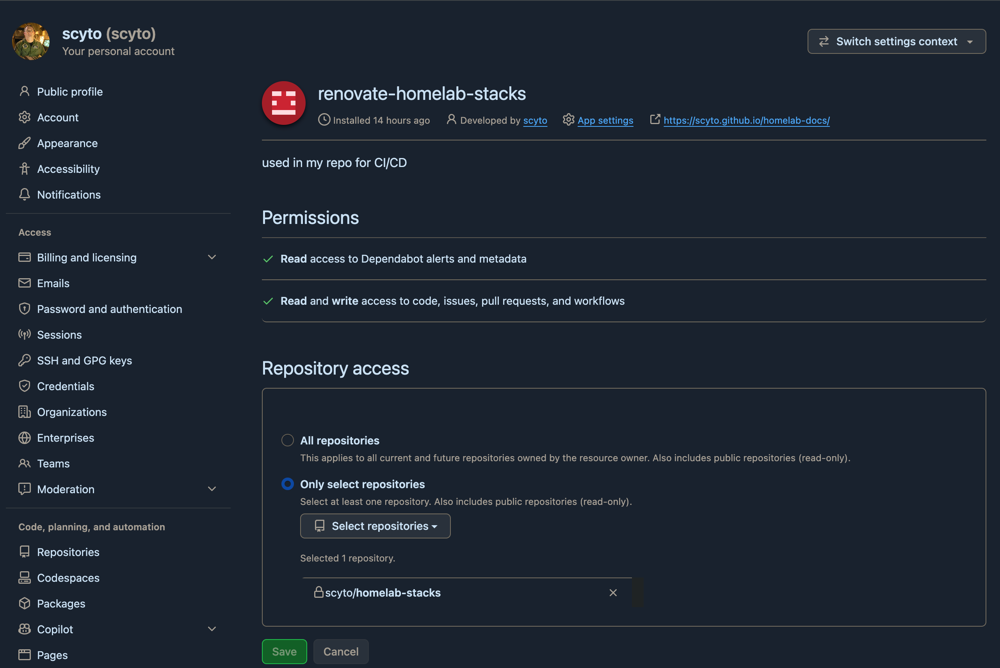
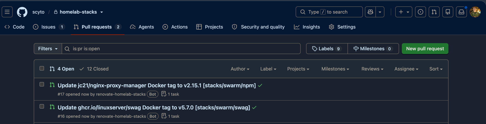
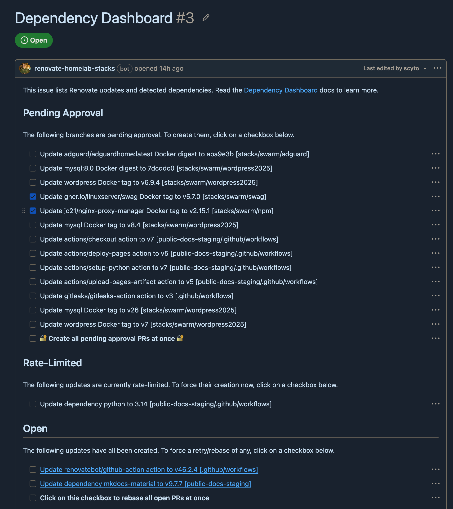
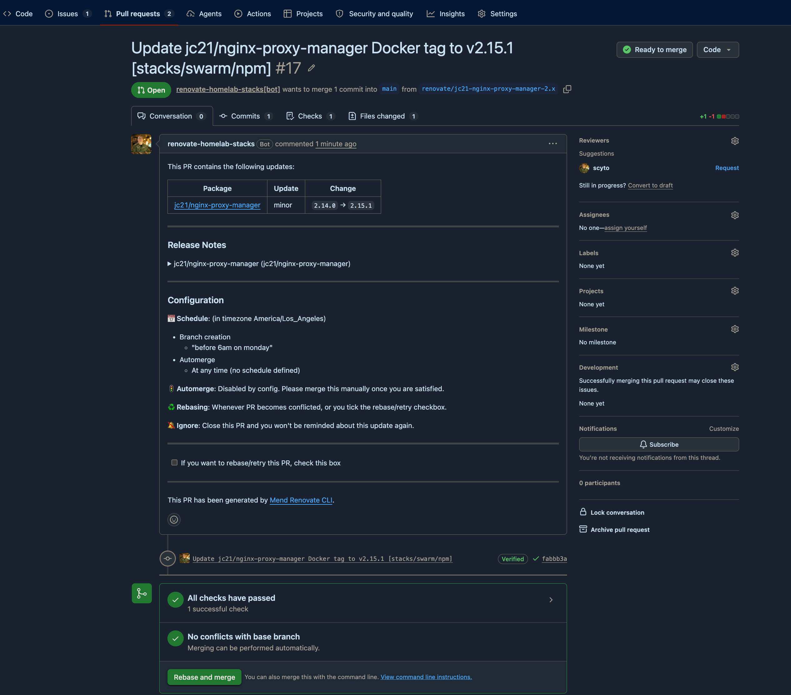

# image updates with renovate

i ran watchtower and shepherd for years, both are gone, replaced with
[renovate](https://docs.renovatebot.com/).

difference is renovate never touches a running container. it reads the compose
files in git, spots a newer image and opens a **pull request** editing the
compose. nothing moves until i merge, then my normal deploy path picks it up.

assumes you have your [stacks in git](gitops-with-portainer.md) already, this is
pointless otherwise.

## why bother

- i get a diff and a changelog link before anything moves
- i can say no, or not-this-one, per image
- covers swarm services and standalone containers the same way (watchtower could
  only do standalone, shepherd only swarm)
- nothing needs the docker socket, both the old ones held it
- rollback is `git revert`

cost is updates are no longer automatic. thats the point, but you do have to read
the PRs.

## Pre-reqs

1. compose files in a github repo
2. admin on that repo (you are adding secrets and a workflow)
3. a github account you can create an app under

i run it as a scheduled github action, **not** the mend-hosted app, because the
repo is private and i want the credentials to be mine.

## Create a github app

use an app, not a PAT. a PAT carries all your own permissions everywhere, and a
fine grained one expires within a year, after which renovate stops opening PRs
with nothing failing to tell you. an app install doesn't expire.

1. github > settings > developer settings > **GitHub Apps** > New GitHub App
2. name it whatever, homepage url can be your repo
3. **uncheck webhook active**, you don't need it
4. set the repository permissions per the table below
5. create it, then **Generate a private key**, it downloads a `.pem`
6. note the **App ID** from the top of the app page
7. Install App > install it on just the one repo, not all repos

| permission | access | why |
| --- | --- | --- |
| Contents | read & write | it pushes the branch |
| Pull requests | read & write | it opens the PR |
| Issues | read & write | the dependency dashboard *is* an issue |
| Workflows | read & write | only needed if it bumps `.github/workflows` versions |

the list in the UI is alphabetical so Contents is nowhere near Pull requests, and
Workflows is right at the bottom. easy to miss one.



## Add the two secrets

repo > settings > secrets and variables > actions > New repository secret

| name | value |
| --- | --- |
| `RENOVATE_APP_ID` | the app id number |
| `RENOVATE_APP_PRIVATE_KEY` | whole contents of the `.pem`, including the BEGIN/END lines |

## Add the workflow

`.github/workflows/renovate.yml`

```yaml
name: renovate

on:
  schedule:
    - cron: "0 12 * * 1"        # mondays ~05:00 my time
  workflow_dispatch:

concurrency:
  group: renovate
  cancel-in-progress: false

jobs:
  renovate:
    runs-on: ubuntu-latest
    steps:
      - uses: actions/checkout@v5

      - name: mint an installation token
        id: app-token
        uses: actions/create-github-app-token@v3.2.0
        with:
          app-id: ${{ secrets.RENOVATE_APP_ID }}
          private-key: ${{ secrets.RENOVATE_APP_PRIVATE_KEY }}

      - uses: renovatebot/github-action@v46.2.3
        with:
          token: ${{ steps.app-token.outputs.token }}
        env:
          RENOVATE_REPOSITORIES: ${{ github.repository }}
          RENOVATE_PLATFORM: github
          RENOVATE_BASE_BRANCHES: main
```

do **not** use the built in `GITHUB_TOKEN` here. PRs opened with it don't trigger
`pull_request` workflows, so your own validation never runs, and if main requires
those checks the renovate PRs can never be merged.

## Add renovate.json

in the repo root. this is a cut down version of mine.

```json
{
  "$schema": "https://docs.renovatebot.com/renovate-schema.json",
  "extends": ["config:recommended"],
  "timezone": "America/Los_Angeles",
  "schedule": ["before 6am on monday"],
  "prConcurrentLimit": 5,
  "dependencyDashboard": true,
  "ignorePaths": ["_attic/**"],
  "commitMessageSuffix": " [{{packageFileDir}}]",
  "packageRules": [
    {
      "matchCategories": ["docker"],
      "pinDigests": false
    },
    {
      "matchUpdateTypes": ["patch"],
      "groupName": "patch updates {{packageFileDir}}"
    },
    {
      "matchUpdateTypes": ["major"],
      "dependencyDashboardApproval": true
    },
    {
      "matchPackageNames": ["adguard/adguardhome", "jc21/nginx-proxy-manager"],
      "dependencyDashboardApproval": true
    },
    {
      "matchPackageNames": ["portainer/portainer-ee", "portainer/agent"],
      "enabled": false
    }
  ]
}
```

with the layout from the [gitops page](gitops-with-portainer.md) that gives PR
titles like:

```
Update jc21/nginx-proxy-manager Docker tag to v2.12.6 [stacks/swarm/npm]
patch updates stacks/pi-zwave01/zwave-js-ui
```

which is what you want, because merging the first one moves `deploy/swarm/npm`
and nothing else.



what each bit is doing:

- `commitMessageSuffix` puts the stack directory in the commit subject. with
  twenty odd stacks this is the difference between a readable git log and mush
- `groupName` with `{{packageFileDir}}` gives you one PR per stack instead of one
  per image, which is a lot less noise
- `dependencyDashboardApproval` = don't open a PR, put it on the dashboard with a
  checkbox and wait for me. i use it for major bumps, anything with a database in
  it, anything home assistant has to stay compatible with, and anything thats
  bitten me before
- `enabled: false` for images you never want it to touch. portainer can't safely
  redeploy itself so it stays manual
- `ignorePaths` for junk drawers, otherwise it raises PRs for stacks you aren't
  running
- if you want a whole stack left alone rather than an image, match the directory
  instead:

  ```json
  {
    "matchFileNames": ["stacks/pi-zwave01/zigbee2mqtt/**"],
    "enabled": false
  }
  ```

## Run it

don't wait until monday, run it by hand first

repo > Actions > renovate > Run workflow

first run it opens an issue called **Dependency Dashboard** listing everything it
found, plus whatever PRs it is allowed to open.





tick a checkbox on the dashboard and the PR appears on the next run.

thats it. merge a PR and your normal deploy path does the rest.

## Lock the branches down, last

do this **after** renovate has opened its first PR, not before. you cannot
require a status check until a run has reported one, and the name has to match
exactly.

on `main`:

| rule | why |
| --- | --- |
| require a pull request before merging | otherwise renovate's whole point is optional |
| require status checks, tick your validate job | this is the gate |
| block force pushes | keeps history honest |

the check name in the ruleset is the **job `name:`** from your workflow, not the
file name and not the workflow name. rename the job later and every PR sits there
forever waiting on a check that never reports, with nothing failing to tell you
why. change both together or not at all.

on `deploy/*`, block force pushes and deletions so a deploy branch can only move
forward. mind the `**` trap covered on the
[gitops page](gitops-with-portainer.md), a ruleset targeting `refs/heads/deploy/**`
matches nothing and shows as active while enforcing nothing.

do not add renovate's app to any bypass list. the point is that its PRs go
through the same gate as yours.

rolling one back once its merged is a revert on `main`, promoted forward, see
[rolling back a compose](gitops-with-portainer.md#7-rolling-back-a-compose).

## Notes

- if renovate dies with `FORBIDDEN` mentioning `["repository","issues"]` you
  missed the Issues permission, the dashboard is an issue
- if it does all your compose files fine and then fails only on a
  `.github/workflows` bump, thats the Workflows permission
- the dashboard issue regenerates, closing it does nothing, don't bother tidying it
- the dashboard doesn't say which host a stack is on, only the directory, so name
  your directories usefully
- **check your actions minutes.** my validation workflow was burning ~300 minutes
  a day which on a private repo is real money. billing rounds **each job** up to
  a whole minute, so five jobs finishing in nine seconds each bill as five
  minutes not one. i collapsed mine into a single job and it went from ~5 billed
  minutes a run to 1. the actual work takes under twenty seconds
