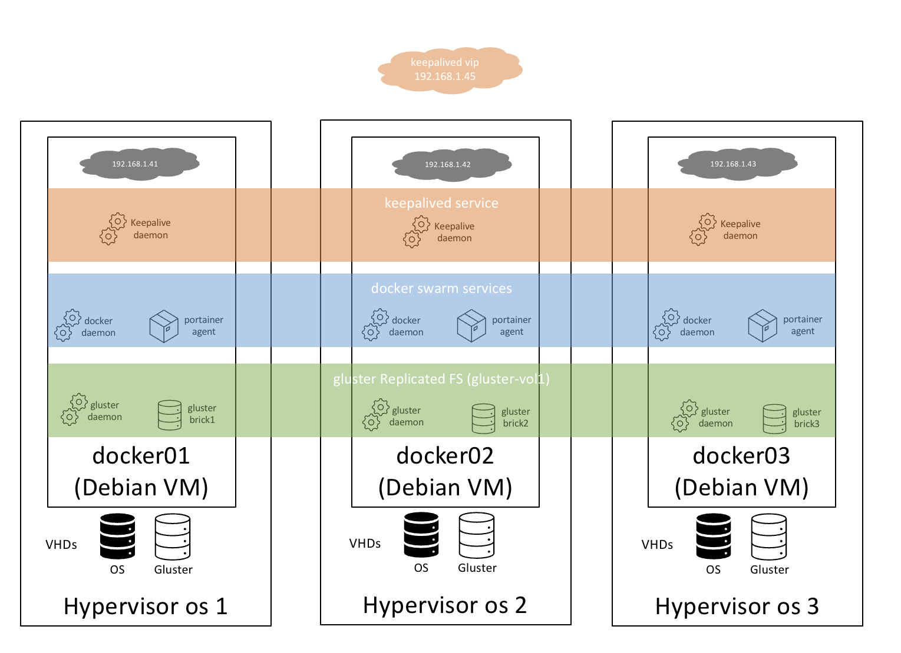

This (and related gists) captures how i created my docker swarm architecture.  This is intended mostly for my own notes incase i need to re-creeate anything later! As such expect some typos and possibly even an error...

# Installation Step-by-Step
Each major task has its own gist, this is to help with maitainability long term.
1. [Install Debian VM for each docker host](debian-vm-install.md)
2. [install Docker](install-docker.md)
3. [Configure Docker Swarm](configure-swarm.md)
4. [Install Portainer](portainer.md) 
5. [Install KeepaliveD](keepalived.md)
6. [Using VirtioFS backed by CephFS for bind mounts (migrating from glsuterFS - WIP)](../proxmox/cephfs-virtiofs-passthrough.md)
7. ~~[glusterFS disk prep, install & config ](glusterfs-install.md)~~
8. ~~[gluster FS plugin for docker (optional )](glusterfs-docker-plugin.md)~~
9. example stack templates:
    - [adguard 2 node + adguard settings sync](stacks/adguard.md)
    - [cloudflare Dynamic DNS Updater](stacks/cloudflare-ddns.md)
    - [infinitude carrier infinity thermostat control](stacks/infinitude.md)
    - [Mosquitto MQTT](stacks/mosquitto-mqtt.md)
    - [Nginx Proxy Manager (NPM)](stacks/nginx-proxy-manager.md)
    - [ouath2-proxy manager](stacks/oauth2-proxy.md)
    - [migrate portainer agent to be managed by portainer **not recommeded**](stacks/portainer-agent.md)
    - [shepherd to update swarm images](stacks/shepherd.md)
    - [traefik](stacks/traefik.md)
    - [uPoller (unifi poller)](stacks/unifi-poller.md)
    - [watchtower](stacks/watchtower.md)
    - wordpress - todo
    - [portception (portainer deployed by portainer - do not attempt)](stacks/portception.md)
    - [auto lable nodes with name of running containers](stacks/auto-label-nodes.md)

# More Details on What and Why

## design goals:
  - ensure every container stays running if any of the following fail (one VM, one hypervisor, one docker service)
  - remove chance of blackhole requests (aka eliminate the use of DNS round robin to address the service)
  - enable the use of replicated state so any container can start on any single docker swarm node and fail between nodes and see the data it needs to
  - enable safe replicated shared volume across all nodes that allow state to be replicated and accessible from all nodes and allows for use of datatbases like mariadb which will corrupt if placed on NFS or CIFS/SMB shares across the network
  - make it easy to backup with my synology (this model enabled me to easily backup using active backup for business)

## current state 4/14/2025
- VMs updated to debian bookworm using apt, and latest docker version
- still love portainer - use it so much i paid for the education/home version
- in the middle of migrating to virtioFS for bind mounmts, backed by my cephFS cluster, as my first attempt to migrate away from glusterFS
  - goal: get rid of the gluster service and vdisks
- found swarm is very bad at knowing if a volume is truly unsed or not
  - this broke badly with glusterFS
  - i removed all the volumes marked as unused created by the plugin - seems when you delete the volume using docker / portainer it deleted the volumen *AND* the data in them 
  - this seems to be because the volume is linked via inodes to the gluster storage it deleted the data on the node were it was marked unused and this deletions was replicated to all other nodes - EEK.  
  - I had to do full restore of alll 3 VM nodes from my PBS backup.  This worked surprisingy well.

## current state 9/30/2024
- all still working
- all running now on top of my proxmox cluster (see here)
- only issue is fragile GlusťerFS plugin that needs me to re-enable it when the inteface on the hosts becomes available (e.g upgrading my unifi switch)

## current state 8/26/2023
  - all seems to be functioning nearly a year layte
  - I switched fully from native nginx container to NPM
  - i elimnated NFS and iSCSI and moved all containers with state to running on GlusterFS inlcuding things with databases like wordpress
  - i plan to move the VMs from Hyper-V to my new [proxmox cluster](../proxmox/index.md)

## Architecture

### Design Assumptions
- I wanted to continue to use docker, docker-compose, docker swarm & portainer due to existing skills
- I have no interest at this time in k8s (i don't use it at work and never will)
- Start simple, even if that means i do what i shouldn't (this is just a home network)
- This is small, the containers include (nginx reverse proxy, oauth2-proxy, wordpress site + database, mqtt, upoller, cloudflare ddns) so bear that in mind, this isn't designed for super throuput or scale - its designed for some resilliency.
- I want to deploy all services (containers) with stack templates and possibly contribute back to portainer template repo
- The clustered file system must support databases on it (like mariadb)

### Design Decisions
- Debian for my docker host VMs - i seem to gel with debian and it (and other debian derivatives) seems to play nice with most contaniners
- I will only use package versions included in the debian distri (bullseye stable)
- I chosee glusterfs as my clustered, replicated file system
- Gluster volumes will be deployed in dispersed mode
- I mapped seperate VHDs into the docker hosts one for OS and one for gluster - this is to prevent risk of infinite boot loops
- my gluster service will be installed on the docker host VMs.  Best practice dicates they should be seperate VMs for scale.  But as all VMs share the same host CPU this really gives no benefit. If this turns out to be bad decision i will change.
- I wont tear down my current NFS and iSCSI mapped volumes (not shown) until glusterfs has been shown to run ok and survive reboots etc

## A note on docker swarm and state (assume you know docker already)
Docker containers are ephemeral and generally loose all their data when they are stopped. For most docker containers there is some level of confguration state you need to pass to the container (variable, file, folders of data). Simillarly many containers want to persist data state (databases, files etc)

On a single node docker most people map a directory or file on the host into the container as a volumen or bind mount.
We also see the following more advanced techniques used:

1. mount a shared CIFS or NFS volume at bootime on the docker hosts
2. defining a CIFS volume and mapping it into the container at runtime (this avoids editing fstab on the host)
3. same as aove but with NFS
4. using configs - if you have just a single, readi only, confg file that needs to  be read this can be defined.

In a swarm where you want a container to run on any node you need to find a way to make the data available on all nodes in a safe effective way.

If you have a simple container that only needs environment variables to be cofigure you can do that directly when you deploy the portainer template as a portaineer stack.  See this [cloudflare dynamic dns updater](https://gist.github.com/scyto/22d570be47ba4ce52912160878d9495e) as an example.

- Only #4 offers a safe way to make this happen (the 'config' is available to all nodes) - but this is super restrictive and doesn't help with containers that need to store more state and read/write that state. See this [mosquitto mqtt example](https://gist.github.com/scyto/e4098fcd9d35999ecc4f58f4ee42fbc7)
- #1 this can work and you can mount the shares to multiple nodes via fstab.  Typically databases cannot be placed on these shares and will ultimately corrupt.  You do have to be careful to only have one container writing to any given file to avoid potentials issues.
- #2 and #3 - thishas the advantage of not being generall mounted to the host OS, but mount on demand by the container, this reduced all the tedious mucking about is ~~hyperspace~~ fstab.  You do need to use the volumes UI in portaine for this.

and for nost folks NFS/CIFS shares are not replicated for high availability.

This is why in this architecture i have chose to see if I can overcome these limitations uings glusterfs.
