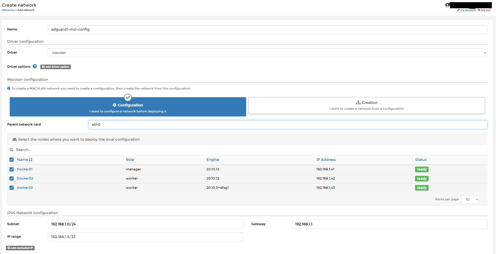
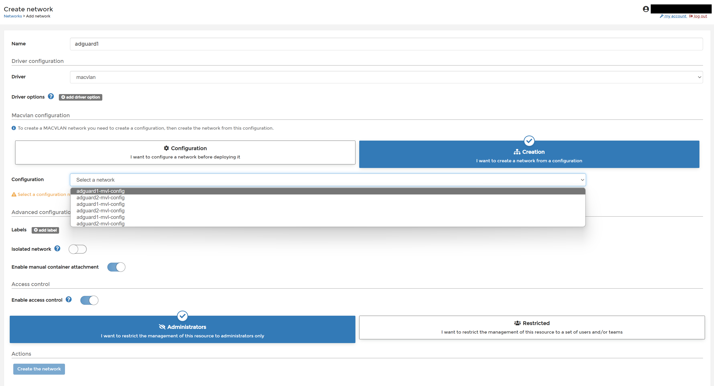
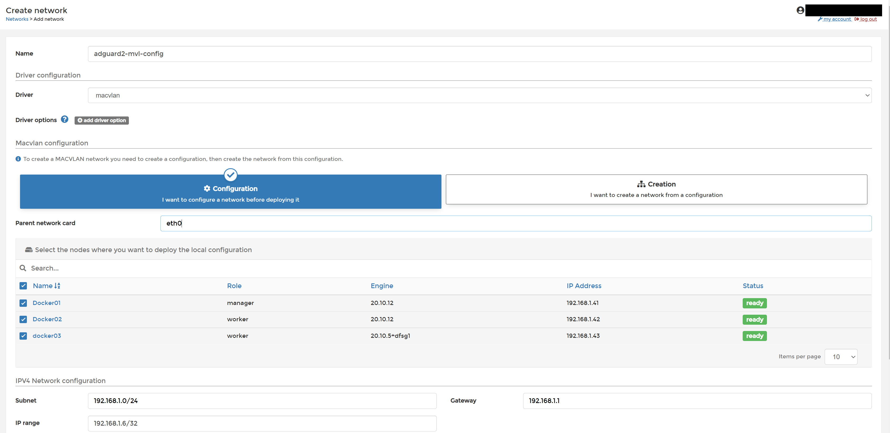
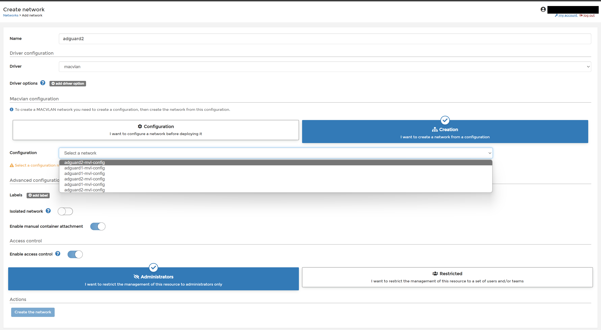

# adguard two node setup with adguard sync

## Description

UPDATED 9/2/2023 - here we are a few years later, adguuard has been stable as heck
now i wanted to add IPv6 to this mix
these were the steps
1. stop the stack
2. delete the 6 adguard config networks and the two deployed macvlans from within portainer
3. recreate using the instructions below adding the following for IPv6 (note the Ipv6 are the documented subnet examples - don't use them, use ones right for your network) 

```
node 1
subnet  2001:db8:830:1::/64
gateway 2001:db8:830:1::1
range   2001:db8:830:1::5/128

node 2
subnet  2001:db8:830:1::/64
gateway 2001:db8:830:1::1
range   2001:db8:830:1::6/128
```
4. assign the actual MVL networks (i actually renamed mine so the 6 config networks are called adguard1/2-config and the two macvlan networks are called adguard1/2-mvl - much easier, i had them the wrong way round when i wrote the original article)  
5. restart the stack (it really was this easy)
learning: also the randomness i talk about below when selecting the networks in the UI can be avoided if all your machines are hosts!
don't forget to add the IPv6 upstream resolvers in adguard
--------


I wanted redundant adguard - there are two ways to do this:
1. run single swarm instance and assume swarm will keep the service running (i ahve a template for this at the bottom of this gist)
2. run two instances so you can specify two DNS servers on client - this is much harder and requires adguard sync too - this is what we are covering in this gist.

I also wanted adguard to accurately record the client host names accessing adgaurd - this meant i needed to use macvlan networking.
I also wanted to use native ports like 443 but have other services that need to use that too so rather than use host networking i used macvlan/  This is not rquired but i wanted to make this one `interesing` :-)

## State Considerations for SWARM
Each of the two nodes needs to have their own confgi and worker mounts.  I chose to use the glusterfs volume driver to make these so they are available on any node. 

## Network Considerations
Wow, this is the most complex network setup because i need each adguard instance to be able to have its own MAC and IP address and i needed the adguard sync container to be able to sync between the two nodes.  Also macvlan in swarm is a quite complex and a little werid.  We have the following networks in this config:
- **adguard1-mvl-config   
    - public macvlan config for adguard1 and is dsitributed to all 3 docker nodes
- **adguard1              
    - public macvlan network used in the adgaurd1 container
- **adguard2-mvl-config
    - public macvlan config for adguard2 and is dsitributed to all 3 docker nodes
- **adguard2              
  - public macvlan network used in the adgaurd2 container
- **adguard_sync
  - private overlay network to allow all 3 nodes to talk to each other for purpose of sync

## Placement Considerations
It is not possible to have a single host adapter (i.e eth0) have two macvlans running at the same time.
It is not possible to have a sigle host support two default gateways.
You may see placement rejection of the second service if it initially tries to place it on the same node as the other adguard instance.  Once rejected docker will try the service on another node and it will wok.  The rejection errors can be ignored.  This works as an implicit placement constraint.  If someone knows how to specifiy that two services in the same stack run on different swarm nodes (lables won't cut it in this 3 node scenario) let me know in the comments!


## Network Preparation
This is one of the few times where showing picture will use less space than trying to explain something complex and non-intutive.
Note is asbolutely possible to do this via command line.  If you prefer that [this is the best article](https://jpft.win/docker-swarm-macvlan/) i won't be covering command line here as i didn't use it after i had learnt what i was doing :-).

Note this result in your tow adguard servers being 192.168.1.5 and 192.168.1.6 respectively.  Adjust as needed for your network.


### Define the macvlan configuration for adguard1 service
make sure you select the 3 docker nodes and get the IP details correct (modify if you don't use 192.168.1.0/24 as your LAN)
Note: the ip range of /32 is valid - this hard sets the IP on this service / container to that IP.


### Create the macvlan for adguard1 service
You will have 3 nodes to pick from (see picture) 2 will not work and throw error, 1 will work - it is trial and error to find the right one (the one that works is you managerr node, you only need to this once, not once per node)


### Define the macvlan configuration for adguard2 service
Do the same again, note the change in IP range.
make sure you select the 3 docker nodes and get the IP details correct (modify if you don't use 192.168.1.0/24 as your LAN)


### Create the macvlan for adguard2 service
Same as before, it is trial and error as to which one will work


### note on adguard sync
This is created automatically from the stack and allows all 3 nodes to talk to each other and have private name resolution (without any need to mess with DNS, hosts) it also keeps the traffic off the LAN


### if you have made it to this point, here is the template

```
version: '3.2'
services:
  adguard1:
    image: 'adguard/adguardhome:latest'
    restart: always
    volumes:
      - work1:/opt/adguardhome/work
      - config1:/opt/adguardhome/conf
    networks:
      - adguard1
      - adguard_sync

  adguard2:
    image: 'adguard/adguardhome:latest'
    restart: always
    volumes:
      - work2:/opt/adguardhome/work
      - config2:/opt/adguardhome/conf
    networks:
      - adguard2
      - adguard_sync

  adguardhome-sync:
    image: ghcr.io/bakito/adguardhome-sync
    command: run
    networks:
      - adguard_sync
    depends_on:
      - adguard1
      - adguard2
    environment:
      # Origin Server is you first server.  For first time run connect to port 3000, set username and password to what you set bellow for source and origin, settings and move admin interface port 80 when propmted.
      - ORIGIN_URL=http://adguard1
      - ORIGIN_USERNAME=username
      - ORIGIN_PASSWORD=password
      # replica server - this will be setup automatically
      - REPLICA_AUTOSETUP=true # if true, AdGuardHome is automatically initialized. 
      - REPLICA_URL=http://adguard2:3000  #note the autosetup will not move this port to 3000, hoever as it is replica it doesn't really need to be moved
      - REPLICA_USERNAME=username
      - REPLICA_PASSWORD=password
      - CRON=*/1 * * * * # run every 1 minutes
      - RUNONSTART=true
      # Configure sync features; by default all features are enabled.
      # - FEATURES_GENERALSETTINGS=true
      # - FEATURES_QUERYLOGCONFIG=true
      # - FEATURES_STATSCONFIG=true
      # - FEATURES_CLIENTSETTINGS=true
      # - FEATURES_SERVICES=true
      # - FEATURES_FILTERS=true
      # - FEATURES_DHCP_SERVERCONFIG=true
      # - FEATURES_DHCP_STATICLEASES=true
      # - FEATURES_DNS_SERVERCONFIG=true
      # - FEATURES_DNS_ACCESSLISTS=true
      # - FEATURES_DNS_REWRITES=true
    restart: unless-stopped


volumes:
  work1:
    driver: gluster-vol1
  config1:
    driver: gluster-vol1
  work2:
    driver: gluster-vol1
  config2:
    driver: gluster-vol1  

networks:
   adguard1:
     external: true
   adguard2:
     external: true
   adguard_sync:  
```   

### single node swarm - much less frightening
If you don't want to mess with all of that this will work quite fine (it still requires you to make one macvlan, but if you want to skip that and go for host networking do that.  I won't cover that here other than to say remeber you need to use the longform host publishing port syntax.

```
version: '3.2'
services:
  adguard1:
    image: 'adguard/adguardhome:latest'
    restart: always
    volumes:
      - work1:/opt/adguardhome/work
      - config1:/opt/adguardhome/conf
    networks:
      - adguard1

volumes:
  work1:
    driver: gluster-vol1
  config1:
    driver: gluster-vol1

networks:
   adguard1:
     external: true
```
