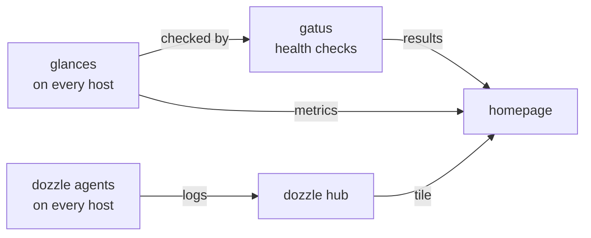

# monitoring

how i know it all works. each tool does one job:

| tool | job |
| --- | --- |
| [gatus](gatus.md) | checks that each service works, by what it returns |
| [glances](glances.md) | host metrics, on every docker host and every proxmox node |
| [dozzle](dozzle.md) | container logs from every host in one place |
| [homepage](homepage.md) | the dashboard that shows all of it |

gatus replaced uptime kuma because its config lives in git, and uptime kuma's can't.

- homepage shows gatus's results on the plumbing tab, and each host's glances on the infrastructure tab
- gatus checks the other tools too: every glances, every dozzle agent and the dashboard itself
- all of it deploys from git except glances on the proxmox nodes, which i [install by hand](glances.md#on-the-proxmox-nodes). gatus and homepage read their own config from git, so a merged change is live without a restart
