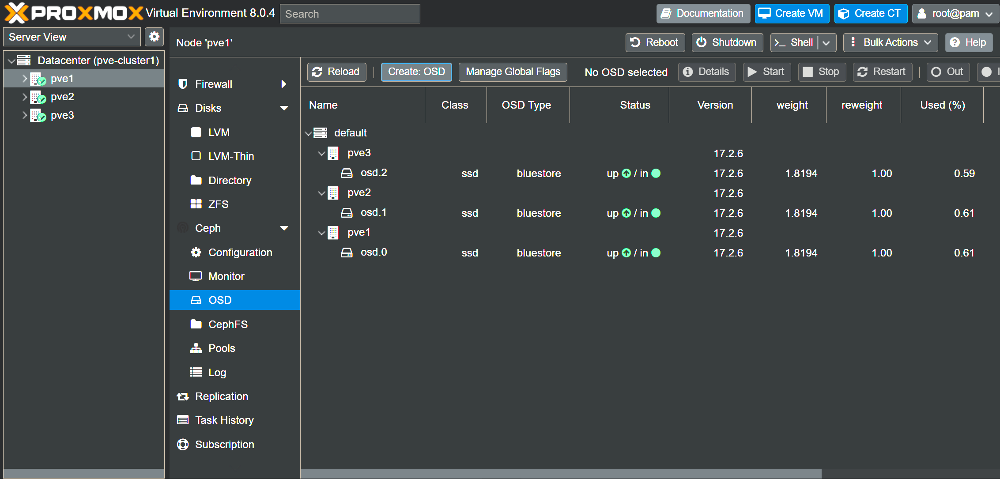

# CEPH HA Setup
**Note this should only be done once you are sure you have reliable TB mesh network.**

this is because proxmox UI seems fragile wrt to changing underlying network after configuration of ceph.

All installation done via command line due to gui not understanding the mesh network

This setup doesn't attempt to seperate the ceph public network and ceph cluster network (not same as proxmox clutser network),  The goal is to get an easy working setup.

**2025.04.24 NOTE: some folks had to switch to IPv6 for ceph due to IPv4 unreliability issues, we think as of pve 8.4.1 and all the input the community has give to update this set of gsists - that IPv4 is now reliable even on MS-01.  As such i advising everyone to use IPv4 for ceph as if you have IPv6 you will have issues with SDN at this time (if you don't use SDN this is not an issue).

[this gist is part of this series](index.md)

## Ceph Initial Install & monitor creation
1. On all nodes execute the command `pveceph install --repository no-subscription` accept all the packages and install
2. On node 1 execute the command `pveceph init --network 10.0.0.81/24`
3. On node 1 execute the command `pveceph mon create --mon-address 10.0.0.81`
4. On node 2 execute the command `pveceph mon create --mon-address 10.0.0.82`
5. On node 3 execute the command `pveceph mon create --mon-address 10.0.0.83`

Now if you access the gui `Datacenter > pve1 > ceph > monitor` you should have 3 running monitors (ignore any errors on the root ceph UI leaf for now).

If so you can proceed to next step.
If not you probably have something wrong in your network, check all settings.

## Add Addtional managers
1. On any node go to ` Datacenter > nodename > ceph > monitor` and click `create` manager in the *manager* section.
2. Selecty an node that doesn't have a manager from the drop dwon and click `create`
3 repeat step 2 as needed
If this fails it probably means your networking is not working

## Add OSDs
1. On any node go to ` Datacenter > nodename > ceph > OSD`
2. click `create OSD`select all the defaults (again this for a simple setup)
3. repeat untill you have 3 nodes like this (note it can take 30 seconds for a new OSD to go green)


If you find there are no availale disks when you try to add it probably means your dedicated nvme/ssd has some other filesystem or old osd on it.  To wipe the disk use the following UI.  Becareful not to wipe your OS disk. 


## Create Pool
1. On any node go to ` Datacenter > nodename > ceph > pools` and click `create`
1. name the volume, e.g. `vm-disks` and leave defaults as is and click `create`

<p align="center">

</p>

## Configure HA
1. On any node go to ` Datacenter > options `
2. Set `Cluster Resource Scheduling` to `ha-rebalance-on-start=1` (this will rebalance nodes as needed) 
3. Set `HA Settings` to `shutdown_policy=migrate` (this will migrate VMs and CTs if you gracefully shutdown a node).
4. Set `migration settings` leave as default (seperate gist will talk about seperating migration network later) 

## make ceph hard dependent on frr service (added 2025.04.20)

this is my blind attempt at ensuring ceph doesn't try and start until frr service is up - i don't have any tests in the startup to make sure the interfaces are up so it may not make too much diff to MS-01 users. but anyhoo here it is...

edit `/usr/lib/systemd/system/ceph.target` to look like this

```
[Unit]
Description=ceph target allowing to start/stop all ceph*@.service instances at once
After=frr.service
Requires=frr.service


[Install]
WantedBy=multi-user.target
```
note: i need to revise this as this file could be overwritten on upgrade)

## make sure VMs don't try and start before ceph service is present
### note this will stop any VMs on local storage starting too - just be aware

1. make a directory `mkdir /etc/systemd/system/pvestatd.service.d`
2. create a file in `nano /etc/systemd/system/pvestatd.service.d/dependencies.conf`
3. add to file the following

```
[Unit]
After=pve-storage.target
```
4. save

(note i am ucnlear if this currently works despite this being the recommended answer)
