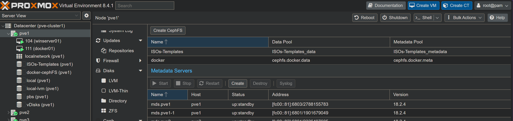
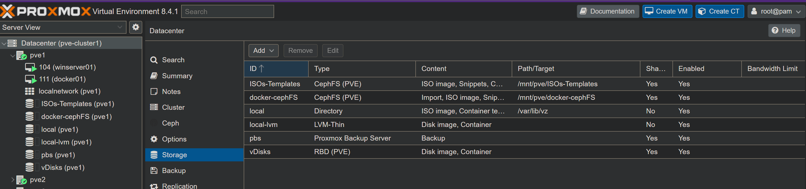
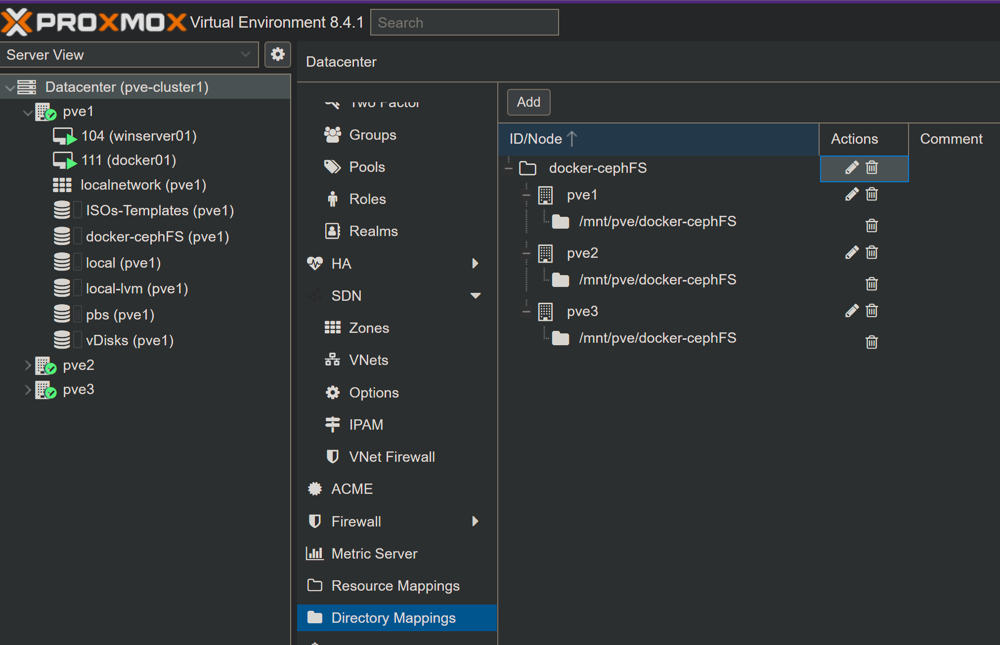
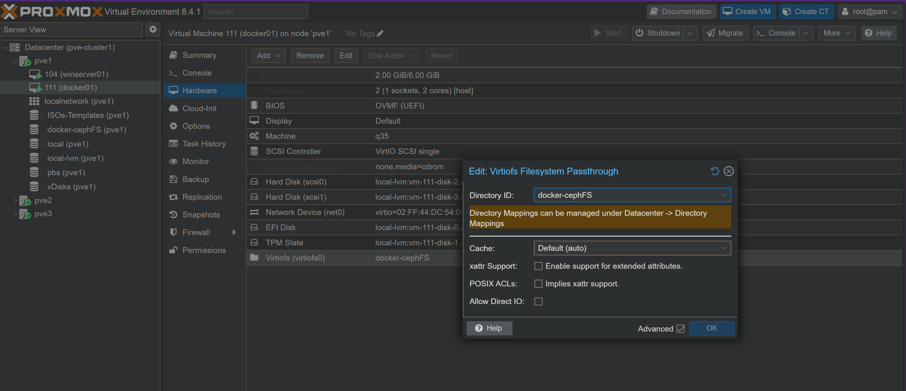

# Hypervisor Host Based CephFS pass through with VirtioFS

## Using VirtioFS backed by CephFS for bind mounts
This is currently a work-in-progress documentation - rough notes for me, maybe missing a lot or wrong

The idea is to replace GlusterFS running inside the VM with storage on my cephfs cluster.  This is my proxmox cluster and it runs both the storage and is the hypervisor for my docker VMs.

Other possible approaches:
- ceph fuse clien in VM to mount cephFS or CephRBD over IP
- use of ceph docker volume plugin (no useable version of this yet exists but it is being worked on) 

Assumptions:
- I already have a working Ceph Cluster - this will not be documented in this gist. See my proxmox gist for a working example.
- this is for proxmox as a hypervisor+ceph cluster and the VMs are hosted on the same proxmox that is the ceph cluster

## Workflow

### Create a new cephFS on the proxmox cluster
I created one called docker



The storage ID is docker-cephFS (i chose this name as I will play with ceph in a varity of other ways too)




### Add this to directory mappings




### Configure docker host VMs to pass through




### In *each* VM

In each VM

- `sudo mkdir /mnt/docker-cephFS/`
- `sudo nano /etc/fstab`
  - add ```#for virtiofs mapping
docker-cephFS  /mnt/docker-cephFS  virtiofs  defaults  0  0```
  - save the file
- `sudo systemctl daemon-reload`
- `sudo mount -a`

## Migrating Docker Swarm Stacks for exising Stack

basically its

- stop the stack
- mv the data from /mnt/gluster-vol1/dirname to /mnt/docker-cephFS/dirname

- Edit the stack to change the volume defitions from my gluster defition to a local volume - this mean no editing of the service volme lines

Example from my wordpress stack

```
volumes:
  dbdata:
    driver: gluster-vol1
  www:
    driver: gluster-vol1

```

to

```
volumes:
  dbdata:
    driver: local
    driver_opts:
      type: none
      device: "/mnt/docker-cephFS/wordpress_dbdata"
      o: bind

  www:
    driver: local
    driver_opts:
      type: none
      device: "/mnt/docker-cephFS/wordpress_www"
      o: bind

```

- triple check everything
- restart the stack

if you get an error about the volumen already being defined you may need to delete the old volume defition by had - thi can easily be done  in portainer or using the docker volume command

## Backup
havent figured out an ideal strategy for backing up the cephFS on the host or from the vm - with glsuter the bricks were stored on a dedicated vdisk - this was backed up as part of the pbs backup of the vm

As the virtioFS is not presented as a disk this doesn't happen (this is reasonable as the cephFS is not VM specific)
