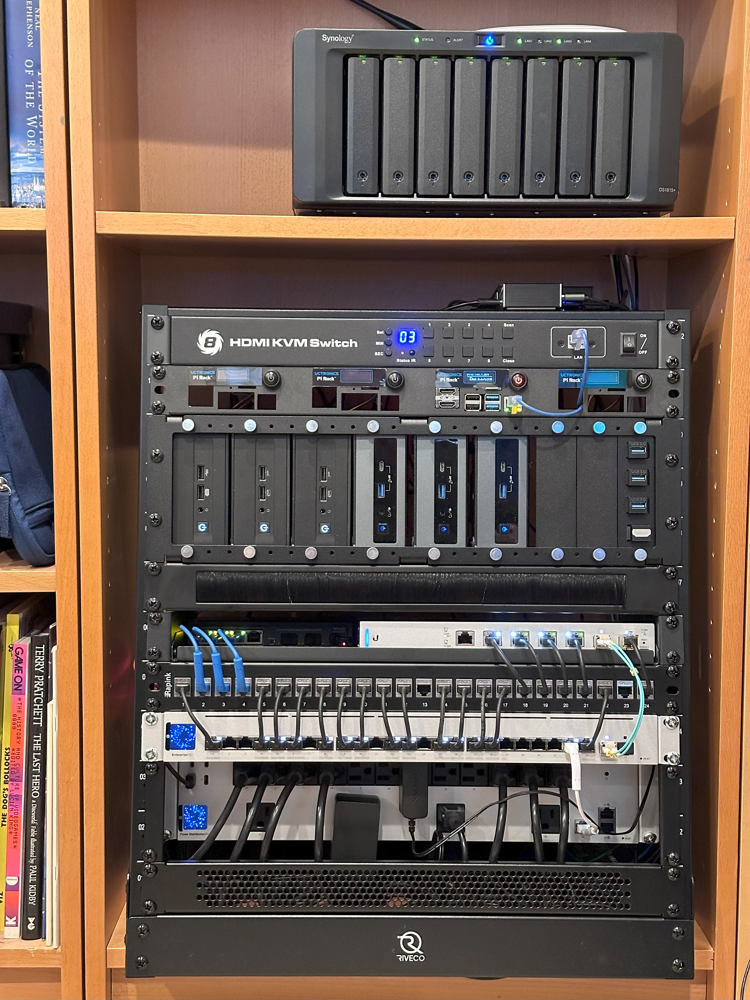

# ProxMox Cluster - Soup-to-Nutz
aka what i did to get from nothing to done.

_note: these are designed to be primarily a re-install guide for myself (writing things down helps me memorize the knowledge), as such don't take any of this on blind faith - some areas are well tested and the docs are very robust, some items, less so).  YMMV_  

[Purpose of Proxmox cluster project](#purpose-of-cluster)

[Required Outomces of cluster project](#goals-of-cluster)

<h4 align="center">The first 3 NUCs are the new proxmox cluster, the second set of 3 NUCs is the old Hyper-V nodes.</h4>

Update as of 2025.04.29
- Added some more tweaks to the thunderbolt setup, mesh setup
- added way to get VMs to access ceph mesh (no you cant bridge en05 and en06 - it breaks if you do that)
- added way to get any machine on LAN to access ceph mesh
- todo: bind my docker swarm VMs to mesh, mount ceph isnide vm (coming soon as gist)

Updates as of 2025.04.20
Been running great, still had issues with IPv4 dual fabric.  Have refactored that with some great suggestions from commenters.  Now need to see if longhaul tests prove out if these have helped.

Also made ceph take a hard dependecy on frr service being started - this may help some scenarios, but not if the thunderbolt interfaces are down, still not sure how to help folks there (this applies mostly to MS-101 users, see commnts sections of indidual gists, esp old deprecated openfrabric mesh gist) 

## Outcomes
1. [Hardware and Base Proxmox Install](hardware-and-base-install.md)
2. Thunderbolt Netwokring Setup 
   - [Prepare Thunderbolt-Net cables and interface setup](thunderbolt/cables-and-interfaces.md)
   - [Enable Dual Stack IPv4 / IPv4) Openfabric Routing Mesh (new)](thunderbolt/openfabric-mesh.md)
   - ~Enable Dual Stack (IPv4 and IPv6) Openfabric Routing Mesh (old)~ deprecated - [Old gist here](thunderbolt/openfabric-mesh-legacy.md)
   - Optional: [Enable VMs to access ceph mesh](thunderbolt/vm-access-to-mesh.md)
   - Optional: [Enable LAN clients to access mesh](thunderbolt/lan-access-to-mesh.md)
   - Optional: [cephFS Clients - mount remote cephFS volume](thunderbolt/cephfs-client-mount.md)
4. [Setup Cluster](cluster-setup.md)
5. [Setup Ceph and High Availability](ceph-and-ha.md)
6. [Create CephFS and storage for ISOs and CT Templates](cephfs-and-storage.md)
   - [cephFS - virtiofs passthrough to docker swarm VMs](cephfs-virtiofs-passthrough.md)
7. [Setup HA Windows Server VM + TPM](ha-windows-vm-tpm.md)
8. [How to migrate Gen2 Windows VM from Hyper-V to Proxmox](migration/windows-gen2-from-hyperv.md)
   1. [Notes on migrating my real world domain controller #2 ](migration/domain-controller-2.md)
   2. [Notes on migrating my real world domain controller #1 (FSMO holder, AAD Sync and CA server) ](migration/domain-controller-1.md)
   3. [Notes on migrating my windows (server 2019) admin center VM](migration/admin-center-vm.md)
9. [Migrate HomeAssistant VM from Hyper-V](migration/home-assistant.md)
10. [Migrate my debian VM based docker swarm from Hyper-V to proxmox](migration/docker-swarm-vms.md)
11. Extra Credit (optional):
    1. [Enable vGPU Passthrough (+windows guest, CT guest configs](extras/vgpu/index.md)
    2. [Install Lets Encrypt Cert (CloudFlare as DNS Provder](extras/lets-encrypt-cloudflare.md)
    3. [Azure Active Directory Auth](extras/azure-ad-auth.md)
    4. [Install Proxmox Backup Server (PBS) on synology with CIFS backend](extras/proxmox-backup-server.md)
    5. [Send email alerts via O365 using Postfix HA Container](extras/postfix-o365-relay.md)
12. [Random Notes & Troubleshootig](troubleshooting.md)

# TODO
- add TLS to the mail relay?  with LE certs? maybe?
- maybe send syslog to my syslog server (securely)
- figure out ceph public/cluster running on different networks - unclear its needed for this size of install
- get all nodes listening to my network UPS and shut down before power runs out
- using one of these three ceph volume plugins [Brindster/docker-plugin-cephfs](https://github.com/Brindster/docker-plugin-cephfs) [flaviostutz/cepher](https://github.com/flaviostutz/cepher) [n0r1sk/docker-volume-cephfs](https://gitlab.com/n0r1sk/docker-volume-cephfs) each has different strengths and weaknesses (i will like choose either the n0r1sk or the Brindster one) - until i figure out ceph networking more this is dead in the water as ceph isn't reachable from LAN or docker swarm VMs - so using virtiofs linked in main items above.

## Purpose of cluster
I have been using Hyper-V for my docker swarm cluster VM hosts ([see other gists](../docker-swarm/index.md)).  Original intenttion was to try and get Thunderbolt Networking for a Hyper-V cluster going and clustered storage for the VMs.  This turns out to be super hard when using NUCs as cluster nodes due to too few disks.  I looked at solar winds as alternative but this was both complex and not pervasive.

I had been watching proxmox for years and thought now was a good time to jump in and see what it is all about. 
(i had never booted or looked at proxmox UI before doing this - so this documentation is soup to nuts and intended for me to repro if needed)

### Goals of Cluster
1. VMs running on clustered storage {completed}
2. Use of ThunderBolt for ~26Gbe Cluster VM operations (replication, failover etc)
    - Thunderbolt meshs with OSPF routing {completed}
    - Ceph over thunderbolt mesh {completed}
    - VM running with live migration {completed}
    - VM running with HA failove of node failure {completed}
    - Seperate VM/CT Migration network over thunderbolt mesh    {not started}
4. Use low powered off the shelf Intel NUCs {completed}
5. Migrate VMs from Hyper-V:
    - Windows Server Domain Controler / DNS / DHCP / CA / AAD SYNC VMs {not started}
    - Debian Dcoker Host (for my 3 running 3 node swarm) VMs {not started}
    - HomeAssistant VM {not started}
7. Sized to last me 5+ years (lol, yeah, right)

### Hardware Selected
1. 3x 13th Gen Intel NUCs (NUC13ANHi7):
    - Core i7-1360P Processor(12 Cores, 5.0 GHz, 16 Threads)
    - Intel Iris Xe Graphics
    - 64 GB DDR4 3200 CL22 RAM
    - Samsung 870 EVO SSD 1TB Boot Drive
    - Samsung 980 Pro NVME 2 TB Data Drive
    - 1x Onboard 2.5Gbe LAN Port
    - 2x Onboard Thunderbolt4 Ports
    - 1 x 2.5Gbe usinng Intel NUCIOALUWS nvme epxansion port
3. 3 x OWC TB4 Cables 

### Key Software Components Used
1. Proxmox v8.x
2. Ceph (included with Proxmox)
3. LLDP (included with Proxmox)
4. Free Range Routing - FRR OSPF - (included with Proxmox)
5. nano ;-)

### Key Resources Leveraged
[Proxmox/Ceph Guide](https://packetpushers.net/proxmox-ceph-full-mesh-hci-cluster-w-dynamic-routing/) from packet pushers

[Proxmox Forum - several community members were invaluable in providing me a breadcrumb trail.](https://forum.proxmox.com/threads/intel-nuc-13-pro-thunderbolt-ring-network-ceph-cluster.131107/)

[systemd.link manual pages](https://www.man7.org/linux/man-pages/man5/systemd.link.5.html)

[udevadm manual](https://www.man7.org/linux/man-pages/man8/udevadm.8.html)

[udev manual](https://www.man7.org/linux/man-pages/man7/udev.7.html)
