# EFI / BIOS changes

# These are the steps need to boot disks when the source hypervisort (in my case hyper-v) was using EFI and GPT disks.

Note wether the OS is Debian, Ubuntu, etc or Windows these steps change - the main difference will be step 7 and the name of the efi file.  You will only need to do this if the OS has been install on  a source hypervisor where EFI was enabled on VMs (e.g. gen2 VMs on Hyper-v)

## Steps

1. boot and entio bios to change UEFI order click in console as it says bootin and mash esc key until you see:

    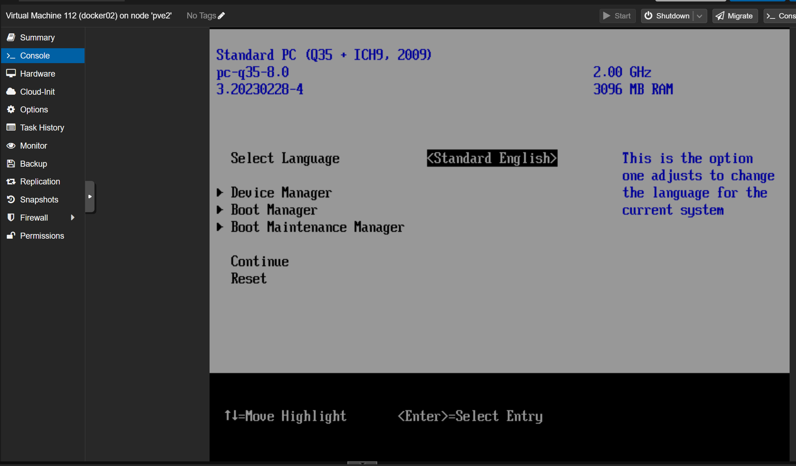{ width="600" }

2. select boot maintenace manager above

    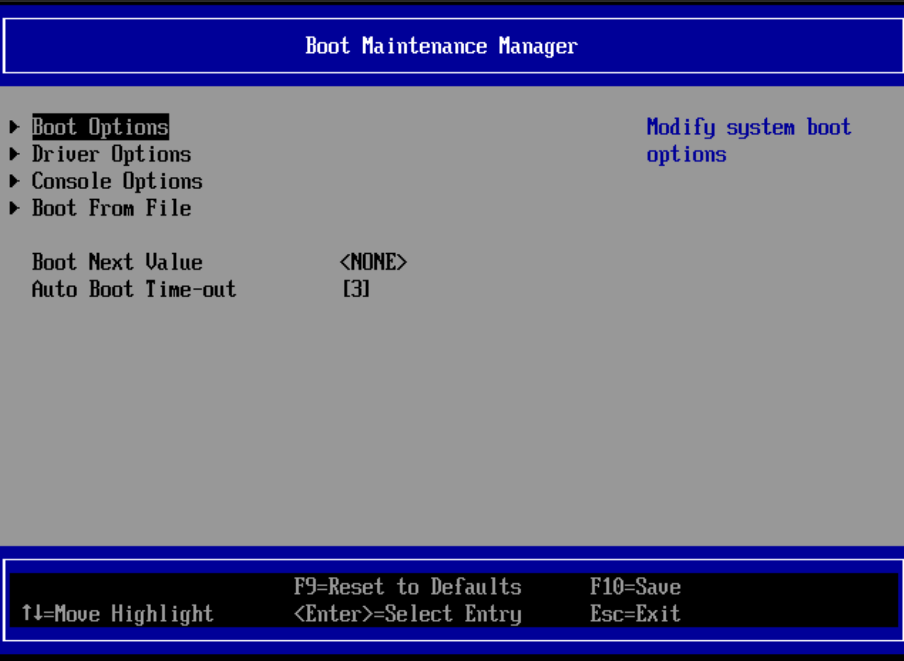{ width="600" }

3. then select boot options.

    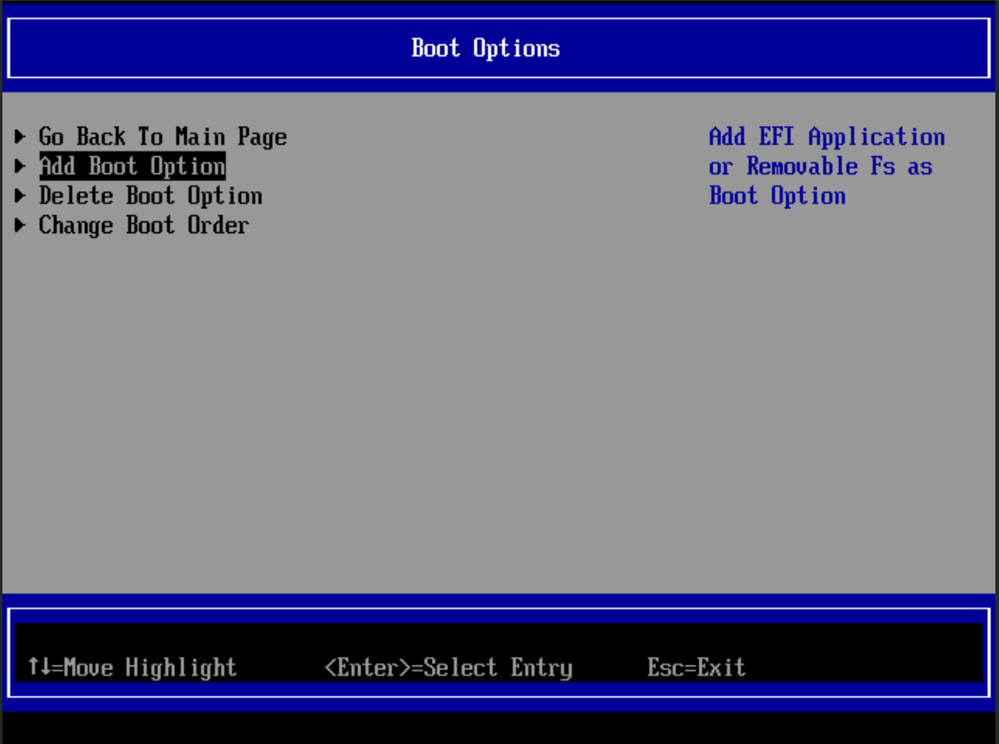{ width="600" }

4. then select add boot option

    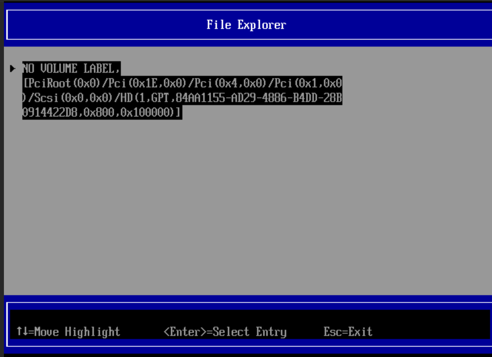{ width="600" }

5. then select the boot volume (if you did [step 8](docker-swarm-vms.md) right there will be only one)

    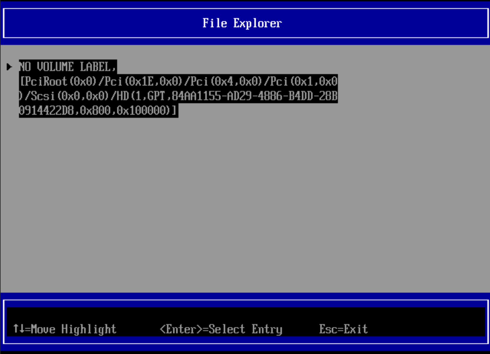{ width="600" }

6. select EFI

    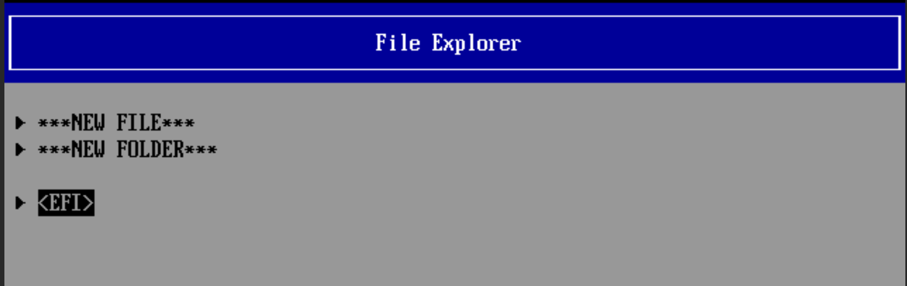{ width="600" }

7. select the OS (in my case debian)

    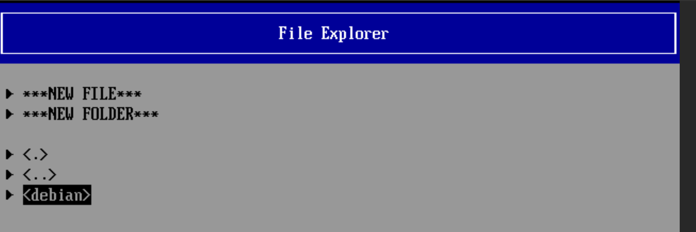{ width="600" }

8. select the right EFI file - in my case either grubx64.efi or shimx64.efi will work, i go with grubx64.efi

    { width="600" }

9. add a description - anything will do, just rememebr it

    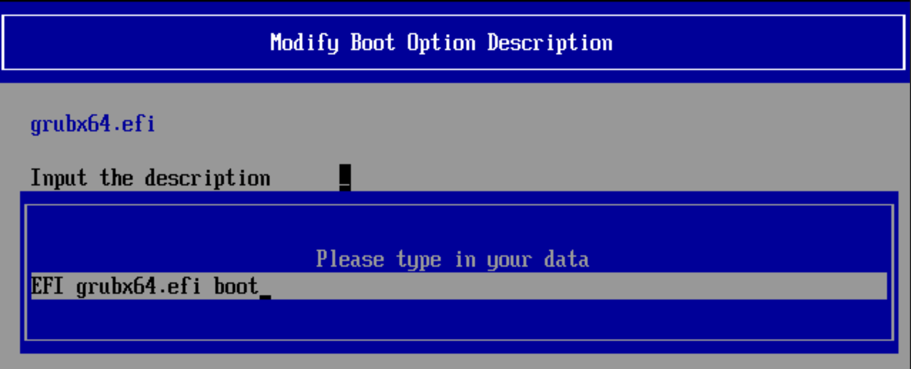{ width="600" }

10. commit changes and exit

    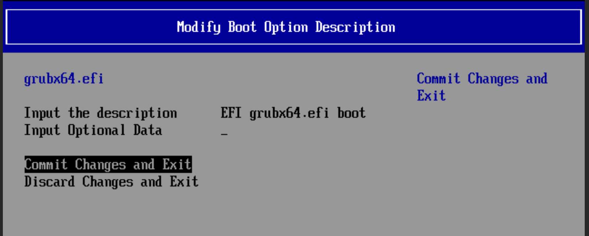{ width="600" }

11. select change boot order:

    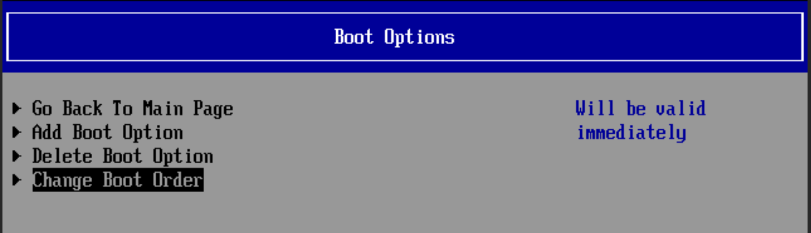{ width="600" }

12. select what you see here ny default by pressing enter:

    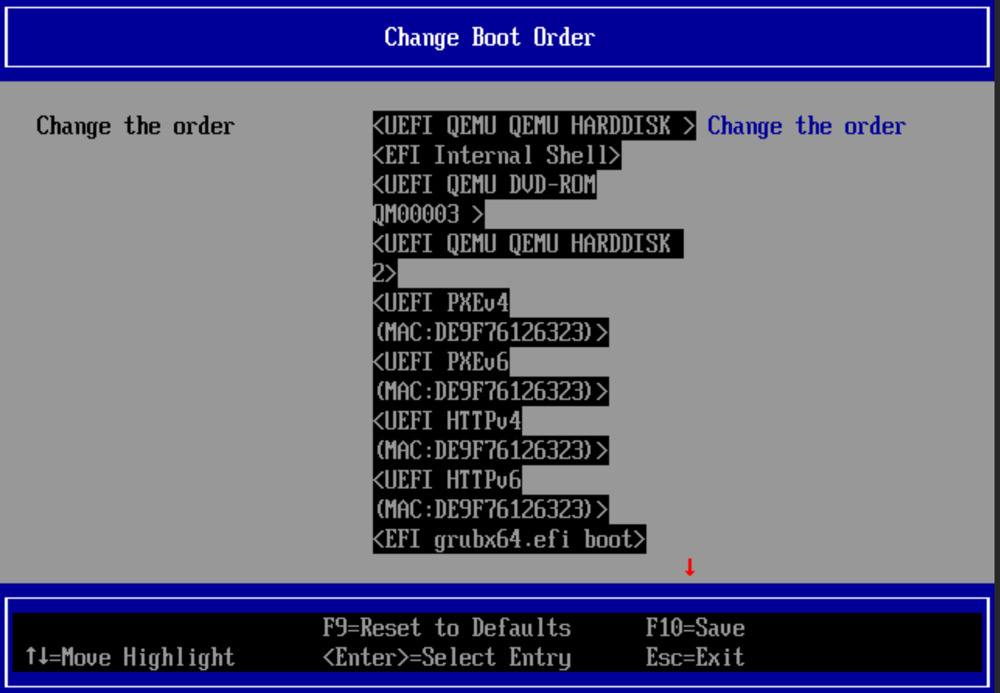{ width="600" }

13. now highlught the entry you made:

    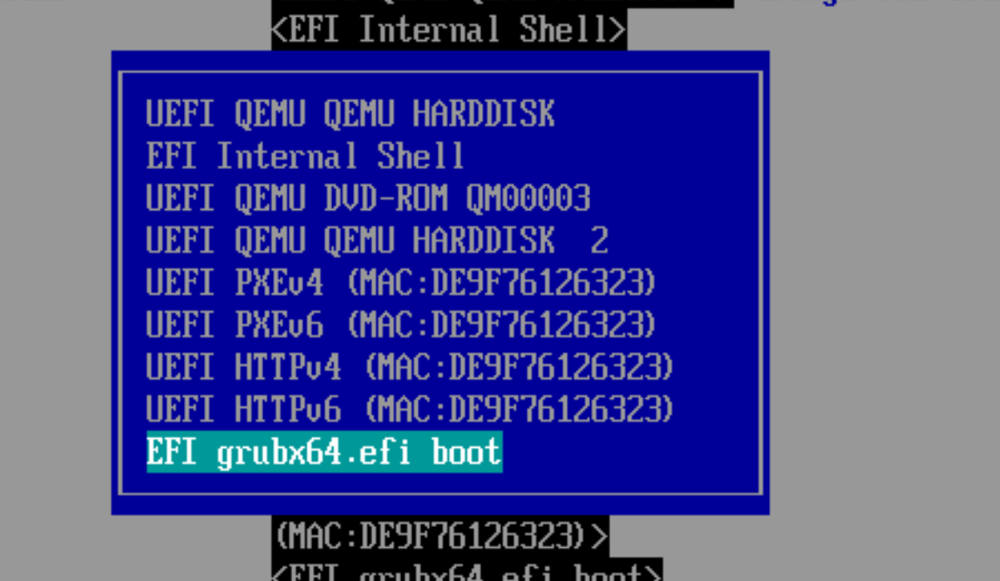{ width="574" }

14. and keep pressing + until it looks like this and press enter:

    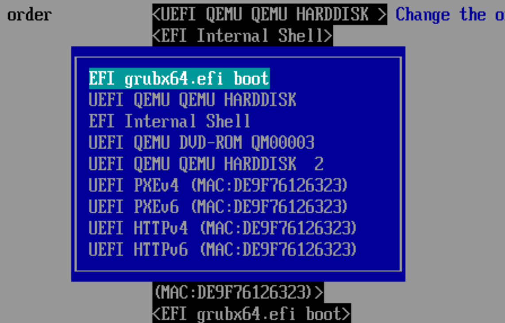{ width="571" }

15. you be back here, press F10 to save, and then esc and esc and   :

    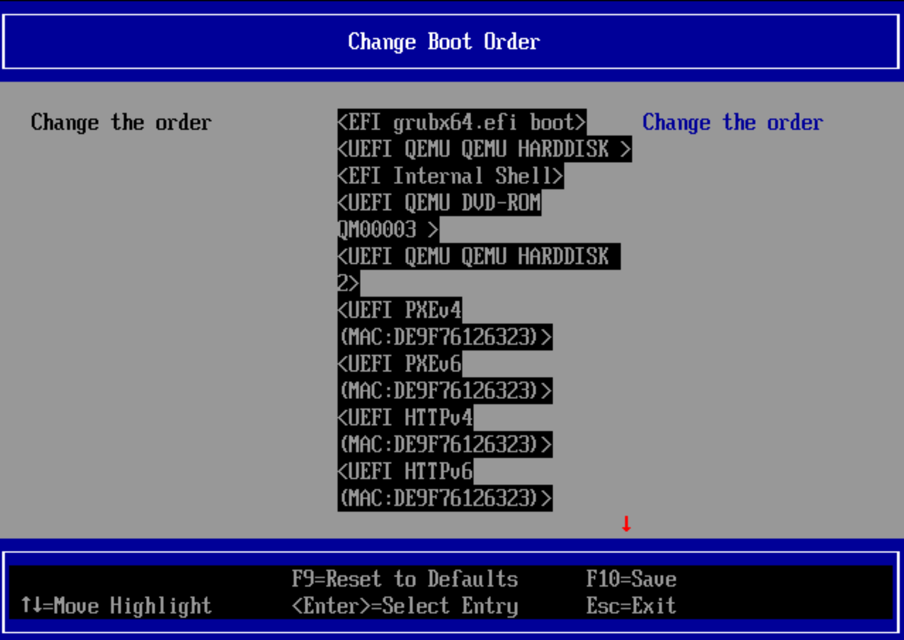{ width="600" }

16. when you are back here choose reset and your new vm will boot

    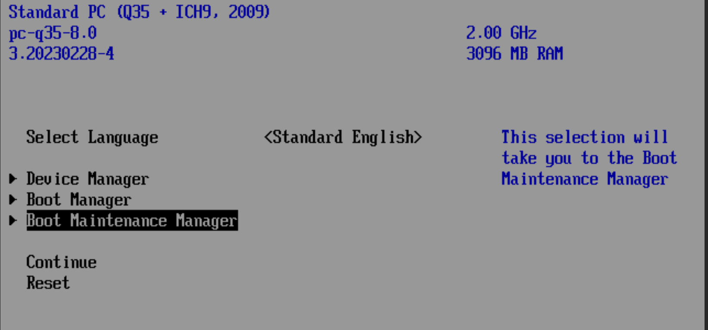{ width="600" }
