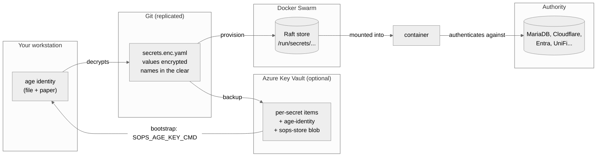
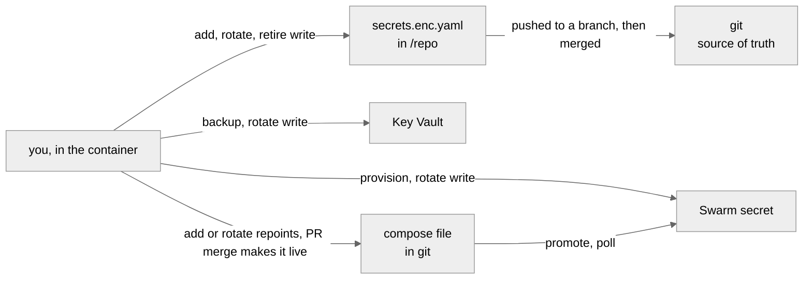
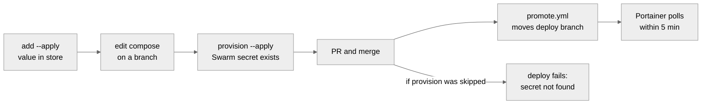

# Secrets: background

Why the secret store works the way it does, and reference material. The
procedures are separate: [ADD.md](add.md), [ROTATE.md](rotate.md),
[RETIRE.md](retire.md) and [RECOVER.md](recover.md). The incidents and rejected
alternatives behind these choices are in
the design notes in my private repo.
The key-manager container and its commands are in
[KEY-MANAGER.md](key-manager.md).

---

## The problem

A container needs a password. Four places will take it and leak it:

| Route | Who can read it |
| --- | --- |
| Compose file in git | anyone with the repo, forever, including history |
| Portainer environment variable | anyone with Portainer, and it lands in the service spec |
| The service spec | anyone who can read the Docker API; here that was the whole LAN, through `dockerproxy:2375`, with no credentials |
| A Docker label | anyone with socket access; labels cannot reference secrets at all |

The third one was real here. On 2026-08-22, `2375` returned 23 services with no
authentication, 16 of them exposing environment variables including
`MYSQL_ROOT_PASSWORD` and `REPLICA_PASSWORD`. That port is closed now:
`dockerproxy` publishes no host port, and only containers on its overlay reach
it. A value in the spec is still readable by anything that can read the API.

So the value has to reach the process without passing through the repo, the
stack definition, or the service spec.

A second problem follows: the value has to live somewhere you control, be
recoverable after a total loss, and be reviewable in a pull request without
being readable in one.

---

## age and SOPS

**age** encrypts files. One keypair, two strings. This pair is an example, not
this estate's key:

```
# public key: age1yourpublickeyhere
AGE-SECRET-KEY-1<58 more characters, all on this one line>
```

The `age1...` recipient encrypts and is safe to commit. The
`AGE-SECRET-KEY-1...` identity decrypts and is the one thing to protect. Both
are single lines, so the identity fits on paper or in a vault item.

**SOPS** encrypts *values inside a structured file* and leaves the keys
readable:

```yaml
npm_db_password_v2:
    note: rotated 2026-08-25
    value: ENC[AES256_GCM,data:Kx8f2Q==,iv:...,tag:...,type:str]
```

That property is the reason for the pairing. A diff shows *which* secret
changed and when, without showing what it changed to, so rotation is
reviewable. Plain age would give one opaque blob and `git log` would say
nothing.

SOPS does not implement the cryptography. It generates a data key, encrypts
values with it, then wraps that data key for each configured recipient: age
here, but equally Azure Key Vault or AWS KMS. Recipients can be added later
without re-encrypting the file.

Chosen over the alternatives because the store is a file in git: it replicates
with the repo, needs no server, and works offline. See
the design notes in my private repo.

---

## The model



| Copy | Job | Lose it and... |
| --- | --- | --- |
| `secrets/secrets.enc.yaml` | source of truth | nothing, it is in git |
| age identity | decrypts the store | the store is unreadable |
| Azure Key Vault | offsite copy **and** bootstrap | fall back to the local key |
| Swarm Raft | what containers read | reprovision from the store |

The store is useless without the identity; the identity is useless without the
store.

### Where Key Vault fits

Key Vault is **a layer, not a variant**. The age identity is the root of trust
either way. The vault holds a copy of it, plus a write-ahead log during
rotation.

Everything is identical with or without it, except:

- **Bootstrap and recovery** differ. [RECOVER.md](recover.md) gives both paths.
- **Adding and retiring** gain one trailing `backup --apply`.
- **A rotation** without a vault is not resumable if it dies partway.

Without a vault the identity exists only on your disk and on paper. Losing
both loses every secret.

---

<span id="everything-runs-in-a-container"></span><span id="swarm-access"></span><span id="three-ways-to-run-it"></span><span id="once-you-are-in-the-container"></span><span id="what-each-mount-is-for"></span><span id="what-feed-can-reach"></span><span id="on-other-machines"></span>Running the container, what it mounts and what `feed` can reach moved to [KEY-MANAGER.md](key-manager.md).

---

## Where a change has to travel

A secret exists in up to four places, and a change is not finished until each
one that matters has it. This is the part it is easiest to get half-done.



| Place | What puts it there | If you skip it |
| --- | --- | --- |
| `/repo/secrets/secrets.enc.yaml` | `add`, `rotate`, `retire` | nothing else works |
| **git** | **you push after `add`; `rotate` and `retire` push their own branch; then a PR merge** | the repo disagrees with everything else |
| Key Vault | `rotate`, `backup --apply` | recovery restores an older store |
| Swarm | `rotate`, `provision` | the container has nothing to mount |
| the compose file | `add` or `rotate` repoints it; the PR merge makes it live | the container mounts the OLD secret |

**Nothing is finished until it is pushed and merged.** `add` writes the store
and leaves the commit to you. `rotate` and `retire` commit and push a branch of
their own. Until the push, the repo everyone else clones is behind, and nothing
detects that: `backup --verify` compares the store against the vault, and
`check` compares compose against whatever is committed. Neither compares the
vault against git.

**So make changes from a full clone.** A store-only directory, which is what
`restore` gives you, is for reading and for rebuilding a Swarm. Change a secret
there and it has nowhere to go. Signed in to GitHub, `rotate` says so only at
the end, after it has already written the new value to Key Vault, the store and
Swarm:

```
  NOT PUSHED  /repo is not a git clone, so nothing can be committed
```

Signed out, it refuses before generating anything.

### Does the stack need changing?

Almost always yes, and for a specific reason: **Swarm secrets are immutable**,
so `rotate` cannot replace a value in place. It creates a new name, and the
compose file has to point at it.

| Situation | Compose change? |
| --- | --- |
| Swarm secret, rotated to `_v2` | **yes**, that is the whole point |
| Value edited in place under the same name | no, but the Swarm keeps the old value until you remove and recreate the secret, which restarts the service |
| Still a Portainer environment variable | only its `x-secrets` line, which restarts nothing. The new value goes into the Portainer stack variable by hand |
| Not deployed anywhere (`WHERE` is `-`) | no |

`check` is what catches the mistake: it fails if a compose file mounts a name
the store does not have. It runs in CI on every PR and needs no key, because
names are plaintext by design.

---

## How `rotate` makes a value

**The command creates the value. You never see it and are never asked for it.**
It is 32 bytes from the system random source, rendered as 43 characters, and it
goes straight to Key Vault, the store and Swarm without passing through a
terminal, a file, or a command line. What you see is:

```
  rotating    my_new_secret  ->  my_new_secret_v2
  new value   43 chars, urlsafe, 256 bits, generated by this command. You never
              see it and are never asked for it.
  old digest  8a36ac856a42   (keyed; for spotting reuse elsewhere)
```

That is deliberate. A value a person picks carries a pattern no matter how long
it is, and one leak then makes the others guessable. Nothing here is ever typed
or remembered, so there is nothing to gain by choosing it.

If you genuinely need to read it, for pasting into a provider's web console:

```bash
key-manager akv-get my_new_secret_v2
```

## Changing one field with `sops set`

`add` uses `sops set` underneath. It is still the tool for changing one field of
an existing entry:

```bash
sops set secrets/secrets.enc.yaml '["secrets"]["my_new_secret"]' --value-stdin
# then paste the JSON-encoded value, e.g.  "hunter2"   <- quotes required
```

`--value-stdin` keeps the value out of process listings. Input is **JSON**, so
a bare string needs its quotes. It also echoes what you paste, and shows no
count, which is how a doubled paste went unnoticed once.

---

## Delivering a secret to the container

Check the image first. `docker image inspect` is definitive and has been right
every time here.

```bash
docker image inspect <image> --format '{{json .Config.Env}}'      # look for *_FILE
docker image inspect <image> --format '{{json .Config.Entrypoint}} {{json .Config.Cmd}}'
docker run --rm --entrypoint /bin/sh <image> -c 'echo has-shell'  # mechanism 4?
```

| # | Mechanism | Use when | In the service spec? |
| --- | --- | --- | --- |
| 1 | **Native**, app reads `/run/secrets/<name>` | the app supports it | no |
| 2 | **`_FILE` convention** | image declares `SOMEVAR_FILE` | no |
| 3 | **Config-file-as-secret** | the secret *is* the config file | no |
| 4 | **Entrypoint wrapper** | image has a shell but no `_FILE` | no |
| 5 | **Portainer env var** | distroless, no `_FILE` | **yes** |

**No mechanism puts a secret in a Docker label.** A label is part of the
service spec by definition. What a label can carry is a placeholder that the
app reading it fills from a file: see
[placeholders](#placeholders-an-app-fills-from-a-file).

### 1. Native

```yaml
services:
  app:
    secrets: [my_new_secret]
secrets:
  my_new_secret:
    external: true
```

`external: true` means `docker stack rm` will not delete it.

**On a standalone endpoint there are no Swarm secrets, so bind the file.** The
app still reads `/run/secrets/<something>`; a bind puts a host file there:

```yaml
services:
  frigate:
    volumes:
      - /mnt/fast/configs/frigate/frigate_plus_api_key:/run/secrets/PLUS_API_KEY:ro
```

- The file holds the **raw value** and nothing else. It is read as the secret,
  not parsed.
- Mode 600, owned by root, on a dataset the snapshot task covers.
- **A bind source that does not exist becomes a DIRECTORY**, and the app then
  reads a directory as a key.
- `env_file:` is NOT an alternative here. It is read by whatever *runs*
  compose, not bind-mounted by the daemon -- and Portainer deploys truenas1
  through `portainer-agent`, whose only mounts are the Docker socket and
  `/mnt/.ix-apps/docker/volumes`. It cannot see `/mnt/fast/configs` at all, so
  the deploy fails outright. A bind is resolved by the daemon on the host,
  which is why one works and the other cannot.

**When the app dictates the filename, declare it in `x-secrets` anyway.**
frigate reads `/run/secrets/PLUS_API_KEY` because `frigate/plus.py` looks for
the file named after the variable. That name cannot also be the globally unique
store name, so the usual "the path IS the link" property does not hold:

```yaml
x-secrets:
  PLUS_API_KEY: frigate_plus_api_key_v1  # gitleaks:allow
```

`check` accepts a declaration satisfied by an interpolated `${VAR}`, a literal
`/run/secrets/<VAR>`, or `VAR=` set to a path, in the same file, and the derived
scan defers to the mapping rather than demanding a store secret called
`PLUS_API_KEY`.

### 2. The `_FILE` convention

```yaml
    environment:
      APP_SECRET_FILE: /run/secrets/my_new_secret
    secrets: [my_new_secret]
```

Confirm the variable in the image's own `ENV` rather than in its docs.

### 3. Config-file-as-secret

The secret is the whole config file. `adguardhome-sync` runs
`--config /run/secrets/adguard_sync_config`, a YAML document containing both
credentials.

### 4. Entrypoint wrapper

For an image with a shell but no `_FILE` support.

```yaml
    entrypoint:
      - /bin/sh
      - -c
      - >
        set -e;
        MY_VAR="$$(cat /run/secrets/my_new_secret)";
        export MY_VAR;
        exec <the image's real entrypoint AND cmd>
```

Four things to get right.

**Never `export VAR="$(cat ...)"`.** `export` is a command whose own exit status
is 0, so `set -e` cannot see a failed `cat` and the app starts with an **empty**
value. A plain assignment propagates the failure:

```
sh -c 'set -e; V="$(cat /nope)"; export V; echo REACHED'   # exit 1, silent
sh -c 'set -e; export V="$(cat /nope)"; echo REACHED'      # exit 0, REACHED
```

An empty value usually fails quietly rather than loudly. `unifiapibrowser`
falls back to an auth mode UniFi OS refuses, `cloudflare-ddns` stops updating
the DNS record, which goes stale when the address changes, and `infinitude`
uses a default baked into the image.

**Exec the entrypoint *and* the cmd.** Overriding the entrypoint **clears** the
image's `CMD`, in Compose and with `docker run --entrypoint` alike. Read both
from `docker image inspect` and reproduce both.

**`$$` is Compose's escape for a literal `$`.** A single `$` is substituted by
Compose at deploy time, which is the thing you are avoiding.

**`exec` preserves PID 1**, which s6-based images require for signal handling.

Test the wrapper against the real image before deploying, both ways:

```bash
WRAP='set -e; V="$(cat /run/secrets/x)"; export V; exec <real entrypoint and cmd>'
docker run --rm --entrypoint /bin/sh <image> -c "$WRAP"; echo "no secret: exit=$?"   # must be non-zero
docker run --rm -v /path/to/fake:/run/secrets/x:ro --entrypoint /bin/sh <image> -c "$WRAP"
```

### 5. Portainer environment variable

For distroless images that have no shell and no `_FILE` support. The value
lands in the service spec, where anything that can read the Docker API reads it
back, as the whole LAN once could on `2375`. Use it only when none of the other
four apply.

> **It does not survive a stack edit, and fails silently.** A Portainer stack
> variable is typed into the UI, and editing a stack detaches and recreates it
> -- the variable goes too. On 2026-09-20 frigate's running container was found
> with `PLUS_API_KEY` set to the **empty string**: Frigate+ uploads had been
> unauthenticated since the migration and nothing reported it. On a standalone
> endpoint, prefer a bind into `/run/secrets` (mechanism 1); this one is for
> Swarm, where there is no single host to put a file on.

This mechanism always has to say which stored secret it uses. The other four
name it in the `/run/secrets/<name>` path, so the file already says it, except
where the path names something else, as frigate's does above and Homepage's do
below. Here the value arrives as `${SOME_VAR}` from a Portainer stack variable,
and nothing would otherwise connect the two:

```yaml
x-secrets:
  OAUTH2_PROXY_COOKIE_SECRET: oauth_cookie_secret
```

A top-level `x-` key is not part of any service spec, so adding one restarts
nothing. `check` verifies both halves: the variable must really be interpolated
in that file, and the target must really be in the store.

Matching the names instead does not work. `MYSQL_PASSWORD` is required by both
`npm` and `wordpress2025` for two different values, because mariadb calls it
that in every stack that runs it. A store name is global; an image's variable
name is not.

### Placeholders an app fills from a file

Some apps take a placeholder where the value would go, and fill it from a file
when they read it. The placeholder can then sit where a secret never could,
even in a label. Two do it here.

**Homepage** replaces `{{HOMEPAGE_FILE_X}}`, in its config files and in the
`homepage.*` labels it discovers, with the contents of the file that its own
`HOMEPAGE_FILE_X` variable names. adguard's dashboard widget signs in that way,
and its label holds only the placeholder:

```yaml
    deploy:
      labels:
        - homepage.widget.password={{HOMEPAGE_FILE_ADGUARD1_PASSWORD}}
```

**Gatus**, in this estate's fork, reads `${VAR}` in its config from the file
that `VAR_FILE` names, when that is set. `PROXMOX_TOKEN_FILE` points at
`/run/secrets/proxmox_api_token_v1`, so `${PROXMOX_TOKEN}` in a check is the
token. Upstream declined the feature.

When the file is a Swarm secret, as gatus's is, its `/run/secrets/<name>` path
is the link and nothing more is declared. When it is a file you place yourself,
as Homepage's are, on its config volume, the path names no stored secret, so
declare the mapping in `x-secrets` as mechanism 5 does:

```yaml
x-secrets:
  HOMEPAGE_FILE_RADARR_KEY: radarr_api_key_v1  # gitleaks:allow
```

`check` accepts that declaration when the same compose file sets the variable
to a path, `HOMEPAGE_FILE_RADARR_KEY=/app/config/secrets/radarr_key`. A value
written there instead of a path does not satisfy it. `provision` does not create
these files: `feed` writes them, as in
[ADD.md, step 6b](add.md#6b-a-secret-that-is-not-a-swarm-secret-in-the-container).

### Confirm it worked

```bash
# 1. the value is OUT of the service spec -- names only
docker service inspect <svc> \
  --format '{{range .Spec.TaskTemplate.ContainerSpec.Env}}{{println .}}{{end}}' | sed 's/=.*//'

# 2. the deployed value matches the store
key-manager verify --only <name>
```

Then verify **function**. A container that starts proves nothing. Two stacks
here ran broken for months while appearing healthy.

---

## Why the Swarm secret must exist before the merge

A stack that mounts an external secret which does not exist does not start:

```
secret not found: <name>
```

Merge first and `promote.yml` moves the deploy branch, Portainer polls within
five minutes, and the deploy fails until you provision. A brand new stack is
forgiving, because nothing polls it until you create it in Portainer. A stack
Portainer already tracks has no grace at all.



---

## What `check` refuses

Two directions, both in CI, neither needing a key.

**A declared secret that is not delivered.** A compose file mounting a name the
store does not have, an `x-secrets` mapping pointing at nothing, a constraint
field the tool does not recognise and therefore ignores.

**A credential that was never declared at all.** An environment value that looks
like a live credential sitting in git:

```
PLAINTEXT  stacks/swarm/x/compose.yml: broker.API_TOKEN looks like a hex blob
PLAINTEXT  stacks/swarm/x/compose.yml: broker.MQTT_PASSWORD the name ends in a
           credential word and the value is a bare word
```

Shape decides, not the name. Measured over this estate, the name alone flags 17
of 73 keys and 11 are wrong, because `OAUTH2_PROXY_PASS_HOST_HEADER` uses PASS
as a verb and `PASS_REQS` is a number. Both are still matched by the name rule
and neither alarms, because their values are a boolean and a number and shape is
consulted first. The name only decides the one bucket where shape cannot: a bare
word, which is an enum value and a weak password at the same time.

Against ten planted credentials it catches ten, with no false positive on the
estate. It will not catch every weak password: a short dictionary word under a
key whose name says nothing is invisible to both signals. Treat it as a net.

When it is wrong, end the line with `# not-a-secret`. The alternative to an
escape hatch is somebody turning the check off.

Anything it catches that IS real should be treated as disclosed. Committing a
value publishes it, and rotating is the only thing that undoes that.

---

<span id="rotation-in-more-depth"></span><span id="the-new-name"></span><span id="effects-a-rotation-can-have"></span><span id="what-alter-user-actually-does"></span><span id="rotation-due-dates-in-key-vault"></span>What a rotation does underneath moved to [ROTATE.md, rotation in more depth](rotate.md#rotation-in-more-depth).

---

## When 43 characters will not fit

`rotate` generates 43 characters because that is 256 bits and nothing here has
to type it. Some systems cannot take that: appliance web UIs truncate, some
APIs reject symbols, a few stop at 16 or 20 characters.

`max_chars` is not a limit you are imposing. It is **the most that service will
accept**, and `rotate` fills it as closely as whole bytes of entropy allow,
rather than staying well under it, so each secret gets the strongest value its
consumer can actually hold.

Do not remember the limit. Record it against the secret, so it survives whoever
knew it. `rotate` takes the cap and stores it in one step:

```
key-manager rotate <secret-name> --max-chars 20 \
  --why "the controller UI truncates past 20" --apply
```

The cap is written into the store, so **later rotations honour it without being
told again**. Omit `--why` and it says so: a cap with no reason is hard to
revisit when you are wondering whether it still applies.

To record a cap without rotating, or to add `alphabet: alnum` for a service
that rejects symbols:

```bash
sops set secrets/secrets.enc.yaml '["secrets"]["some_secret"]["constraints"]' \
  '{"max_chars": 20, "alphabet": "alnum", "why": "the controller UI truncates past 20"}'
```

`constraints` is not encrypted, so it shows up in a diff like a name or a note.
`rotate` then generates to fit, carries the constraint onto the new version, and
tells you the entropy it actually got:

```
  new value   19 chars, alnum, 113 bits, generated by this command.
```

**Most caps are not actually a problem.** A cap of 20 alphanumeric characters
gives 19 of them, because the budget is whole bytes of entropy, and that is 113
bits, still above the 112-bit floor. The floor exists because of the
3-character passwords this estate started with, not to insist on 43.

A cap that does fall below the floor is allowed, but never quietly:

```
  CONSTRAINED some_secret caps at 16 chars, giving 89 bits, under the 112 floor.
              reason recorded: the controller UI truncates past 16
              This is weaker than default and is only permitted because the cap
              is written down.
```

That is the trade: a weaker secret is accepted because the cap is recorded in
the store, where a pull request shows it. A missing reason does not stop it:
without `--why`, `rotate` prints `no --why given`, records the reason as
`recorded at rotation; reason not given`, and carries on. What it refuses is a
short `--length` with no cap behind it:
`--length 13 is 104 bits; refusing below 112`.

---

## One secret, several environments

A value can be mounted by containers on the Swarm **and** on a standalone host
like `syn02` or `pi-zwave01`. Nothing needs recording for that: the repo
already says so, in `stacks/<env>/<stack>/compose.yml`. `list` derives it. If
`example_app` from [ADD.md](add.md) also ran on syn02, from
`stacks/syn02/example_app/compose.yml`, reading the same secret, `list` would
show:

```
  NAME                            CHARS  DIGEST        WHERE        FLAGS
  example_app_portal_password_v1     32  5d1e07c93a4f  swarm,syn02  not-generated
```

**Do not put the environment in the name.** One value shared by two places is
one secret, and `foo_swarm` plus `foo_syn02` would be worse than useless: the
reuse detector would flag them as a shared password to break apart, when
sharing is the whole point, and the two copies could drift with nothing
noticing.

`WHERE` is derived rather than declared, so it cannot disagree with the compose
files. It sees a mount only where a compose file names the stored secret: a
`/run/secrets/<name>` path, a `secrets:` entry, or an `x-secrets` mapping. A
bind whose paths do not name it is invisible to it. `-` means nothing in this
repo mounts it: either an unmigrated environment variable, or a superseded
version kept for rollback.

The environments are also mirrored into the Key Vault item's tags, so someone
reading only the vault can see it too.

**`provision` only speaks Swarm.** `docker secret create` has no equivalent on
a standalone host, which takes a file instead. When a secret is mounted outside
the Swarm, `provision` says so rather than reporting success for somewhere it
never touched:

```
  NOTE  these are also mounted outside the Swarm, which this command cannot reach:
        example_app_portal_password_v1  ->  syn02
```

Placing it there is manual: write the value to the path the compose file names,
mode 600, owned by root. Getting it out of the store without it reaching a
disk or your scrollback is what `feed` is for, run on that host:
[ADD.md, step 6b](add.md#6b-a-secret-that-is-not-a-swarm-secret-in-the-container)
has the commands.

---

## Secrets that must not be generated

Not every secret is a password to mint. Three kinds are not:

- a **document**, like `adguard_sync_config`, which is the YAML that
  `adguardhome-sync` reads as its config file
- a **provider-issued credential**, like `cloudflare_dns_api_key_v2` or
  `unifi_apikey`, where the value exists because Cloudflare or UniFi created it
- a **password also set by hand in another system**, like `asrock_bmc_password_v2`,
  the BMC login. You may have generated it yourself, but nothing here can change
  it on the other side

Running `rotate` on any of them would mint 43 random characters and store them
as the new version. The stack would then start and fail to parse its own
config, or present a credential the other system has never seen.

`add` asks **"Can rotate replace it on its own?"**. Answering **n** records this
marker. It used to ask "Did a provider issue this, rather than you choosing
it?", and a password its owner generated, but had also typed into another
system, was answered no, correctly by that wording, which left it rotatable.

To mark an existing entry so the tool refuses:

```bash
sops set secrets/secrets.enc.yaml '["secrets"]["some_secret"]["constraints"]' \
  '{"generated": false, "why": "issued by the provider; mint a new one there"}'
```

`list` shows them as `not-generated`, and `rotate` stops with the recorded
reason and the command to edit the value by hand instead.

---

<span id="how-the-image-is-built"></span><span id="command-reference"></span>[How the image is built](key-manager.md#how-the-image-is-built) and the [command reference](key-manager.md#command-reference) moved to KEY-MANAGER.md.

---

## Digests are keyed

`list` prints HMAC digests, not raw SHA-256. A raw hash of a low-entropy value
is reversible. The entire 3-character keyspace is 830,584 candidates and
exhausts in about half a second, so a raw digest of a short password *is* the
password. The HMAC key lives encrypted inside the store, so only someone who
could already decrypt can compute one.

Equal digests still mean equal values, so reuse stays visible. That property
found `npm_db_password` and `npm_mysql_root_password` sharing a string, and the
`adguard` pair sharing another.
