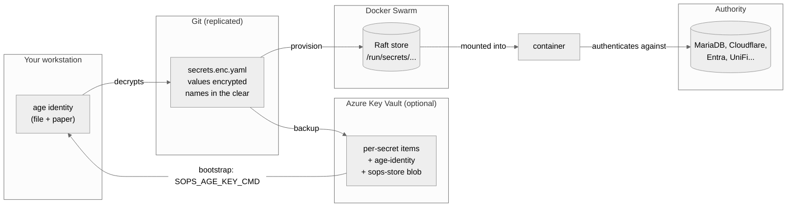
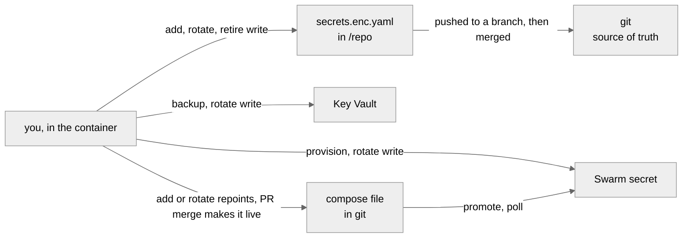
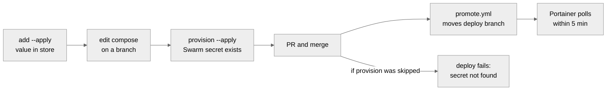
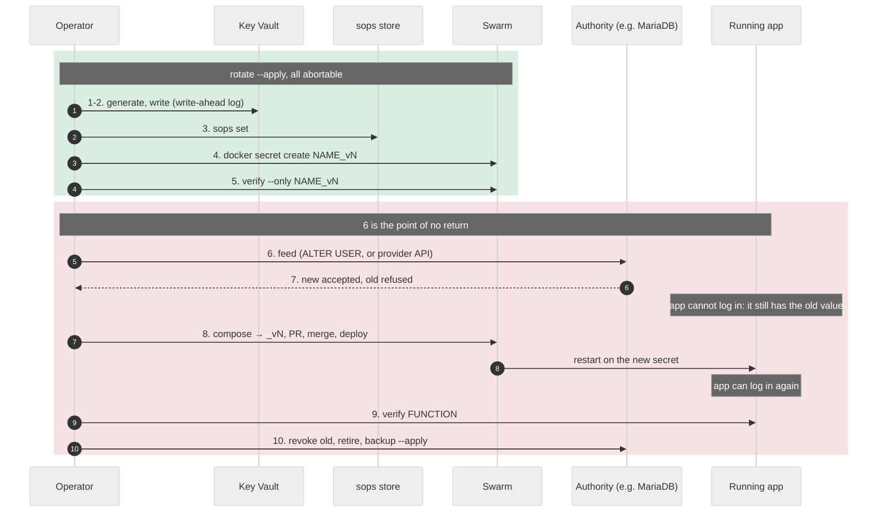

# Secrets: background

Why the secret store works the way it does, and reference material. The
procedures are separate: [ADD.md](add.md), [ROTATE.md](rotate.md),
[RETIRE.md](retire.md) and [RECOVER.md](recover.md). The incidents and rejected
alternatives behind these choices are in
the design notes in my private repo.

---

## The problem

A container needs a password. Four places will take it and leak it:

| Route | Who can read it |
| --- | --- |
| Compose file in git | anyone with the repo, forever, including history |
| Portainer environment variable | anyone with Portainer, and it lands in the service spec |
| The service spec | anyone who can reach `dockerproxy:2375`, with no credentials |
| A Docker label | anyone with socket access; labels cannot reference secrets at all |

The third one is real here. On 2026-08-22, `2375` returned 23 services with no
authentication, 16 of them exposing environment variables including
`MYSQL_ROOT_PASSWORD` and `REPLICA_PASSWORD`.

So the value has to reach the process without passing through the repo, the
stack definition, or the service spec.

A second problem follows: the value has to live somewhere you control, be
recoverable after a total loss, and be reviewable in a pull request without
being readable in one.

---

## age and SOPS

**age** encrypts files. One keypair, two strings. This pair is an example, not
this estate's key:

```
# public key: age1yourpublickeyhere
AGE-SECRET-KEY-1<59 more characters, all on this one line>
```

The `age1...` recipient encrypts and is safe to commit. The
`AGE-SECRET-KEY-1...` identity decrypts and is the one thing to protect. Both
are single lines, so the identity fits on paper or in a vault item.

**SOPS** encrypts *values inside a structured file* and leaves the keys
readable:

```yaml
npm_db_password_v2:
    note: rotated 2026-08-25
    value: ENC[AES256_GCM,data:Kx8f2Q==,iv:...,tag:...,type:str]
```

That property is the reason for the pairing. A diff shows *which* secret
changed and when, without showing what it changed to, so rotation is
reviewable. Plain age would give one opaque blob and `git log` would say
nothing.

SOPS does not implement the cryptography. It generates a data key, encrypts
values with it, then wraps that data key for each configured recipient: age
here, but equally Azure Key Vault or AWS KMS. Recipients can be added later
without re-encrypting the file.

Chosen over the alternatives because the store is a file in git: it replicates
with the repo, needs no server, and works offline. See
the design notes in my private repo.

---

## The model



| Copy | Job | Lose it and... |
| --- | --- | --- |
| `secrets/secrets.enc.yaml` | source of truth | nothing, it is in git |
| age identity | decrypts the store | the store is unreadable |
| Azure Key Vault | offsite copy **and** bootstrap | fall back to the local key |
| Swarm Raft | what containers read | reprovision from the store |

The store is useless without the identity; the identity is useless without the
store.

### Where Key Vault fits

Key Vault is **a layer, not a variant**. The age identity is the root of trust
either way. The vault holds a copy of it, plus a write-ahead log during
rotation.

Everything is identical with or without it, except:

- **Bootstrap and recovery** differ. [RECOVER.md](recover.md) gives both paths.
- **Adding and retiring** gain one trailing `backup --apply`.
- **A rotation** without a vault is not resumable if it dies partway.

Without a vault the identity exists only on your disk and on paper. Losing
both loses every secret.

---

## Everything runs in a container

Nothing is installed on the host except Docker. The container holds `sops`,
`age`, the Docker CLI and the Azure libraries. Getting that set onto every
machine you might work from is the problem it exists to solve, so **you get a
shell inside it and run every command from there.**
For starting it from a machine with nothing, see
[RECOVER.md](recover.md#1-read-the-store-from-anywhere).

### Swarm access

`/var/run/docker.sock`, mounted straight through:

```text
  -v /var/run/docker.sock:/var/run/docker.sock \
```

**This means you run the container on a Swarm manager.** A manager's local
socket is the Swarm API. On a worker it is not, and on a workstation there is
no Swarm socket to mount at all.

Because the socket is passed through unfiltered, the container talks to
whatever daemon owns it. The store records which Swarm it describes, and every
Swarm read checks against it, so pointing at the wrong daemon fails closed
rather than creating secrets somewhere nobody meant to touch:

```
error: WRONG SWARM. The store expects cluster cvuql7mtd3yh..., this socket
belongs to abc123...  Refusing to touch a Swarm this store does not describe.
```

Commands that need this: `status`, `verify`, `provision`, `rotate`, `retire`.
Commands that do not: `list`, `diff`, `check`, `clone`, `restore`, `backup`,
`gh-login`, `az-login`.

### Three ways to run it

All three run the same image with the same mounts. Pick whichever suits the
machine you are on.

**A `docker run` command.** Nothing to fetch first, works anywhere. It is in
[RECOVER.md, section 1](recover.md#1-read-the-store-from-anywhere).

**`ssh -t` to a manager from your workstation**, as one line, or the `keyman`
alias. Nothing installed on the workstation but ssh. See
[README.md, one-time setup](index.md#one-time-setup-the-keyman-alias).

**A compose file.** One file to download, then shorter commands:

```bash
curl -fsSLO https://raw.githubusercontent.com/scyto/homelab-stacks/main/tools/compose.yaml
docker compose run --rm key-manager            # shell
docker compose run --rm key-manager list       # one command
```

**This one is mine only, for now.** That `curl` is unauthenticated and the repo
is private, so it 404s for anyone else; you would need a token, or to write the
equivalent compose file yourself. The `docker run` form above needs nothing but
the image, which is public, so prefer it.

**The wrapper script**, if you have a clone of this repo. It builds the same
`docker run` for you, and finds the swarm and the store without being told:

```bash
sudo install -m0755 tools/key-manager /usr/local/bin/key-manager
key-manager status          # from any directory
```

Without installing, `tools/key-manager` only works from inside the clone, which
is why running it from your home directory says "no such file or directory".
From elsewhere, point it at a clone:

```bash
export HOMELAB_REPO=~/repos/homelab-stacks
```

If you are not using Key Vault, mount your age key by hand: compose cannot
skip a mount whose path is unset.

### Once you are in the container

The subcommands work on their own. `list` and `key-manager list` are the same
thing, and `help` prints them all:

```
key-manager -- read, provision and rotate this estate's secrets.

  Reading            list      names, notes and keyed digests. Never a value.
                     status    store vs what the Swarm actually holds
  Getting set up     az-login  sign in to Entra. Once per container session.
                     restore   fetch the encrypted store from Key Vault
  Changing a secret  rotate    generate a new value and stage it everywhere
  ...
```

`<command> --help` explains one of them. Every writing command is a dry run
until given `--apply`.

### What each mount is for

| Mount | Why |
| --- | --- |
| `$PWD:/repo` | **where the store lives, or will live.** `secrets/secrets.enc.yaml` is the one file the image cannot carry, because it changes. A full clone works, so does a directory holding only that file, so does an empty one if you then run `restore` |
| *(no flag)* | The GitHub token, the Entra token and `/work` all default to `/dev/shm`, which Docker mounts as a tmpfs in every container. Memory is what you get by doing nothing; putting them on disk would take a deliberate flag |
| `/var/run/docker.sock` | the Swarm API. Only meaningful on a manager, and checked against the cluster the store describes |
| `$SOPS_AGE_KEY_FILE:/run/age-key:ro` | optional. Your age identity, if you are not fetching it from Key Vault |

Two absences are deliberate. **No private key is ever mounted** except the age
identity, and only when you ask for it. **Nothing writable is mounted** except
the token cache, so a container cannot leave anything behind.

**The tokens are in memory, with one caveat.** `gh-login` warns
"Authentication credentials saved in plain text" because a container has no OS
keyring: the GitHub token goes to `~/.config/gh/hosts.yml` in cleartext. That
path, and the Entra token cache, are tmpfs mounts, so they stay off the
container's writable layer and go when it exits. **Memory-backed is not
memory-only**: tmpfs pages can be swapped under memory pressure, and all three
managers run with swap enabled. Docker 28 does not accept the `noswap` mount
option, so closing that gap means turning swap off on the managers or
encrypting it. Both tokens are short-lived and small, which is why this is a
note rather than a blocker.

`gh` also becomes git's credential helper, so a push works without key-manager
handling a token.

### What `feed` can reach

`feed` hands a value to a command on stdin, and for a database that command has
to run against the container holding the database. With only the local socket
mounted, `docker exec` reaches containers **on this node**, and nothing else.

So run the key-manager container on the node where that database is. Find it
with:

```
status                                  # confirms you are on the right Swarm
docker service ps <stack>_db --format '{{.Node}}'
```

If the database is on another node, v1 has no route to it: ssh from inside the
container was removed along with the ssh transport. Run key-manager on that
node instead.

The wrapper still passes `--dns-search`, so names resolve inside the container
the way they do on the host. Docker writes a `resolv.conf` with a nameserver
and no `search` line, so without it a bare `docker01` does not resolve even
though the host resolves it fine.

### On other machines

Same command. The image is the reason it behaves identically on macOS, Linux
and WSL. On Windows the ssh agent is a named pipe rather than a socket, so
either run the wrapper from WSL or pass `-e SOPS_AGE_KEY_FILE` and skip the
swarm commands.

---

## Where a change has to travel

A secret exists in up to four places, and a change is not finished until each
one that matters has it. This is the part it is easiest to get half-done.



| Place | What puts it there | If you skip it |
| --- | --- | --- |
| `/repo/secrets/secrets.enc.yaml` | `add`, `rotate`, `retire` | nothing else works |
| **git** | **you push after `add`; `rotate` and `retire` push their own branch; then a PR merge** | the repo disagrees with everything else |
| Key Vault | `rotate`, `backup --apply` | recovery restores an older store |
| Swarm | `rotate`, `provision` | the container has nothing to mount |
| the compose file | `add` or `rotate` repoints it; the PR merge makes it live | the container mounts the OLD secret |

**Nothing is finished until it is pushed and merged.** `add` writes the store
and leaves the commit to you. `rotate` and `retire` commit and push a branch of
their own. Until the push, the repo everyone else clones is behind, and nothing
detects that: `backup --verify` compares the store against the vault, and
`check` compares compose against whatever is committed. Neither compares the
vault against git.

**So make changes from a full clone.** A store-only directory, which is what
`restore` gives you, is for reading and for rebuilding a Swarm. Change a secret
there and it has nowhere to go. `rotate` says so:

```
  WARNING  /repo is not a git clone, so this change cannot be committed.
```

### Does the stack need changing?

Almost always yes, and for a specific reason: **Swarm secrets are immutable**,
so `rotate` cannot replace a value in place. It creates a new name, and the
compose file has to point at it.

| Situation | Compose change? |
| --- | --- |
| Swarm secret, rotated to `_v2` | **yes**, that is the whole point |
| Value edited in place under the same name | no, but the Swarm keeps the old value until you remove and recreate the secret, which restarts the service |
| Still a Portainer environment variable | no, it is not mounted from the store |
| Not deployed anywhere (`WHERE` is `-`) | no |

`check` is what catches the mistake: it fails if a compose file mounts a name
the store does not have. It runs in CI on every PR and needs no key, because
names are plaintext by design.

---

## How `rotate` makes a value

**The command creates the value. You never see it and are never asked for it.**
It is 32 bytes from the system random source, rendered as 43 characters, and it
goes straight to Key Vault, the store and Swarm without passing through a
terminal, a file, or a command line. What you see is:

```
  rotating    my_new_secret  ->  my_new_secret_v2
  new value   43 chars, urlsafe, 256 bits, generated by this command. You never
              see it and are never asked for it.
  old digest  8a36ac856a42   (keyed; for spotting reuse elsewhere)
```

That is deliberate. A value a person picks carries a pattern no matter how long
it is, and one leak then makes the others guessable. Nothing here is ever typed
or remembered, so there is nothing to gain by choosing it.

If you genuinely need to read it, for pasting into a provider's web console:

```bash
key-manager akv-get my_new_secret_v2
```

## Changing one field with `sops set`

`add` uses `sops set` underneath. It is still the tool for changing one field of
an existing entry:

```bash
sops set secrets/secrets.enc.yaml '["secrets"]["my_new_secret"]' --value-stdin
# then paste the JSON-encoded value, e.g.  "hunter2"   <- quotes required
```

`--value-stdin` keeps the value out of process listings. Input is **JSON**, so
a bare string needs its quotes. It also echoes what you paste, and shows no
count, which is how a doubled paste went unnoticed once.

---

## Delivering a secret to the container

Check the image first. `docker image inspect` is definitive and has been right
every time here.

```bash
docker image inspect <image> --format '{{json .Config.Env}}'      # look for *_FILE
docker image inspect <image> --format '{{json .Config.Entrypoint}} {{json .Config.Cmd}}'
docker run --rm --entrypoint /bin/sh <image> -c 'echo has-shell'  # mechanism 4?
```

| # | Mechanism | Use when | In the service spec? |
| --- | --- | --- | --- |
| 1 | **Native**, app reads `/run/secrets/<name>` | the app supports it | no |
| 2 | **`_FILE` convention** | image declares `SOMEVAR_FILE` | no |
| 3 | **Config-file-as-secret** | the secret *is* the config file | no |
| 4 | **Entrypoint wrapper** | image has a shell but no `_FILE` | no |
| 5 | **Portainer env var** | distroless, no `_FILE` | **yes** |

**No mechanism works for Docker labels.** A label is part of the service spec
by definition.

### 1. Native

```yaml
services:
  app:
    secrets: [my_new_secret]
secrets:
  my_new_secret:
    external: true
```

`external: true` means `docker stack rm` will not delete it.

### 2. The `_FILE` convention

```yaml
    environment:
      APP_SECRET_FILE: /run/secrets/my_new_secret
    secrets: [my_new_secret]
```

Confirm the variable in the image's own `ENV` rather than in its docs.

### 3. Config-file-as-secret

The secret is the whole config file. `adguardhome-sync` runs
`--config /run/secrets/adguard_sync_config`, a YAML document containing both
credentials.

### 4. Entrypoint wrapper

For an image with a shell but no `_FILE` support.

```yaml
    entrypoint:
      - /bin/sh
      - -c
      - >
        set -e;
        MY_VAR="$$(cat /run/secrets/my_new_secret)";
        export MY_VAR;
        exec <the image's real entrypoint AND cmd>
```

Four things to get right.

**Never `export VAR="$(cat ...)"`.** `export` is a command whose own exit status
is 0, so `set -e` cannot see a failed `cat` and the app starts with an **empty**
value. A plain assignment propagates the failure:

```
sh -c 'set -e; V="$(cat /nope)"; export V; echo REACHED'   # exit 1, silent
sh -c 'set -e; export V="$(cat /nope)"; echo REACHED'      # exit 0, REACHED
```

An empty value usually fails quietly rather than loudly. `unifiapibrowser`
falls back to an auth mode UniFi OS refuses, `cloudflare-ddns` deletes the DNS
record, and `infinitude` uses a default baked into the image.

**Exec the entrypoint *and* the cmd.** Compose **clears** the image's `CMD` when
you override `entrypoint`, which `docker run` does not. Read both from
`docker image inspect` and reproduce both.

**`$$` is Compose's escape for a literal `$`.** A single `$` is substituted by
Compose at deploy time, which is the thing you are avoiding.

**`exec` preserves PID 1**, which s6-based images require for signal handling.

Test the wrapper against the real image before deploying, both ways:

```bash
WRAP='set -e; V="$(cat /run/secrets/x)"; export V; exec <real entrypoint and cmd>'
docker run --rm --entrypoint /bin/sh <image> -c "$WRAP"; echo "no secret: exit=$?"   # must be non-zero
docker run --rm -v /path/to/fake:/run/secrets/x:ro --entrypoint /bin/sh <image> -c "$WRAP"
```

### 5. Portainer environment variable

For distroless images that have no shell and no `_FILE` support. The value
lands in the service spec and is readable on `2375`, so use it only when none
of the other four apply.

This is the only mechanism that has to say which stored secret it uses. The
other four name it in the `/run/secrets/<name>` path, so the file already says
it. Here the value arrives as `${SOME_VAR}` from a Portainer stack variable, and
nothing would otherwise connect the two:

```yaml
x-secrets:
  OAUTH2_PROXY_COOKIE_SECRET: oauth_cookie_secret
```

A top-level `x-` key is not part of any service spec, so adding one restarts
nothing. `check` verifies both halves: the variable must really be interpolated
in that file, and the target must really be in the store.

Matching the names instead does not work. `MYSQL_PASSWORD` is required by both
`npm` and `wordpress2025` for two different values, because mariadb calls it
that in every stack that runs it. A store name is global; an image's variable
name is not.

### Confirm it worked

```bash
# 1. the value is OUT of the service spec -- names only
docker service inspect <svc> \
  --format '{{range .Spec.TaskTemplate.ContainerSpec.Env}}{{println .}}{{end}}' | sed 's/=.*//'

# 2. the deployed value matches the store
key-manager verify --only <name>
```

Then verify **function**. A container that starts proves nothing. Two stacks
here ran broken for months while appearing healthy.

---

## Why the Swarm secret must exist before the merge

A stack that mounts an external secret which does not exist does not start:

```
secret not found: <name>
```

Merge first and `promote.yml` moves the deploy branch, Portainer polls within
five minutes, and the deploy fails until you provision. A brand new stack is
forgiving, because nothing polls it until you create it in Portainer. A stack
Portainer already tracks has no grace at all.



---

## What `check` refuses

Two directions, both in CI, neither needing a key.

**A declared secret that is not delivered.** A compose file mounting a name the
store does not have, an `x-secrets` mapping pointing at nothing, a constraint
field the tool does not recognise and therefore ignores.

**A credential that was never declared at all.** An environment value that looks
like a live credential sitting in git:

```
PLAINTEXT  stacks/swarm/x/compose.yml: broker.API_TOKEN looks like a hex blob
PLAINTEXT  stacks/swarm/x/compose.yml: broker.MQTT_PASSWORD the name ends in a
           credential word and the value is a bare word
```

Shape decides, not the name. Measured over this estate, the name alone flags 17
of 73 keys and 11 are wrong, because `OAUTH2_PROXY_PASS_HOST_HEADER` uses PASS
as a verb and `PASS_REQS` is a number. Both are still matched by the name rule
and neither alarms, because their values are a boolean and a number and shape is
consulted first. The name only decides the one bucket where shape cannot: a bare
word, which is an enum value and a weak password at the same time.

Against ten planted credentials it catches ten, with no false positive on the
estate. It will not catch every weak password: a short dictionary word under a
key whose name says nothing is invisible to both signals. Treat it as a net.

When it is wrong, end the line with `# not-a-secret`. The alternative to an
escape hatch is somebody turning the check off.

Anything it catches that IS real should be treated as disclosed. Committing a
value publishes it, and rotating is the only thing that undoes that.

---

## Rotation, in more depth

The procedure is [ROTATE.md](rotate.md). This is what is going on underneath.

### The new name

Swarm secrets are immutable, so `rotate` always creates a **new name**:
`npm_db_password` becomes `npm_db_password_v2`. Nothing uses that name until
the compose file says so, which is why nothing has broken yet.

The edit is not one line. In `stacks/swarm/npm/compose.yml` the real rotation
touched four places:

```diff
      # 1. the path the entrypoint wrapper reads
-        DB_MYSQL_PASSWORD="$$(cat /run/secrets/npm_db_password)";
+        DB_MYSQL_PASSWORD="$$(cat /run/secrets/npm_db_password_v2)";

      # 2. the service's own secrets list
     secrets:
-      - npm_db_password
+      - npm_db_password_v2

      # 3. the same two again in the db service, which mounts it too

      # 4. the top-level block that declares them external
 secrets:
-  npm_db_password:
+  npm_db_password_v2:
     external: true
```

Miss one and the stack either mounts a secret nothing reads, or reads a path
that does not exist. `key-manager check` catches the second.



Key Vault is written **first** on purpose. A provider issues a credential once;
if the rotation dies partway an unrecorded value is gone and the service is
unreachable. A run here failed at step 3 after the vault write, and the value
was still durable and the rotation resumable.

### Effects a rotation can have

**But the change may still be visible to users.** The app was using the old
value for something, and that something stops working. Two examples from this
estate:

- a cookie-signing secret invalidates every existing session, so everyone is
  logged out
- a key used to encrypt stored data makes that data unreadable, permanently

Neither is a failure of the rotation. They are what the value was doing. Before
you run it, read the application's own documentation for what it uses the
secret for, and decide whether the effect is acceptable now or should wait for
a quiet moment.

**Some services let you avoid the outage case entirely** ([ROTATE.md](rotate.md) case C or D). `unifiapibrowser` used to be here,
using a UniFi account password. Switching it to a UniFi API key moved it to case B,
because the controller issues several keys and a password is singular. Same
service, no interruption, because the *kind* of credential changed. Where a
service offers both, take the key.

### What `ALTER USER` actually does

MariaDB does not store the password. It stores a hash:

```
npm  @ %   mysql_native_password   *468472B916B...
```

`ALTER USER 'npm'@'%' IDENTIFIED BY '<new>'` recomputes that hash and
overwrites the row. Nothing restarts, no data changes, and open connections are
unaffected. Only *new* connections are checked against the new hash, which is
why the app often keeps working right up until it restarts.

The host is part of the identity: `'npm'@'%'` and `'npm'@'localhost'` are
different rows with different hashes. The root rotation needed both.

`ALTER USER` is not recoverable from the database, because the old hash is
gone. It is reversible only because the old plaintext is still in the store,
which is why retiring comes last.

### When 43 characters will not fit

`rotate` generates 43 characters because that is 256 bits and nothing here has
to type it. Some systems cannot take that: appliance web UIs truncate, some
APIs reject symbols, a few stop at 16 or 20 characters.

`max_chars` is not a limit you are imposing. It is **the most that service will
accept**, and `rotate` fills it rather than staying under it, so each secret
gets the strongest value its consumer can actually hold.

Do not remember the limit. Record it against the secret, so it survives whoever
knew it. `rotate` takes the cap and stores it in one step:

```
key-manager rotate <secret-name> --max-chars 20 \
  --why "the controller UI truncates past 20" --apply
```

The cap is written into the store, so **later rotations honour it without being
told again**. Omit `--why` and it says so: a cap with no reason is hard to
revisit when you are wondering whether it still applies.

### Rotation-due dates in Key Vault

`rotate` stamps two things on the vault item: a `minted` tag with the date, and
an expiry 90 days later. Both are labels for a human reading the portal. For
Key Vault **secrets**, unlike keys, `exp` and `nbf` are informational and a
`get` still succeeds outside the window, so an lapsed date never breaks
recovery. That was worth checking rather than assuming.

Per secret, with `constraints.rotate_days`.

The date is stamped at **rotation**, not at backup. Setting it on every backup
would push it forward each run and tell you nothing. `backup` reads the current
expiry and carries it forward, because `set_secret` creates a new version with
exactly the properties given and would otherwise erase it.

**A secret with no expiry has never been rotated through this tool.** That
absence is information, so nothing invents a date to fill it.

For a provider-issued credential, [ROTATE.md](rotate.md) case B is the procedure:
create the new one in their console, store it, deploy, then revoke the old.

To record a cap without rotating, or to add `alphabet: alnum` for a service
that rejects symbols:

```bash
sops set secrets/secrets.enc.yaml '["secrets"]["some_secret"]["constraints"]' \
  '{"max_chars": 20, "alphabet": "alnum", "why": "the controller UI truncates past 20"}'
```

`constraints` is not encrypted, so it shows up in a diff like a name or a note.
`rotate` then generates to fit, carries the constraint onto the new version, and
tells you the entropy it actually got:

```
  new value   19 chars, alnum, 113 bits, generated by this command.
```

**Most caps are not actually a problem.** 20 alphanumeric characters is 119
bits, comfortably above the 112-bit floor. The floor exists because of the
3-character passwords this estate started with, not to insist on 43.

A cap that does fall below the floor is allowed, but never quietly:

```
  CONSTRAINED some_secret caps at 16 chars, giving 89 bits, under the 112 floor.
              reason recorded: the controller UI truncates past 20
              This is weaker than default and is only permitted because the cap
              is written down.
```

That is the trade: a weaker secret is acceptable when the reason is recorded
and reviewable, and refused when it is just a preference.

---

## One secret, several environments

A value can be mounted by containers on the Swarm **and** on a standalone host
like `syn02` or `pi-zwave01`. Nothing needs recording for that: the repo
already says so, in `stacks/<env>/<stack>/compose.yml`. `list` derives it:

```
  NAME                    CHARS  DIGEST        WHERE        FLAGS
  wordpress_db_password      15  467a4b204ad8  swarm,syn02  short
```

**Do not put the environment in the name.** One value shared by two places is
one secret, and `foo_swarm` plus `foo_syn02` would be worse than useless: the
reuse detector would flag them as a shared password to break apart, when
sharing is the whole point, and the two copies could drift with nothing
noticing.

`WHERE` is derived rather than declared, so it cannot disagree with the compose
files. `-` means nothing in this repo mounts it: either an unmigrated
environment variable, or a superseded version kept for rollback.

The environments are also mirrored into the Key Vault item's tags, so someone
reading only the vault can see it too.

**`provision` only speaks Swarm.** `docker secret create` has no equivalent on
a standalone host, which takes a file instead. When a secret is mounted outside
the Swarm, `provision` says so rather than reporting success for somewhere it
never touched:

```
  NOTE  these are also mounted outside the Swarm, which this command cannot reach:
        wordpress_db_password  ->  syn02
```

Placing it there is manual: write the value to the path the compose file names,
mode 600, owned by root. Getting it out of the store without it reaching a
disk or your scrollback is what `feed` is for.

---

## Secrets that must not be generated

Not every secret is a password to mint. Three kinds are not:

- a **document**, like `adguard_sync_config`, which is the YAML that
  `adguardhome-sync` reads as its config file
- a **provider-issued credential**, like `cloudflare_dns_api_key_v2` or
  `unifi_apikey`, where the value exists because Cloudflare or UniFi created it
- a **password also set by hand in another system**, like `asrock_bmc_password`,
  the BMC login. You may have generated it yourself, but nothing here can change
  it on the other side

Running `rotate` on any of them would mint 43 random characters and store them
as the new version. The stack would then start and fail to parse its own
config, or present a credential the other system has never seen.

`add` asks **"Can rotate replace it on its own?"**. Answering **n** records this
marker. It used to ask "Did a provider issue this, rather than you choosing
it?", and a password its owner generated, but had also typed into another
system, was answered no, correctly by that wording, which left it rotatable.

To mark an existing entry so the tool refuses:

```bash
sops set secrets/secrets.enc.yaml '["secrets"]["some_secret"]["constraints"]' \
  '{"generated": false, "why": "issued by the provider; mint a new one there"}'
```

`list` shows them as `not-generated`, and `rotate` stops with the recorded
reason and the command to edit the value by hand instead.

---

## How the image is built

Built and published by a workflow in my private repo
on any change to the tools, for `linux/amd64` and `linux/arm64`. Tagged
`latest` and with the commit SHA, so a rotation can be pinned to the exact
image it was run with.

`tools/key-manager` is a thin wrapper around `docker run`. Read it if you need to
know exactly what is mounted, or run the image directly for anything the
wrapper does not cover.

The image holds no secrets and no site configuration. `.sops.yaml` is
deliberately not baked in: sops resolves its config by walking up from the file
it is editing, so with the repo mounted it finds `/repo/.sops.yaml` and a baked
copy is never read. Leaving it out keeps the age recipient out of the image.

```bash
docker build -f tools/Containerfile -t key-manager .

# -v "$PWD:/repo"                              where the store is, or will be
docker run --rm -it \
  -v "$PWD:/repo" \
  -e AKV_VAULT=<vault> \
  key-manager <subcommand>
```

`SOPS_AGE_KEY_CMD` is set in the image, so the identity comes from the vault
with nothing pre-placed. Safe as a default because sops treats `KEY_CMD` and
`KEY_FILE` as *additive*:

| `KEY_CMD` | `KEY_FILE` | Result |
| --- | --- | --- |
| fails | valid | exit 0, the file is used |
| fails | absent | exit 128 |
| valid | absent | exit 0 |

The helper fast-fails when `SOPS_AGE_KEY_FILE` is readable or `AKV_VAULT` is
unset. Without that it would sit on a device-code prompt until timeout before
sops ever reached the file. That is correct eventually, but it looks like a
hang on the one path you take when everything else is broken.

`backup --apply` pushes each secret and the encrypted store without a key file.
Only the **identity upload** needs one: with no file it prints `identity
skipped: no local key file` and carries on, which is right when the vault's copy
is what decrypted the store. Uploading the identity is a bootstrap and recovery
step, not part of adding a secret.

---

## Command reference

Every writing command is a **dry run** unless given `--apply`.

| Command | Does | Also needs |
| --- | --- | --- |
| `list` | names, notes, keyed digests | |
| `add` | record a secret, repoint compose to `_v1`; shows `*` per character and the length ([ADD.md](add.md)) | a terminal |
| `diff` | store vs the local plaintext copies | |
| `status` | store vs what Swarm holds | |
| `check` | can the store rebuild production, and is anything a secret that is not one? | nothing at all, runs in CI |
| `verify` | deployed values match the store | |
| `provision` | create missing Swarm secrets | |
| `backup` | push to Key Vault, or `--verify` | `SOPS_AGE_KEY_FILE` only to upload the identity |
| `restore` | fetch the encrypted store back from Key Vault | |
| `akv-get` | one value to stdout, for `SOPS_AGE_KEY_CMD` | |
| `gh-login` | GitHub device code, and git identity for commits typed in the container. Required before any change | a terminal |
| `clone` | fetch this repo into `/repo`, every branch's tip | `gh-login` first |
| `az-login` | Entra device code, cache the token | |
| `rotate` | generate, store, create in Swarm, verify, repoint compose, push a `rotate/` branch ([ROTATE.md](rotate.md)) | `gh-login` first, on `main` |
| `feed` | plaintext into a command's stdin | whatever the command needs |
| `retire` | mark a superseded secret unprovisionable, push a `retire/` branch ([RETIRE.md](retire.md)) | `gh-login` first, on `main` |

The wrapper supplies the identity, the vault name and the docker connection, so
those are not listed. Uploading the identity with `backup --apply` is the one
exception: fetching it from the vault to upload it there would be circular, so
that part needs a real file and is skipped without one.

`check` needing nothing is deliberate: secret **names** are plaintext by design,
so CI can verify the store covers production without holding any key.

### Digests are keyed

`list` prints HMAC digests, not raw SHA-256. A raw hash of a low-entropy value
is reversible. The entire 3-character keyspace is 830,584 candidates and
exhausts in about half a second, so a raw digest of a short password *is* the
password. The HMAC key lives encrypted inside the store, so only someone who
could already decrypt can compute one.

Equal digests still mean equal values, so reuse stays visible. That property
found `npm_db_password` and `npm_mysql_root_password` sharing a string, and the
`adguard` pair sharing another.
