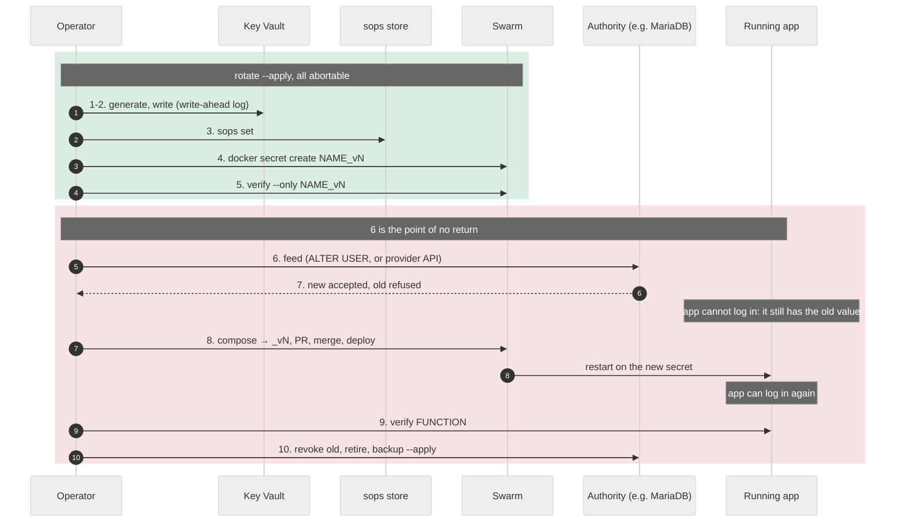

# Rotate a secret

Replace a secret's value everywhere it is held, then retire the old one.

Every case below uses the made-up `example_app` stack. Where you see the
example's names, use your own. Background and reasons are in
[BACKGROUND.md](background.md). Adding a secret for the first time is
[ADD.md](add.md).

## Before you start

- **The `keyman` alias** is set up on your workstation. See
  [README.md, one-time setup](index.md#one-time-setup-the-keyman-alias).
- **Key operations run only in the key-manager container.**
- **Swarm secrets can't be changed.** A rotation always makes a new name: `_v1`
  becomes `_v2`, the compose file is changed to point at it, and the PR's merge
  is what makes it live.
- **A secret that is not a Swarm secret** -- a file bound into a container on a
  standalone host, a file an app reads through a placeholder, or a Portainer
  stack variable -- is rotated the same way, but nothing below puts the new
  value where the stack reads it. Place it by hand, as when it was added: write
  the file with `feed`, as in
  [ADD.md, step 6b](add.md#6b-a-secret-that-is-not-a-swarm-secret-in-the-container),
  or set the stack variable in Portainer. Until then the stack keeps the old
  value. `rotate` still creates the new version as a Swarm secret, which nothing
  mounts.

## Pick your case

Ask: **if this value changed, which other system would have to be told?**

| Case | Who else holds the value | Example secret | Is there an outage? |
| --- | --- | --- | --- |
| [A](#case-a-nobody-else-holds-the-value) | nobody | `example_app_session_secret_v1`, a cookie-signing key only the app uses | no |
| [B](#case-b-a-provider-can-issue-a-second-credential) | a provider that can issue a second credential | `example_app_api_token_v1`, issued by Example Cloud | no |
| [C](#case-c-a-database-holds-one-copy) | a database, one password per user | `example_app_db_password_v1`, MariaDB user `example` | yes, a few minutes |
| [D](#case-d-you-set-it-by-hand-in-another-system) | another system where you set it by hand | `example_app_portal_password_v1`, the service account from [ADD.md](add.md) | yes, a few minutes |

`list` shows B and D as `not-generated`, and `rotate` refuses them: nothing here
can mint a value a provider or a web UI would accept.

## How the branches fit together

**Cases A and C:** `rotate` makes and pushes the branch itself. The container
must be on `main`, and a fresh `keyman` session is.

```text
main
 |
 +-- rotate/example-app-session-secret-v2    made and pushed by `rotate`, in the container:
 |                                              secrets.enc.yaml gains _v2, compose.yml points at _v2
 |
 +-- retire/example-app-session-secret-v1    made and pushed by `retire` afterwards (retire.md)
 |
 +-> deploy/swarm/example_app               moves when each PR merges
```

**Cases B and D:** you make the branch on your workstation, as in ADD.md, and
the container adds the value to it.

```text
main
 |
 +-- stacks/example-app-api-token-v2        you create it and point compose at _v2 (workstation),
 |                                              the container adds the value (container)
 |
 +-- retire/example-app-api-token-v1        made and pushed by `retire` afterwards (retire.md)
 |
 +-> deploy/swarm/example_app               moves when each PR merges
```

---

## Case A. Nobody else holds the value

Example: `example_app_session_secret_v1`, which `example_app` uses to sign its
login cookies. Rotating it logs every user out, and nothing else.

### A1. Generate and stage the new value (in the container)

**A1.1** On your workstation, start a fresh container and sign in to GitHub
when it asks:

```bash
keyman
```

**A1.2** Confirm the container is on `main`. It prints `main`:

```
git branch --show-current
```

**A1.3** Sign in to Key Vault:

```
az-login
```

**A1.4** See what `rotate` would do, without doing it:

```
rotate example_app_session_secret_v1
```

**A1.5** Do it:

```
rotate example_app_session_secret_v1 --apply
```

**A1.6** It shows the compose change, `example_app_session_secret_v1` to
`example_app_session_secret_v2`. Read it, then at
`Apply this to the compose file(s)? [y/N]` type **y**.

**A1.7** It prints `pushed branch rotate/example-app-session-secret-v2` and
`MERGING THAT PR RESTARTS: example_app`. Open the PR and note its number, `124`
here:

```
gh pr create --fill
```

**A1.8** Refresh the store copy in Key Vault:

```
backup --apply
```

**A1.9** Leave the container:

```
exit
```

> **What `--apply` did in A1.5:** it generated a 43-character value you never
> see, wrote it to Key Vault, the store and Swarm as
> `example_app_session_secret_v2`, verified Swarm against the store, changed the
> compose file, and committed and pushed both files.
>
> **Nothing is live yet.** The running container still mounts `_v1`, because
> `main` still says `_v1`. You can abandon the PR at this point with no effect.

### A2. Merge and deploy (on your workstation)

**A2.1** Merge the PR:

```bash
gh pr merge 124 --rebase --delete-branch
```

**A2.2** Within five minutes Portainer redeploys `example_app` from
`deploy/swarm/example_app`. Check the service restarted: in a `keyman` session,
run this and look for a new task started after the merge:

```
docker service ps example_app_app --format '{{.Name}} {{.CurrentState}}'
```

**A2.3** Log in to `example_app`. Expect to be logged out first: that is the old
signing key no longer being accepted.

### A3. Retire the old value

**A3.1** Follow [RETIRE.md](retire.md) for `example_app_session_secret_v1`.

---

## Case B. A provider can issue a second credential

Example: `example_app_api_token_v1`, an API token Example Cloud issued. Example
Cloud lets two tokens work at once, so there is no outage **if the old token is
revoked last**.

### B1. Get the new credential (at the provider)

**B1.1** In Example Cloud's console, create a new token with the same
permissions as the old one. Copy it.

**B1.2** Do **not** revoke the old token yet.

### B2. Point compose at the new name (on your workstation)

**B2.1** Create the branch:

```bash
cd ~/repos/homelab-stacks
git checkout main
git pull --ff-only
git checkout -b stacks/example-app-api-token-v2
```

**B2.2** In `stacks/swarm/example_app/compose.yml`, change every
`example_app_api_token_v1` to `example_app_api_token_v2`. For this example that
is three places:

```diff
     environment:
-      API_TOKEN_FILE: /run/secrets/example_app_api_token_v1
+      API_TOKEN_FILE: /run/secrets/example_app_api_token_v2
     secrets:
-      - example_app_api_token_v1
+      - example_app_api_token_v2

 secrets:
-  example_app_api_token_v1:
+  example_app_api_token_v2:
     external: true
```

**B2.3** Commit, push, and open a draft PR. The number is `125` here:

```bash
git add stacks/swarm/example_app/compose.yml
git commit -m "example_app: use the new Example Cloud token"
git push -u origin stacks/example-app-api-token-v2
gh pr create --draft --fill
```

### B3. Store the new value (in the container)

**B3.1** Start a fresh container and sign in to GitHub when it asks:

```bash
keyman
```

**B3.2** Check out the branch and sign in to Key Vault:

```
git checkout stacks/example-app-api-token-v2
az-login
```

**B3.3** Record the value:

```
add example_app_api_token_v2 --apply
```

**B3.4** Answer the prompts. There is no rename question, because the name
already ends in `_v2`:

| Step | Prompt | Answer for the example |
| --- | --- | --- |
| B3.4.1 | `Paste the value, then press Ctrl-D. Each character shows as *.` | paste **once**, check the `*` count, press **Ctrl-D** |
| B3.4.2 | `Can rotate replace it on its own? [Y/n]` | **n** |
| B3.4.3 | `why (one line):` | `issued by Example Cloud; mint a new token there` |
| B3.4.4 | `Longest value the consuming service accepts? [enter = no limit]` | **Enter** |
| B3.4.5 | `Does anything ELSE store this value -- a database, an appliance? [y/N]` | **n** |
| B3.4.6 | `Note (why this exists), or enter:` | `example_app token for Example Cloud` |

**B3.5** Check the length matches the token, then create, verify and back up:

```
list | grep example_app_api_token
provision --only example_app_api_token_v2 --apply
verify --only example_app_api_token_v2
backup --apply
```

**B3.6** Commit, push, leave:

```
git add -A
git commit -m "secrets: example_app Example Cloud token v2"
git pull --rebase
git push
exit
```

### B4. Merge and deploy (on your workstation)

**B4.1** Mark the PR ready and merge it:

```bash
gh pr ready 125
gh pr merge 125 --rebase --delete-branch
```

**B4.2** Within five minutes Portainer redeploys `example_app`. Check it can
reach Example Cloud, for example in its logs.

### B5. Retire and revoke the old token

**B5.1** Follow [RETIRE.md](retire.md) for `example_app_api_token_v1`.

**B5.2** Then revoke the old token in Example Cloud's console.

> **Why revoke last:** both tokens work until B5.2, so the old one is your way
> back if B4 goes wrong.

---

## Case C. A database holds one copy

Example: `example_app` has a service `app` and a MariaDB service `db`.
`example_app_db_password_v1` is the password of database user `example`, and
`example_app_db_root_password_v1` is the root password.

A database user has one password. Once you change it, the app can't open new
connections until it restarts with the new secret, a gap of a few minutes.

### C1. Find the database's node

**C1.1** On your workstation, start a fresh container and sign in to GitHub
when it asks:

```bash
keyman
```

**C1.2** Find where `db` runs. It prints a node name, `docker02` here:

```
docker service ps example_app_db --filter desired-state=running --format '{{.Node}}'
```

> **Why:** `feed` in C3 runs `docker exec` into the database container, and the
> key-manager container can only reach containers on its own node. So C3 runs
> in a second container, on that node.

### C2. Generate and stage the new value (in the same container)

**C2.1** Confirm the container is on `main`, and sign in to Key Vault:

```
git branch --show-current
az-login
```

**C2.2** Rotate:

```
rotate example_app_db_password_v1 --apply
```

**C2.3** Read the compose change, then at
`Apply this to the compose file(s)? [y/N]` type **y**. It pushes
`rotate/example-app-db-password-v2`.

**C2.4** Open the PR, `126` here, and refresh the store copy in Key Vault:

```
gh pr create --fill
backup --apply
```

**C2.5** Leave the container:

```
exit
```

> **Why here, and not on the database's node:** `rotate` creates a Swarm
> secret, which only a manager can do. On a worker it stops with
> `this node is not a Swarm MANAGER`. `keyman` runs on a manager; the database
> may not.
>
> **Still nothing is live.** The database has not been touched, and `main` still
> says `_v1`.

### C3. Change the password in the database (in a container on that node)

**C3.1** On your workstation, start key-manager on `docker02`. This is the
`keyman` command with the node changed:

```bash
ssh -t docker02 'docker pull -q ghcr.io/scyto/key-manager:latest && docker run --rm -it -v /var/run/docker.sock:/var/run/docker.sock --dns-search mydomain.com -e AKV_VAULT=YourKeyVaultName -e AKV_TENANT=00000000-0000-0000-0000-000000000000 -e GIT_AUTHOR_NAME=you -e GIT_AUTHOR_EMAIL=you@mydomain.com -e HOMELAB_REPO_URL=https://github.com/you/your-repo.git ghcr.io/scyto/key-manager:latest'
```

**C3.2** Sign in to GitHub when it asks. Then check out the rotation's branch,
the only branch whose store has `_v2` yet, and sign in to Key Vault:

```
git checkout rotate/example-app-db-password-v2
az-login
```

**C3.3** Find the database container on this node:

```
DB=$(docker ps -q -f name=example_app_db)
echo "$DB"
```

**C3.4** Prove the pipeline with a harmless query. It must end with `exited 0`:

```
feed example_app_db_root_password_v1 --template "MYSQL_PWD='{example_app_db_root_password_v1}' mysql -u root -N -B -e 'SELECT 1;'" --apply -- docker exec -i "$DB" sh -s
```

**C3.5** **Point of no return.** Set the new password:

```
feed example_app_db_root_password_v1 --also example_app_db_password_v2 --template "MYSQL_PWD='{example_app_db_root_password_v1}' mysql -u root -e \"ALTER USER 'example'@'%' IDENTIFIED BY '{example_app_db_password_v2}';\"" --apply -- docker exec -i "$DB" sh -s
```

**C3.6** Check the new password works. It must end with `exited 0`:

```
feed example_app_db_password_v2 --template "MYSQL_PWD='{example_app_db_password_v2}' mysql -u example -N -B -e 'SELECT 1;'" --apply -- docker exec -i "$DB" sh -s
```

**C3.7** Check the old password is refused. It must **not** exit 0:

```
feed example_app_db_password_v1 --template "MYSQL_PWD='{example_app_db_password_v1}' mysql -u example -N -B -e 'SELECT 1;'" --apply -- docker exec -i "$DB" sh -s
```

**C3.8** Leave the container:

```
exit
```

> **Why `feed`:** the value has to reach `mysql` without being typed, appearing
> in `ps`, or being written to a file. `feed` renders the template in memory and
> hands it to `sh -s` on stdin, and never prints it.
>
> **`--apply` goes before the `--`.** Everything after `--` is the command, and
> `feed` refuses a `--apply` placed there rather than silently doing a dry run.
>
> **The host is part of the user.** `'example'@'%'` and `'example'@'localhost'`
> are separate accounts with separate passwords. If both exist, change both.
>
> **From C3.5 on, reverting the PR undoes nothing.** The database already has the
> new password. Going back means setting it back to the `_v1` value, which is why
> `_v1` stays in the store until it is retired.

### C4. Merge and deploy straight away (on your workstation)

**C4.1** Merge the PR:

```bash
gh pr merge 126 --rebase --delete-branch
```

**C4.2** Within five minutes Portainer redeploys `example_app` and the gap ends.
Check the app works, not just that it started: it can read and write its data.

### C5. Retire the old value

**C5.1** Follow [RETIRE.md](retire.md) for `example_app_db_password_v1`.

---

## Case D. You set it by hand in another system

Example: `example_app_portal_password_v1`, the service account password from
[ADD.md](add.md). `example-portal` holds one password for that account, and you
change it in its web UI.

### D1. Point compose at the new name (on your workstation)

**D1.1** Create the branch:

```bash
cd ~/repos/homelab-stacks
git checkout main
git pull --ff-only
git checkout -b stacks/example-app-portal-password-v2
```

**D1.2** In `stacks/swarm/example_app/compose.yml`, change every
`example_app_portal_password_v1` to `example_app_portal_password_v2`: the
`PORTAL_PASSWORD_FILE` path, the service's `secrets:` list, and the top-level
`secrets:` block.

**D1.3** Commit, push, and open a draft PR. The number is `127` here:

```bash
git add stacks/swarm/example_app/compose.yml
git commit -m "example_app: use the new example-portal password"
git push -u origin stacks/example-app-portal-password-v2
gh pr create --draft --fill
```

### D2. Generate and store the new value (in the container)

**D2.1** Start a fresh container and sign in to GitHub when it asks:

```bash
keyman
```

**D2.2** Check out the branch and sign in to Key Vault:

```
git checkout stacks/example-app-portal-password-v2
az-login
```

**D2.3** Generate the password with the command in
[ADD.md step 4.1](add.md#4-get-the-value-in-the-container), copy it, and press
Enter. **Do not set it in `example-portal` yet.**

**D2.4** Record it, answering as in [ADD.md step 5.2](add.md#5-record-it-in-the-store-in-the-container).
There is no rename question, because the name already ends in `_v2`:

```
add example_app_portal_password_v2 --apply
```

**D2.5** Check the length is 32, then create, verify and back up:

```
list | grep example_app_portal_password
provision --only example_app_portal_password_v2 --apply
verify --only example_app_portal_password_v2
backup --apply
```

**D2.6** Commit and push. Stay in the container, with the value still on your
clipboard:

```
git add -A
git commit -m "secrets: example_app example-portal password v2"
git pull --rebase
git push
```

> **Everything up to here can be abandoned.** `example-portal` still has the old
> password, and `main` still says `_v1`.

### D3. Switch over (web UI, then workstation, straight after each other)

**D3.1** **Point of no return.** In `example-portal`'s web UI, set the new
password on `example_app`'s service account.

**D3.2** On your workstation, mark the PR ready and merge it:

```bash
gh pr ready 127
gh pr merge 127 --rebase --delete-branch
```

**D3.3** Within five minutes Portainer redeploys `example_app`. Check its logs
show it logging in to `example-portal` again.

**D3.4** In the container, clear the terminal and leave:

```
clear
exit
```

> **The gap runs from D3.1 until the redeploy finishes.** During it,
> `example_app` presents the old password and `example-portal` refuses it. Doing
> D2 first keeps the gap to the merge and one Portainer poll.

### D4. Retire the old value

**D4.1** Follow [RETIRE.md](retire.md) for `example_app_portal_password_v1`.

---

## If the new value must be shorter, or have no symbols

For cases A and C, where `rotate` makes the value. Some systems truncate, reject
symbols, or stop at 16 or 20 characters. Record the limit once, and every later
rotation honours it.

**1** Rotate with the cap and the reason:

```
rotate example_app_db_password_v1 --max-chars 20 --alphabet alnum --why "example_app's config parser rejects symbols and stops at 20" --apply
```

**2** It prints the entropy it actually got. For this example that is
`new value   19 chars, alnum, 113 bits`: 19 characters, not 20, because it
works in whole bytes of entropy. 113 bits is above the 112-bit floor, so there
is no warning. Below the floor it adds a `CONSTRAINED` line and carries on,
because the cap is recorded. Leaving out `--why` does not stop it either.

> For B and D the value comes from you, so the cap is whatever you generate or
> paste. `add`'s `Longest value the consuming service accepts?` prompt records
> it.

---

## Rotation, in more depth

The procedure is above. This is what is going on underneath.

### The new name

Swarm secrets are immutable, so `rotate` always creates a **new name**:
`npm_db_password` becomes `npm_db_password_v2`. Nothing uses that name until
the compose file says so, which is why nothing has broken yet.

The edit is not one line. In `stacks/swarm/npm/compose.yml` the real rotation
touched four places:

```diff
      # 1. the path the entrypoint wrapper reads
-        DB_MYSQL_PASSWORD="$$(cat /run/secrets/npm_db_password)";
+        DB_MYSQL_PASSWORD="$$(cat /run/secrets/npm_db_password_v2)";

      # 2. the service's own secrets list
     secrets:
-      - npm_db_password
+      - npm_db_password_v2

      # 3. the same two again in the db service, which mounts it too

      # 4. the top-level block that declares them external
 secrets:
-  npm_db_password:
+  npm_db_password_v2:
     external: true
```

Miss one and the stack either mounts a secret nothing reads, or reads a path
that does not exist. `key-manager check` catches the second.



Key Vault is written **first** on purpose. A provider issues a credential once;
if the rotation dies partway an unrecorded value is gone and the service is
unreachable. A run here failed at step 3 after the vault write, and the value
was still durable and the rotation resumable.

### Effects a rotation can have

**But the change may still be visible to users.** The app was using the old
value for something, and that something stops working. Two examples from this
estate:

- a cookie-signing secret invalidates every existing session, so everyone is
  logged out
- a key used to encrypt stored data makes that data unreadable, permanently

Neither is a failure of the rotation. They are what the value was doing. Before
you run it, read the application's own documentation for what it uses the
secret for, and decide whether the effect is acceptable now or should wait for
a quiet moment.

**Some services let you avoid the outage case entirely** ([case C](#case-c-a-database-holds-one-copy) or [D](#case-d-you-set-it-by-hand-in-another-system)). `unifiapibrowser` used to be here,
using a UniFi account password. Switching it to a UniFi API key moved it to case B,
because the controller issues several keys and a password is singular. Same
service, no interruption, because the *kind* of credential changed. Where a
service offers both, take the key.

### What `ALTER USER` actually does

MariaDB does not store the password. It stores a hash:

```
npm  @ %   mysql_native_password   *468472B916B...
```

`ALTER USER 'npm'@'%' IDENTIFIED BY '<new>'` recomputes that hash and
overwrites the row. Nothing restarts, no data changes, and open connections are
unaffected. Only *new* connections are checked against the new hash, which is
why the app often keeps working right up until it restarts.

The host is part of the identity: `'npm'@'%'` and `'npm'@'localhost'` are
different rows with different hashes. The root rotation needed both.

`ALTER USER` is not recoverable from the database, because the old hash is
gone. It is reversible only because the old plaintext is still in the store,
which is why retiring comes last.

### Rotation-due dates in Key Vault

`rotate` stamps two things on the vault item: a `minted` tag with the date, and
an expiry 90 days later. Both are labels for a human reading the portal. For
Key Vault **secrets**, unlike keys, `exp` and `nbf` are informational and a
`get` still succeeds outside the window, so an lapsed date never breaks
recovery. That was worth checking rather than assuming.

Per secret, with `constraints.rotate_days`.

The date is stamped at **rotation**, not at backup. Setting it on every backup
would push it forward each run and tell you nothing. `backup` reads the current
expiry and carries it forward, because `set_secret` creates a new version with
exactly the properties given and would otherwise erase it.

**A secret with no expiry has never been rotated through this tool.** That
absence is information, so nothing invents a date to fill it.

For a provider-issued credential, [case B](#case-b-a-provider-can-issue-a-second-credential) is the procedure:
create the new one in their console, store it, deploy, then revoke the old.
