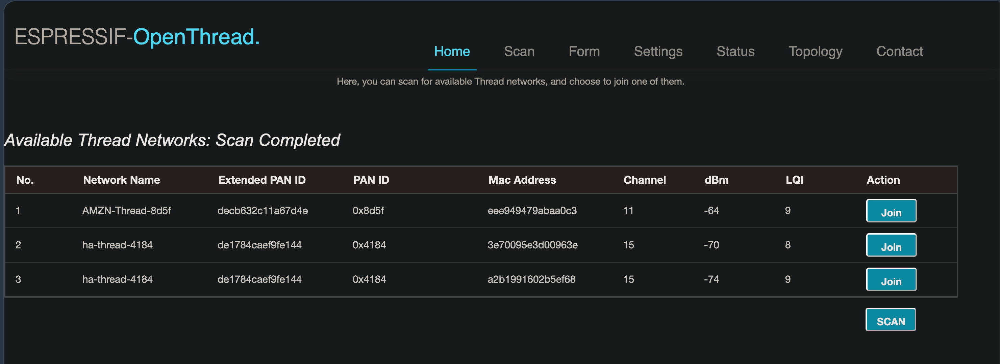

# thread

one Thread network, owned by Home Assistant, with two border routers: Home
Assistant's OpenThread Border Router add-on, using a SkyConnect that sits on the
[pi](../raspberry-pi/index.md#thread-radio-over-the-network) and is reached over
the network, and an Espressif ESP Thread Border Router board. Matter over Thread
devices join it from Home Assistant.

this page is the network as a whole: how it is set up, how it recovers when the
pi goes away, the ESP board, and how to check it is all one mesh. versions it was
checked against: Home Assistant Core 2026.9, Supervisor 2026.09, OpenThread
Border Router add-on 3.1.

## the network

**let Home Assistant own it.** Home Assistant creates the dataset (network name
`ha-thread-xxxx`, channel, PAN ID, extended PAN ID, mesh-local prefix, network
key, PSKc) and keeps it as the preferred network. every border router gets that
dataset, none forms its own. when i ran the border router in a container i spent
a long time making the network use a name i picked, and Home Assistant kept
wanting to manage the name. not worth it.

the dataset is under **Settings** > **Devices & services** > **Thread**, the (i)
on the preferred network. **Active dataset TLVs** there is the whole network,
network key and PSKc included. anyone with the key and a radio in range can join,
so treat that string like a password: not in chat tools, not in an `sdkconfig`,
not in git.


### border routers and routers

two different things, which confused me for a while:

- a **border router** connects the mesh to the LAN. the Thread panel lists these,
  found by their mDNS announcements
- a **router** is a role inside the mesh. mains powered devices (plugs, bulbs)
  take it too and relay traffic for the rest. they are not border routers and are
  not in that panel

mine has three routers, two of which are border routers. the third, a mains
powered device, is currently the leader.

| border router | radio | link to the LAN |
| --- | --- | --- |
| OpenThread Border Router add-on, on the Home Assistant VM | SkyConnect on the pi, through ser2net | the VM's network |
| ESP Thread Border Router board with Espressif's Ethernet daughter board | its own ESP32-H2 | Ethernet, powered over PoE |

### other networks

an Amazon Echo with Thread in it forms its own network, and the panel shows it
under **Other networks**. it cannot join this one: Amazon keeps the Echo's Thread
credentials in the Amazon account and has no setting to join a different network,
and Home Assistant has no way to get Amazon's key either. i leave it alone. it
runs on a different channel.

to use a device from Alexa as well, add it to Home Assistant first so it joins
this network, then **Settings** > **Connectivity** > **Matter** > **Devices** >
the device > **Share device**, and enter the code in the Alexa app. Alexa then
reaches it over the LAN through these border routers.

## why the radio is on the pi

the full back and forth, including the working compose files, is in
[openthread discussion #10311](https://github.com/orgs/openthread/discussions/10311).
short version:

1. **2024, `openthread/otbr` container on the pi.** that image is meant for
   development. without a volume for `/var/lib/thread`, a recreated container came
   back without its network, and Home Assistant only picked it up again after
   removing and re-adding the OTBR integration
2. **2024, ser2net on the pi and the add-on in Home Assistant.** reliable
3. **2025, `openthread/border-router` container**, the image meant for
   deployment, with host networking and a `/data` volume. it kept its network, but
   commissioning needed reboots and retries, Home Assistant did not discover it,
   and restarting it made me nervous
4. **after the pi was rebuilt, back to ser2net and the add-on**

the cost, from the add-on's own documentation: the radio protocol expects a UART,
not TCP. it is timing sensitive, and when the TCP link fails the border router
does not shut down cleanly, which can leave stale routes for up to 30 minutes even
with other routers available. the second border router covers routing while the
add-on is down, it does not make that warning go away.

the ser2net side is on the [pi page](../raspberry-pi/index.md#thread-radio-over-the-network).
the add-on's settings: **network device** is `192.168.1.96:8000`, **device** is
any serial port (it is required and not used), **flow control** on.

## when the pi goes away

what happens, seen when i powered the pi off to fit a GPS antenna:

1. `otbr-agent` loses the radio, tries to recover twice, and exits. the add-on
   treats that as permanent and stops its container
2. with **Watchdog** on, Supervisor starts it again. before the border router
   starts, the add-on migrates its settings, which needs the radio, so with the
   pi gone each start fails in about 10 seconds
3. Supervisor allows 10 watchdog restarts in 30 minutes. at 10 seconds each that
   is used up in about two minutes, and the add-on then stays stopped

in the add-on log, `No route to host` from socat means the whole pi is
unreachable. `Connection refused` means the pi is up and ser2net is not.

so: **Watchdog** on, for short drops such as a ser2net redeploy, and an
automation for anything longer.

### the automation

two things it needs:

1. the add-on's **Running** sensor. **Settings** > **Devices & services** >
   **Home Assistant Supervisor** > the **OpenThread Border Router** device >
   enable **Running**. it is off by default
2. a **Ping (ICMP)** integration for the pi's address

```yaml
alias: Keep the OpenThread border router running
description: >-
  The OTBR add-on stops for good when it loses the SkyConnect radio on the pi
  (ser2net, port 8000), and Supervisor's watchdog gives up after 10 restarts
  in 30 minutes. Start it again once the pi has answered pings for 3 minutes,
  and as a backstop whenever Home Assistant sees it stopped. Starting an
  add-on that is already running does nothing.
triggers:
  - trigger: state
    entity_id: binary_sensor.192_168_1_96
    to: "on"
    for:
      minutes: 3
    id: pi_back
  - trigger: time_pattern
    minutes: "/5"
    id: periodic
conditions:
  - condition: state
    entity_id: binary_sensor.192_168_1_96
    state: "on"
  - condition: or
    conditions:
      - condition: trigger
        id: pi_back
      - condition: state
        entity_id: binary_sensor.openthread_border_router_running
        state: "off"
actions:
  - action: hassio.app_start
    data:
      app: core_openthread_border_router
mode: single
```

change the two entity IDs to whatever yours are called.

| part | why |
| --- | --- |
| ping on for 3 minutes | the pi answers ping before Docker has started ser2net |
| every 5 minutes while **Running** is off | the backstop. the Supervisor integration refreshes add-on state every 15 minutes and nothing pushes it sooner, so this path is slow |
| the pi answering ping, as a condition | no start attempts while the pi is down |
| `hassio.app_start` | starting an add-on that is already running does nothing, Supervisor only logs that it is already running. a stale **Running** sensor cannot cause a restart |

to test the action: stop the add-on, then in the automation ⋮ > **Run actions**,
which skips the triggers and conditions. Thread devices should keep working while
it is stopped, through the ESP. to test the whole automation, follow
[watching a failover](#watching-a-failover).

if you stop the add-on on purpose, turn the automation off first, or it starts the
add-on again within a few minutes.

in the automation editor each condition shows a live badge, a tick when it is true
right now and a cross when it is not. with everything healthy, **Running** is off
shows a cross, which is what you want.


**what i did not use:**

- **a TCP sensor on port 8000.** ser2net has `kickolduser: true`, so a probe from
  Home Assistant's address would kick the add-on off the radio every time it ran
- **Home Assistant's Portainer integration**, which does have a container health
  sensor. it wants a token from a Portainer admin and adds, for every environment,
  prune volumes buttons, recreate with image pull, and stack on/off switches.
  that is a lot of control for a readiness check, and recreate with pull goes
  around the [deploy branches](../docker-swarm/gitops-with-portainer.md)

### alerts

two, to the Home Assistant app. the first is immediate and says recovery
happened, the second is the catch-all.

1. notify when the automation starts the add-on because the pi came back. add to
   its `actions`, after `hassio.app_start`:

    ```yaml
      - if:
          - condition: trigger
            id: pi_back
        then:
          - action: notify.mobile_app_<your phone>
            data:
              title: Thread border router
              message: the pi is back, started the OpenThread border router add-on
    ```

    on that trigger only. the 5 minute backstop path would notify again every
    5 minutes while the **Running** sensor is still stale

2. a second automation, for a stop the first one does not fix:

    ```yaml
    alias: Alert when the OpenThread border router add-on stays stopped
    triggers:
      - trigger: state
        entity_id: binary_sensor.openthread_border_router_running
        to: "off"
        for:
          minutes: 20
    actions:
      - action: notify.mobile_app_<your phone>
        data:
          title: Thread border router
          message: >-
            the OTBR add-on has been stopped for 20 minutes. Thread still works,
            the ESP is a border router too
    mode: single
    ```

- Home Assistant refreshes add-on state every 15 minutes
  (`HASSIO_ADDON_UPDATE_INTERVAL`) and nothing pushes it sooner, so those
  20 minutes can be 35 in real time. this is an alert, not an alarm
- it fires when you stop the add-on yourself too. to mute that, add an
  `input_boolean` helper as a condition on both automations, and create the helper
  first: a condition on an entity that does not exist is false, so nothing would
  fire at all
- neither alert catches the add-on running but not carrying the radio. i have not
  found a signal for that which does not disturb the radio link

## the ESP border router

| | |
| --- | --- |
| hardware | Espressif ESP Thread Border Router/Zigbee Gateway board: ESP32-S3 host, ESP32-H2 radio co-processor, UART between them |
| backbone | Ethernet, on Espressif's Sub-Ethernet daughter board (W5500, 10/100), built with `CONFIG_EXAMPLE_CONNECT_ETHERNET`. the main board alone is Wi-Fi only. i wanted this border router as reliable as i could make it, so no Wi-Fi |
| power | PoE, through an external splitter. Espressif lists 5 V over either USB-C port as the board's only power input, and neither board has PoE |
| firmware | [esp-thread-br](https://github.com/espressif/esp-thread-br) `basic_thread_border_router`, built from `main` at `46d36d3` on ESP-IDF v5.5.4 |

### what you need

| part | what for |
| --- | --- |
| [ESP Thread Border Router / Zigbee Gateway board](https://www.amazon.com/Thread-Border-Router-Zigbee-Gateway/dp/B0C89H9MJ8) | the border router: ESP32-S3 host, ESP32-H2 radio |
| [Sub-Ethernet daughter board](https://www.amazon.com/Thread-Border-Router-Gateway-Sub-Ethernet/dp/B0C89J43LN) | the wired backbone. it stacks on the main board's headers |
| [802.3af PoE splitter with 5 V out](https://www.amazon.com/ANVISION-Gigabit-Splitter-802-3af-Compliant/dp/B08J41JNF8) | one cable to the board: Ethernet for the daughter board, 5 V for the board |
| a barrel to USB-C lead | the splitter's DC output into a USB-C port |
| a USB-C **data** cable | flashing, from your computer. charge-only cables will not enumerate |
| [a printed case](https://www.printables.com/model/1194883-esp-thread-border-router-case-ethernet) | optional. fits the two boards stacked, with the Ethernet socket out the side |

the two USB-C ports are **USB1** (the H2) and **USB2** (the S3). both feed the
board through diodes, so power on one and your computer on the other at the same
time is fine. mine keeps power on USB1 and leaves USB2 for flashing.

### build and flash it

the board arrives blank: it does nothing until you flash Espressif's
`basic_thread_border_router` example onto the S3. the H2 gets its radio firmware
from the S3 on first boot, so you only flash one of them.

1. install ESP-IDF's prerequisites, from Espressif's
   [setup guide](https://docs.espressif.com/projects/esp-idf/en/v5.5.4/esp32s3/get-started/linux-macos-setup.html)
   for your OS. run their commands, not a summary of them:

    - **Linux**, Debian and Ubuntu:

        ```
        sudo apt-get install git wget flex bison gperf python3 python3-pip python3-venv cmake ninja-build ccache libffi-dev libssl-dev dfu-util libusb-1.0-0
        ```

        also add yourself to the `dialout` group (`uucp` on some distributions),
        or flashing fails with a permission error on the port

    - **macOS**: `brew install cmake ninja dfu-util ccache`. ESP-IDF uses the
      system python3
    - **Windows**: the
      [ESP-IDF Windows installer](https://docs.espressif.com/projects/esp-idf/en/v5.5.4/esp32s3/get-started/windows-setup.html),
      which is the supported path rather than WSL. its **ESP-IDF PowerShell**
      shortcut sets the environment up for you, but for the tree **the installer**
      manages. so either:

        - pick **v5.5.4** in the installer, use that shortcut, and skip the
          `esp-idf` clone in the next step, or
        - clone as below and activate that clone yourself, in PowerShell:
          `.\esp-idf\install.ps1 esp32s3,esp32h2` then `. .\esp-idf\export.ps1`

        get this wrong and `idf.py` runs against a different ESP-IDF from the one
        you built the radio firmware in

2. get both trees. on Windows that is `install.ps1` in PowerShell, or
   `install.bat` in the Command Prompt. every `idf.py` below runs in a shell where
   you have sourced the matching `export` script for **this** tree, unless you let
   the installer manage it

    ```
    git clone -b v5.5.4 --depth 1 --recursive https://github.com/espressif/esp-idf.git
    ./esp-idf/install.sh esp32s3,esp32h2
    git clone https://github.com/espressif/esp-thread-br.git
    git -C esp-thread-br checkout 46d36d3
    ```

3. put your settings in a second defaults file rather than editing anything.
   mine, `sdkconfig.esp-ot-br` in `esp-thread-br/examples/basic_thread_border_router`:

    ```
    CONFIG_EXAMPLE_CONNECT_ETHERNET=y
    # CONFIG_EXAMPLE_CONNECT_WIFI is not set
    CONFIG_OPENTHREAD_BR_AUTO_START=y
    CONFIG_OPENTHREAD_BR_START_WEB=y
    CONFIG_OPENTHREAD_COMMISSIONER=y
    CONFIG_OPENTHREAD_JOINER=y
    CONFIG_OPENTHREAD_RADIO_STATS_ENABLE=y
    CONFIG_OPENTHREAD_TIME_SYNC=y
    CONFIG_OPENTHREAD_PACKAGE_NAME="openthread-unit1"
    ```

    the radio link is already the board's defaults, nothing to set:

    ```
    CONFIG_PIN_TO_RCP_TX=17
    CONFIG_PIN_TO_RCP_RX=18
    CONFIG_PIN_TO_RCP_RESET=7
    CONFIG_PIN_TO_RCP_BOOT=8
    CONFIG_AUTO_UPDATE_RCP=y
    ```

    with `AUTO_UPDATE_RCP` the S3 flashes the H2 with the radio firmware it was
    built with, over the reset and boot pins

4. **give the board a name of its own.** Espressif's code sets the same name,
   `esp-ot-br`, on every board, so a second one answers to the same
   `esp-ot-br.local` as the first. one line in `main/esp_ot_br.c` names it after
   its own MAC instead, the way the firmware already names the network it forms:

    ```c
    uint8_t mac[6];
    char hostname[32];
    ESP_ERROR_CHECK(esp_read_mac(mac, ESP_MAC_BASE));
    snprintf(hostname, sizeof(hostname), "esp-ot-br-%02x%02x", mac[4], mac[5]);
    ESP_ERROR_CHECK(mdns_hostname_set(hostname));
    ```

    add `#include "esp_mac.h"` at the top, and replace the line that reads
    `mdns_hostname_set("esp-ot-br")`. this renames the web UI, the REST API and
    the name Home Assistant shows, and it is a change to Espressif's code, so
    re-apply it at each firmware update

    mine came out as `esp-ot-br-33f0.local`, and **every example on this page uses
    that name**. yours ends in your own four characters, which the board prints on
    the console at boot and shows in the web UI. skip this step and it stays
    `esp-ot-br.local`

5. build. the radio firmware goes first, the border router build packs it into
   its `rcp_fw` partition. Linux and macOS:

    ```
    cd "$IDF_PATH/examples/openthread/ot_rcp" &&
      idf.py set-target esp32h2 && idf.py build

    cd ~/esp-thread-br/examples/basic_thread_border_router &&
      export SDKCONFIG_DEFAULTS="sdkconfig.defaults;sdkconfig.esp-ot-br" &&
      idf.py set-target esp32s3 && idf.py build
    ```

    in the ESP-IDF PowerShell, where `export` does not exist and `&&` only works
    in PowerShell 7:

    ```
    cd "$env:IDF_PATH\examples\openthread\ot_rcp"
    idf.py set-target esp32h2
    idf.py build

    cd $HOME\esp-thread-br\examples\basic_thread_border_router
    $env:SDKCONFIG_DEFAULTS = "sdkconfig.defaults;sdkconfig.esp-ot-br"
    idf.py set-target esp32s3
    idf.py build
    ```

    - `IDF_PATH` is set by the `export` script, or by the installer's shortcut on
      Windows, and points at whichever ESP-IDF you activated. using it means these
      commands work whether that tree sits beside `esp-thread-br` or wherever the
      installer put it
    - the second `cd` is wherever you cloned `esp-thread-br`
    - the chaining is not decoration: `idf.py set-target` clears the build
      directory, so a `cd` that failed means the next command wipes the radio
      firmware build. on Windows, check each command worked before the next

6. plug your computer into **USB2** and flash. the S3 appears as a USB serial
   device: `/dev/ttyACM0` on Linux, `/dev/cu.usbmodemXXXX` on macOS, `COM4` or
   similar on Windows. no driver needed, it is the chip's own USB

    ```
    idf.py -p <port> flash
    ```

7. first boot takes about 15 seconds: the S3 flashes the H2 with the radio
   firmware, restarts, brings up Ethernet, and serves its web UI at
   `http://esp-ot-br-33f0.local`. `idf.py -p <port> monitor` shows it, and restarts the
   board when it connects

**it does not join anything by itself.** with no dataset stored it forms its own
network, `ESP-BR-xxxx` after its MAC, on a random channel, and becomes leader of
it. that is expected, and the next section moves it onto yours.

### get it onto your network

Home Assistant can push your network onto the board, which is much better than
copying dataset TLVs around by hand. the panel only offers it for a border router
it *manages*, so add it to the integration first.

1. **Settings** > **Devices & services** > **Add integration** > **OpenThread
   Border Router**, URL `http://esp-ot-br-33f0.local`. port 80, a standard border
   router uses 8081
2. rename both entries, ⋮ > **Rename**. the one you add by URL is always called
   *Open Thread Border Router*, the add-on's takes the add-on's name, and
   otherwise they differ by one space. mine say `(ESP32)` and
   `(add-on + ser2net)`. to tell them apart, ⋮ > **Download diagnostics**, the URL
   is in the JSON
3. **Settings** > **Devices & services** > **Thread**. the board shows under its
   own `ESP-BR-xxxx` network. on **its row**, ⋮ > **Add to preferred network**
4. the dialog says *Home Assistant will join an existing Thread network. Any
   devices that are currently joined on this Home Assistant Thread network will
   need to be re-joined*. it reads backwards: it pushes **your** preferred dataset
   onto **the board**. the devices it means are the ones on the network the board
   is leaving, which is its own empty one. **OK**
5. it attaches as a child and is a router a minute or two later

    ```
    curl -s http://esp-ot-br-33f0.local/node/state; echo
    ```

6. the empty `ESP-BR-xxxx` network is left behind in the panel. delete it with the
   bin icon on its card

- **do not press Make preferred network** on the `ESP-BR-xxxx` card. that promotes
  the board's own network instead of moving the board
- adding the integration only reads: Home Assistant fetches the active dataset and
  stores it, and writes nothing to the board until you ask it to
- **Create network** on a border router factory resets it first. that is the one
  action never to use on a working one
- entries are matched on the border agent ID. a firmware update keeps that ID, so
  the entry survives one, but an erase changes it and you delete and re-add
- if Home Assistant cannot resolve the name, use the address, and give it a DHCP
  reservation first

### web UI and REST API

- web UI: `http://esp-ot-br-33f0.local/`
- `http://esp-ot-br-33f0.local/.well-known/thread/esp-br-rest` lists the API
- REST API, the same shape as OpenThread's own border router:

    ```
    curl -s http://esp-ot-br-33f0.local/node/state; echo
    curl -s http://esp-ot-br-33f0.local/node
    curl -s http://esp-ot-br-33f0.local/diagnostics
    curl -s http://esp-ot-br-33f0.local/topology
    ```

    `/node/state` answers `"disabled"`, `"detached"`, `"child"`, `"router"` or
    `"leader"`. in `/node` the same thing is a number, 0 to 4 in that order
- the answers are not shaped alike: `/topology` and `/ipaddr` wrap theirs in a
  `result` field, while `/diagnostics` is a bare array and `/node` a bare object.
  so `jq` needs `.result[]` for the first two and `.[]` for `/diagnostics`
- a path it does not know returns HTTP 200 with a 404 error in the body, so read
  the body, not the status code
- the OpenThread console is on USB, the S3's USB-C port, not on the network.
  its commands need an `ot` prefix (`ot state`). plain
  `idf.py -p /dev/cu.usbmodemXXXX monitor` restarts the S3 when it connects;
  `--no-reset` is meant to stop that, which i have not tried

**there is no authentication.** anyone on the LAN can read the dataset, network key
included, from `/node/dataset/active`, read the PSKc from the web UI's
`/get_properties`, stop Thread, or make it join or form another network. i accept
that on my LAN. if you do not, build with `CONFIG_OPENTHREAD_BR_START_WEB` off and
use the USB console.



### joining it by hand

[the panel](#get-it-onto-your-network) does this for you. by hand is for when it
cannot: no Home Assistant, or a border router it does not manage.

first, things that do not work, or not the way you would expect:

- **the menuconfig dataset** (**Component config** > **OpenThread** > **Thread
  Operational Dataset**) is ignored. with nothing stored the board forms its own
  `ESP-BR-xxxx` network instead
- **Join in the web UI** once started from a random new network and copied in only
  the channel, PAN ID and key, leaving the name, extended PAN ID and mesh-local
  prefix random. this build has the fix, but i have not used it
- **Form** in the web UI makes a new network

a board that attaches but stays a **child** has a dataset that differs from the
network's, usually in the mesh-local prefix. with the same active timestamp on
both, it never takes the network's copy, and pushing the dataset is what fixes it.

check what it has. `jq` picks out four fields, so the key is never printed:

```
curl -s http://esp-ot-br-33f0.local/node/dataset/active | jq '{NetworkName, Channel, MeshLocalPrefix, ActiveTimestamp}'
```

in Home Assistant's **Active dataset TLVs**, the mesh-local prefix is the 16 hex
characters after `0708` (type 7, length 8). if they differ, push the dataset.

the point of going through the clipboard is that the network key never lands in
shell history or a file. steps 1, 2 and 4 differ per platform and i only run the
macOS ones. in Windows PowerShell 5.1, which is what the installer's shortcut
opens, `curl` is an alias for `Invoke-WebRequest` rather than curl itself, so
`-s`, `-o`, `-w` and `-X` are not understood: call `curl.exe` for the reads, and
use the `Invoke-RestMethod` lines below for the writes. PowerShell 7 dropped that
alias, so there `curl` is the real thing.

1. stop Thread. it only takes a new active dataset while stopped. expect `200`

    ```
    curl -s -o /dev/null -w '%{http_code}\n' -X PUT -H 'Content-Type: application/json' -d '"disable"' http://esp-ot-br-33f0.local/node/state
    ```

    PowerShell, which throws on anything but a 2xx rather than printing a code:

    ```
    Invoke-RestMethod -Method Put -ContentType 'application/json' -Body '"disable"' -Uri http://esp-ot-br-33f0.local/node/state
    ```

2. copy **Active dataset TLVs** from Home Assistant, then send it from the
   clipboard and overwrite the clipboard. expect `200`. macOS:

    ```
    pbpaste | tr -d '[:space:]' | curl -s -o /dev/null -w '%{http_code}\n' -X PUT -H 'Content-Type: text/plain' --data-binary @- http://esp-ot-br-33f0.local/node/dataset/active
    pbcopy < /dev/null
    ```

    Linux over ssh, with no desktop and so no clipboard. `read -rs` takes the
    paste without echoing it, and `read` is a shell builtin, so the key is not in
    the history, not in a file and not in the process list:

    ```
    read -rs TLV
    printf '%s' "$TLV" | tr -d '[:space:]' | curl -s -o /dev/null -w '%{http_code}\n' -X PUT -H 'Content-Type: text/plain' --data-binary @- http://esp-ot-br-33f0.local/node/dataset/active
    unset TLV
    ```

    paste at the blank line and press Enter. `-s` is bash and zsh; on a shell
    without it the paste is echoed, which is only a shoulder-surfing problem

    PowerShell, where `tr` and `pbcopy` do not exist. `-Raw` matters: without it
    `Get-Clipboard` hands back one string per line, and the PUT then carries an
    array rather than the dataset. `Set-Clipboard` will not take an empty string,
    so overwrite it with a space:

    ```
    $tlv = (Get-Clipboard -Raw) -replace '\s', ''
    Invoke-RestMethod -Method Put -ContentType 'text/plain' -Body $tlv -Uri http://esp-ot-br-33f0.local/node/dataset/active
    Set-Clipboard -Value ' '
    ```

    the values in the TLVs replace the stored ones

3. run the check above. the mesh-local prefix should now match
4. start Thread

    ```
    curl -s -o /dev/null -w '%{http_code}\n' -X PUT -H 'Content-Type: application/json' -d '"enable"' http://esp-ot-br-33f0.local/node/state
    ```

    PowerShell:

    ```
    Invoke-RestMethod -Method Put -ContentType 'application/json' -Body '"enable"' -Uri http://esp-ot-br-33f0.local/node/state
    ```

5. after two or three minutes `/node/state` should say `"router"`. if it sits at
   `"detached"`, power cycle the board, it starts from the stored dataset

### firmware updates

same build as [above](#build-and-flash-it), with three differences.

1. keep the old tree. clone the new ESP-IDF and esp-thread-br into new
   directories, so the build you are running now is still there
2. back up the flash before writing anything

    ```
    esptool.py --chip esp32s3 -p <port> read_flash 0 ALL esp-ot-br-backup.bin &&
      idf.py -p <port> flash
    ```

    - the `&&` stops the flash if the backup fails. in PowerShell run the two
      separately and check the backup exists first
    - the backup takes about 12 minutes and holds the network key, keep it out of
      git. the way back is `esptool.py write_flash 0` with it, which i have not
      needed

3. **never `idf.py erase-flash`.** a normal flash keeps the dataset, the border
   agent ID and the board's place in the network. an erase loses all three, and
   you start again at [get it onto your network](#get-it-onto-your-network)

then `/node/state` should say `"router"` within a couple of minutes and the
[dataset check](#joining-it-by-hand) should still match Home Assistant.

`main`'s default partitions need the 8 MB board, its app partitions are 2M each.
`nvs`, where the dataset is stored, does not move.

`/diagnostics` and `/topology` do not return `NetworkData`, `Connectivity`,
`MACCounters` or `ChannelPages`, so network data comes from the USB console, see
[what each border router publishes](#what-each-border-router-publishes).

## checking it is one mesh

### the ESP's API

```
curl -s http://esp-ot-br-33f0.local/topology
```

one entry per router, with its extended address, `Rloc16` and links. the router
ID is `Rloc16` divided by 1024. a child's `Rloc16` has a non zero remainder.
`LeaderData.PartitionId` should be the same in every entry.

### mDNS

every border router announces `_meshcop._udp`:

```
dns-sd -B _meshcop._udp local.
dns-sd -L esp-ot-br-33f0 _meshcop._udp local.
```

`dns-sd` is macOS. on Linux the same two are `avahi-browse _meshcop._udp` and
`avahi-browse -r _meshcop._udp`. most TXT values are binary, so both print them
garbled.

| key | what it is |
| --- | --- |
| `nn` | network name |
| `xp` | extended PAN ID. Home Assistant groups border routers into a network by this |
| `pt` | partition ID, a random number picked by the leader and only announced once attached. the same `pt` on two border routers means one mesh |
| `sb` | state bitmap. bits 0 to 2 connection mode, 3 to 4 Thread interface (2 is active), 7 backbone router active, 8 backbone router primary, 9 to 10 role (1 child, 2 router, 3 leader), 11 ePSKc supported |
| `omr` | the routable prefix the border router favours for Thread devices |
| `at` | active dataset timestamp |
| `tv`, `vn`, `mn` | Thread version, vendor, model |

my ESP's firmware fills `sb`, `omr` and `at` differently from OpenThread's own
border router: no role bits, and its own prefix in `omr`. i read its role from the
REST API, not from mDNS.

??? note "decode the TXT records with python"

    no packages needed. it sends one mDNS query for each instance name and prints
    the fields above.

    ```python
    import socket, struct, sys, time

    def qname(n):
        return b"".join(bytes([len(p)]) + p.encode() for p in n.split(".")) + b"\0"

    def read_name(buf, off):
        end = None
        while buf[off]:
            if buf[off] & 0xC0 == 0xC0:
                end = end or off + 2
                off = ((buf[off] & 0x3F) << 8) | buf[off + 1]
            else:
                off += 1 + buf[off]
        return end or off + 1

    def txt(instance):
        name = f"{instance}._meshcop._udp.local"
        pkt = struct.pack(">6H", 0, 0, 1, 0, 0, 0) + qname(name) + struct.pack(">HH", 16, 0x8001)
        s = socket.socket(socket.AF_INET, socket.SOCK_DGRAM)
        s.settimeout(0.5)
        deadline = time.time() + 3
        while time.time() < deadline:
            s.sendto(pkt, ("224.0.0.251", 5353))
            try:
                buf, _ = s.recvfrom(9000)
            except socket.timeout:
                continue
            counts = struct.unpack(">6H", buf[:12])
            off = 12
            for _ in range(counts[2]):
                off = read_name(buf, off) + 4
            for _ in range(sum(counts[3:])):
                off = read_name(buf, off)
                rtype, _, _, rlen = struct.unpack(">HHIH", buf[off:off + 10])
                rdata = buf[off + 10:off + 10 + rlen]
                off += 10 + rlen
                if rtype == 16 and b"xp=" in rdata:
                    kv, i = {}, 0
                    while i < len(rdata):
                        k, _, v = rdata[i + 1:i + 1 + rdata[i]].partition(b"=")
                        kv[k.decode()] = v
                        i += 1 + rdata[i]
                    return kv

    for inst in sys.argv[1:]:
        kv = txt(inst) or {}
        print(inst)
        for k in ("nn", "xp", "pt", "sb", "omr", "at", "tv", "vn", "mn"):
            if k in kv:
                v = kv[k]
                if k in ("nn", "tv", "vn", "mn"):
                    v = v.decode(errors="replace")
                elif k == "omr":
                    v = f"{v[1:].hex()} /{v[0]}"
                elif k in ("pt", "sb"):
                    v = f"{int.from_bytes(v, 'big')} (0x{v.hex()})"
                else:
                    v = v.hex()
                print(f"  {k} = {v}")
    ```

    ```
    python3 meshcop.py esp-ot-br-33f0 "Home Assistant OpenThread Border Router #XXXX"
    ```

    the instance names are the ones `dns-sd -B` lists.

### what each border router publishes

from the network data. on the ESP's USB console:

```
ot netdata show
ot bbr
```

each entry includes the `Rloc16`, in hex, of the router that published it (`a400`
is router 41, `3800` router 14). `::/0` is a default route, a route with `n` in
its flags is a NAT64 prefix, service `5d` is an SRP server and service `01` is a
backbone router. `ot bbr` names the primary.

mine, since the [failover](#watching-a-failover):

| | add-on | ESP |
| --- | --- | --- |
| default route off the mesh | yes | yes |
| SRP server, where Thread devices register | yes | yes |
| routable (OMR) prefix | uses the ESP's | publishes it |
| backbone router | standby | primary |
| NAT64 prefix | no | yes |

one border router at a time holds the prefix and the primary backbone router.
before the failover the add-on had both, and they did not move back when it
returned. a border router only publishes its own prefix when the network has
none, or only a lower preference one, so every router ends up on one prefix
with no setting.

Thread devices reach IPv4 only addresses through the ESP either way.

### watching a failover

what happens when the add-on goes away, watched over the ESP's REST API, no USB.

1. turn the [automation](#the-automation) off, then stop the add-on
2. watch the routers' addresses and the ESP's own

    ```
    curl -s http://esp-ot-br-33f0.local/diagnostics | jq -c '.[] | {router: (.Rloc16 / 1024 | floor), addresses: .IP6AddressList}'
    curl -s http://esp-ot-br-33f0.local/ipaddr | jq -c '.result[] | {address, preferred}'
    ```

    - an address ending `0:ff:fe00:fc38` is the primary backbone router's,
      `fc00` the leader's, `fc10` upwards are services
    - an address outside the mesh-local prefix and `fe80::` is in the routable
      prefix
    - `"preferred": false` is a deprecated address. the web UI dashboard shows
      the same list
    - in mDNS, bit 8 of `sb` is set on the primary backbone router, see
      [mDNS](#mdns)

3. turn the automation back on. it starts the add-on again

what mine did:

| after stopping the add-on | |
| --- | --- |
| about 5 minutes | the add-on's router dropped out. the ESP became primary backbone router and published its own prefix |
| straight after | addresses in the old prefix deprecated |
| 5 minutes later | those addresses removed, OpenThread's default is 300 seconds |
| automation back on | the add-on rejoined as the same router, standby, on the ESP's prefix |

## troubleshooting

| symptom | cause |
| --- | --- |
| add-on stopped after the pi was off, with **Watchdog** on | the 10 restarts in 30 minutes were used up. the [automation](#the-automation) starts it again |
| `No route to host` in the add-on log | the pi is unreachable. `Connection refused` means ser2net is not running |
| a freshly flashed board sits on its own `ESP-BR-xxxx` network | expected, it forms one when it has no dataset. [move it onto yours](#get-it-onto-your-network) |
| the ESP stays a child | its dataset differs from the network's. [check the mesh-local prefix](#joining-it-by-hand) |
| the panel shows 2 border routers, the ESP's topology shows 3 routers | routers and border routers are different things, see [above](#border-routers-and-routers) |
| the ESP still has the prefix and primary backbone router after the add-on came back | expected, they do not move back. see [watching a failover](#watching-a-failover) |
| an Amazon network under **Other networks** | the Echo's own network. it cannot join this one |
