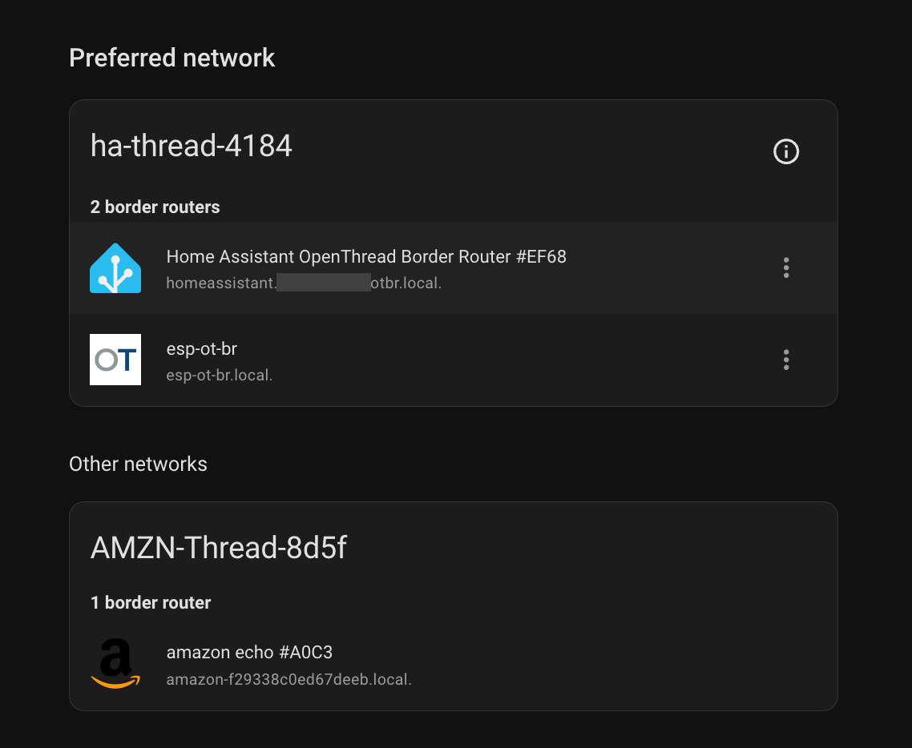
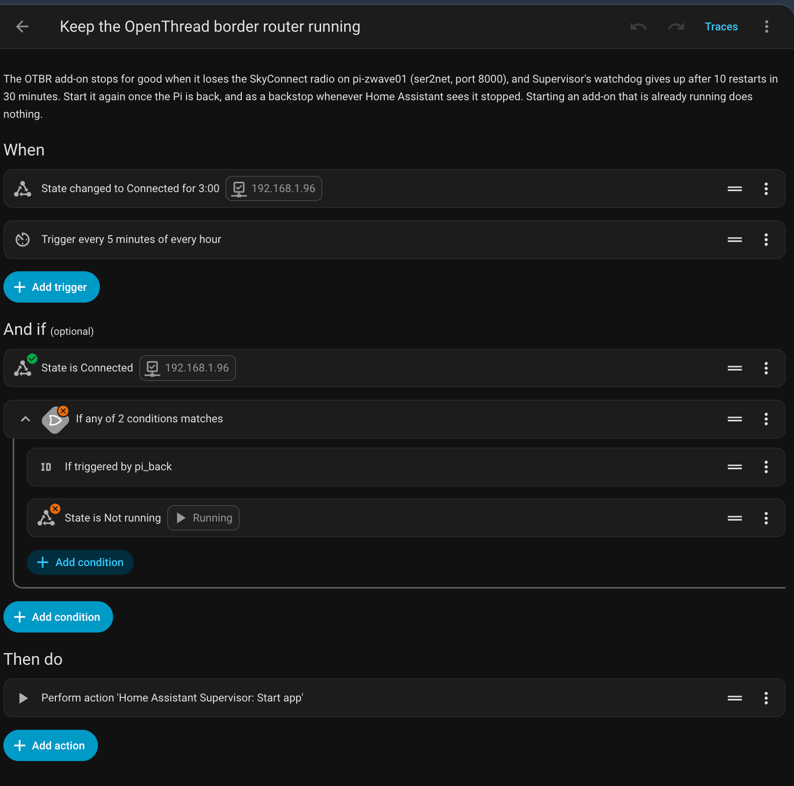

# thread

my Thread network is owned by Home Assistant and has two border routers. one is
Home Assistant's OpenThread Border Router app, using a SkyConnect that sits on
the [pi](../raspberry-pi/thread-radio.md) and is reached over the network. the
other is an Espressif ESP Thread Border Router board. Matter over Thread devices
join the network from Home Assistant.

this page is the network as a whole: how it is set up, and how it recovers when
the pi goes away. the [ESP board](esp-border-router.md) and
[how to check it is all one mesh](checking-the-mesh.md) have their own pages.
checked against Home Assistant Core 2026.9, Supervisor 2026.09 and OpenThread
Border Router app 3.1.

## the network

i let Home Assistant own the network. it creates the dataset (network name
`ha-thread-xxxx`, channel, PAN ID, extended PAN ID, mesh-local prefix, network
key, PSKc) and keeps it as the preferred network. every border router gets that
dataset, and none forms its own. when i ran the border router in a container i
spent a long time making the network use a name i picked, and Home Assistant
kept wanting to manage the name.

the dataset is under **Settings** > **Devices & services** > **Thread**, behind
the (i) on the preferred network. **Active dataset TLVs** there is the whole
network, network key and PSKc included. anyone with the key and a radio in range
can join, so treat that string like a password and keep it out of chat tools,
out of an `sdkconfig` and out of git.



### border routers and routers

these are two different things:

- a **border router** connects the mesh to the LAN. the Thread panel lists these,
  found by their mDNS announcements
- a **router** is a role inside the mesh. mains powered devices (plugs, bulbs)
  take it too and relay traffic for the rest. they are not border routers and are
  not in that panel

mine has three routers, two of which are border routers. the third, a mains
powered device, is currently the leader.

| border router | radio | link to the LAN |
| --- | --- | --- |
| OpenThread Border Router app, on the Home Assistant VM | SkyConnect on the pi, through ser2net | the VM's network |
| ESP Thread Border Router board with Espressif's Ethernet daughter board | its own ESP32-H2 | Ethernet, powered over PoE |

### other networks

an Amazon Echo with Thread in it forms its own network, and the panel shows it
under **Other networks**. it cannot join this one: Amazon keeps the Echo's Thread
credentials in the Amazon account and has no setting to join a different network,
and Home Assistant has no way to get Amazon's key either. i leave it alone. it
runs on a different channel.

to use a device from Alexa as well, add it to Home Assistant first so it joins
this network, then **Settings** > **Connectivity** > **Matter** > **Devices** >
the device > **Share device**, and enter the code in the Alexa app. Alexa then
reaches it over the LAN through these border routers.

## why the radio is on the pi

the full back and forth, including the working compose files, is in
[openthread discussion #10311](https://github.com/orgs/openthread/discussions/10311).
in short, this is what i ran, in order:

1. **2024, `openthread/otbr` container on the pi.** that image is meant for
   development. without a volume for `/var/lib/thread`, a recreated container came
   back without its network, and Home Assistant only picked it up again after
   removing and re-adding the OTBR integration
2. **2024, ser2net on the pi and the app in Home Assistant.** reliable
3. **2025, `openthread/border-router` container**, the image meant for
   deployment, with host networking and a `/data` volume. it kept its network, but
   commissioning needed reboots and retries, Home Assistant did not discover it,
   and restarting it made me nervous
4. **after the pi was rebuilt, back to ser2net and the app**

the app's documentation names the cost: the radio protocol expects a UART, not
TCP. it is timing sensitive, and when the TCP link fails the border router does
not shut down cleanly, which can leave stale routes for up to 30 minutes even
with other routers available. the second border router covers routing while the
app is down, but it does not make that warning go away.

the ser2net side is on the [pi page](../raspberry-pi/thread-radio.md).
in the app's settings, **network device** is `192.168.1.96:8000` and **device**
is any serial port (it is required and not used). **flow control** is on, its
default, and has no effect over the network socket.

## when the pi goes away

this is what happens:

1. `otbr-agent` loses the radio, tries to recover twice, and exits. the app
   treats that as permanent and stops its container
2. with **Watchdog** on, Supervisor starts it again. before the border router
   starts, the app migrates its settings, and that needs the radio. with the pi
   gone, each start fails in about 10 seconds
3. Supervisor allows 10 watchdog restarts in 30 minutes. at 10 seconds each that
   is used up in about two minutes, and the app then stays stopped

in the app's log, `No route to host` from socat means the whole pi is
unreachable. `Connection refused` means the pi is up and ser2net is not.

so i keep **Watchdog** on for short drops, such as a ser2net redeploy, and use
an automation for anything longer.

### the automation

it needs two things:

1. the app's **Running** sensor. **Settings** > **Devices & services** >
   **Home Assistant Supervisor** > the **OpenThread Border Router** device >
   enable **Running**. it is off by default
2. a **Ping (ICMP)** integration for the pi's address

```yaml
alias: Keep the OpenThread border router running
description: >-
  The OTBR app stops for good when it loses the SkyConnect radio on the pi
  (ser2net, port 8000), and Supervisor's watchdog gives up after 10 restarts
  in 30 minutes. Start it again once the pi has answered pings for 3 minutes,
  and as a backstop whenever Home Assistant sees it stopped. Starting an
  app that is already running does nothing.
triggers:
  - trigger: state
    entity_id: binary_sensor.192_168_1_96
    to: "on"
    for:
      minutes: 3
    id: pi_back
  - trigger: time_pattern
    minutes: "/5"
    id: periodic
conditions:
  - condition: state
    entity_id: binary_sensor.192_168_1_96
    state: "on"
  - condition: or
    conditions:
      - condition: trigger
        id: pi_back
      - condition: state
        entity_id: binary_sensor.openthread_border_router_running
        state: "off"
actions:
  - action: hassio.app_start
    data:
      app: core_openthread_border_router
mode: single
```

change the two entity IDs to whatever yours are called.

| part | why |
| --- | --- |
| ping on for 3 minutes | the pi answers ping before Docker has started ser2net |
| every 5 minutes while **Running** is off | the backstop. the Supervisor integration refreshes app state every 15 minutes and nothing pushes it sooner, so this path is slow |
| the pi answering ping, as a condition | no start attempts while the pi is down |
| `hassio.app_start` | starting an app that is already running does nothing, Supervisor only logs that it is already running. a stale **Running** sensor cannot cause a restart |

to test the action: stop the app, then in the automation ⋮ > **Run actions**,
which skips the triggers and conditions. Thread devices should keep working
through the ESP while it is stopped. to test the whole automation, follow
[watching a failover](checking-the-mesh.md#watching-a-failover).

if you stop the app yourself, turn the automation off first, or it starts the
app again within a few minutes.

in the automation editor each condition shows a live badge: a tick when it is
true right now, a cross when it is not. with everything healthy, the **Running**
is off condition shows a cross, as it should.



**what i did not use:**

- **a TCP sensor on port 8000.** ser2net has `kickolduser: true`, so a probe from
  Home Assistant's address would kick the app off the radio every time it ran
- **Home Assistant's Portainer integration**, which does have a container health
  sensor. it wants a token from a Portainer admin, and for every environment it
  adds prune volumes buttons, recreate with image pull, and stack on/off
  switches. that is a lot of control for a readiness check, and recreate with
  pull goes around the [deploy branches](../docker/gitops-with-portainer.md)

### alerts

there are two, both to the Home Assistant companion app. the first is immediate
and says recovery happened. the second is the catch-all.

1. notify when the automation starts the app because the pi came back. add to
   its `actions`, after `hassio.app_start`:

    ```yaml
      - if:
          - condition: trigger
            id: pi_back
        then:
          - action: notify.mobile_app_<your phone>
            data:
              title: Thread border router
              message: the pi is back, started the OpenThread border router app
    ```

    it notifies on that trigger only. the 5 minute backstop path would notify
    again every 5 minutes while the **Running** sensor is still stale

2. add a second automation, for a stop the first one does not fix:

    ```yaml
    alias: Alert when the OpenThread border router app stays stopped
    triggers:
      - trigger: state
        entity_id: binary_sensor.openthread_border_router_running
        to: "off"
        for:
          minutes: 20
    actions:
      - action: notify.mobile_app_<your phone>
        data:
          title: Thread border router
          message: >-
            the OTBR app has been stopped for 20 minutes. Thread still works,
            the ESP is a border router too
    mode: single
    ```

<!-- -->

- Home Assistant refreshes app state every 15 minutes
  (`HASSIO_ADDON_UPDATE_INTERVAL`) and nothing pushes it sooner, so those
  20 minutes can be 35 in real time
- it fires when you stop the app yourself too. to mute that, add an
  `input_boolean` helper as a condition on both automations, and create the helper
  first: a condition on an entity that does not exist is false, so nothing would
  fire at all
- neither alert catches the app running but not carrying the radio. ser2net's
  healthcheck shows it: it goes unhealthy when no client holds port 8000. it
  reads the pi's socket table and never touches the link. see
  [docker and stacks](../raspberry-pi/stacks.md#ser2net)

## on these pages

<!-- this page used to hold both. the empty spans keep its old section
anchors working, so a deep link lands on the link to where that section went -->

- <span id="the-esp-border-router"></span><span id="what-you-need"></span><span id="build-and-flash-it"></span><span id="get-it-onto-your-network"></span><span id="web-ui-and-rest-api"></span><span id="joining-it-by-hand"></span><span id="firmware-updates"></span>[ESP border router](esp-border-router.md) - what you need, building and flashing it, getting it onto your network, its web UI and REST API, joining it by hand, and firmware updates
- <span id="checking-it-is-one-mesh"></span><span id="the-esps-api"></span><span id="mdns"></span><span id="what-each-border-router-publishes"></span><span id="watching-a-failover"></span>[checking the mesh](checking-the-mesh.md) - the ESP's API, mDNS, what each border router publishes, and watching a failover

## troubleshooting

| symptom | cause |
| --- | --- |
| app stopped after the pi was off, with **Watchdog** on | the 10 restarts in 30 minutes were used up. the [automation](#the-automation) starts it again |
| `No route to host` in the app's log | the pi is unreachable. `Connection refused` means ser2net is not running |
| a freshly flashed board sits on its own `ESP-BR-xxxx` network | expected, it forms one when it has no dataset. [move it onto yours](esp-border-router.md#get-it-onto-your-network) |
| the ESP stays a child | its dataset differs from the network's. [check the mesh-local prefix](esp-border-router.md#joining-it-by-hand) |
| the panel shows 2 border routers, the ESP's topology shows 3 routers | routers and border routers are different things, see [above](#border-routers-and-routers) |
| the ESP still has the prefix and primary backbone router after the app came back | expected, they do not move back. see [watching a failover](checking-the-mesh.md#watching-a-failover) |
| an Amazon network under **Other networks** | the Echo's own network. it cannot join this one |
